<!-- Header: the banner is the title. Logo and banners are generated by common/brand_assets.py -->
<h1 align="center">
  <a href="https://hrahman12.github.io/What-the-noise-remembers-MOTH-QUANTUM-HACK/">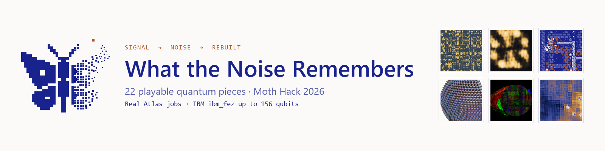</a>
</h1>

  
  
  
  
  
  

  <b>One signal hides, gets lost in noise, and is rebuilt</b>, across 22 pieces you play in your browser.

  
  &nbsp;
  
  &nbsp;
  

  
  
   
  <i>Nine of the pieces, played live in the browser. Click the reel to play them yourself. (<a href="docs/demos/highlights.mp4">MP4 version</a>)</i>

<b>🏠 The home page</b>

 

  

## 💡 The idea

<picture>
  <source media="(prefers-color-scheme: dark)" srcset="assets/logo-dark.svg">
  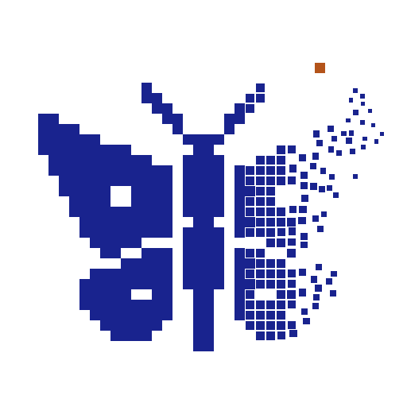
</picture>

22 playable quantum pieces for Moth Hack 2026: **one signal that hides, gets lost in noise, and is rebuilt.** Every image, sound and number comes from real Moth Quantum Atlas jobs, on simulators and IBM hardware (up to 156 qubits on ibm_fez). Games, instruments and explainers, from a Penrose tiling to LIGO's first chirp.

The emblem is the idea in one picture: a moth drawn in ink squares. One wing stays whole (the signal); the other comes apart into noise and drifts toward a single orange tile of light.

### **[Play all 22 pieces in your browser →](https://hrahman12.github.io/What-the-noise-remembers-MOTH-QUANTUM-HACK/)**

No install and no login. Every piece runs in the browser.

## 🧩 The 22 pieces

Every piece is its own interactive page. Click a name to play it. Grouped by the 11 Moth Hack 2026 challenges.

<table>
<thead>
<tr><th>Challenge</th><th colspan="2" align="left">Piece · what you do</th><th align="left">Quantum run</th></tr>
</thead>
<tbody>
<tr><td rowspan="3" align="center"><b>01</b> One image, one engine</td><td width="96"><a href="https://hrahman12.github.io/What-the-noise-remembers-MOTH-QUANTUM-HACK/pieces/01-penrose-hole/">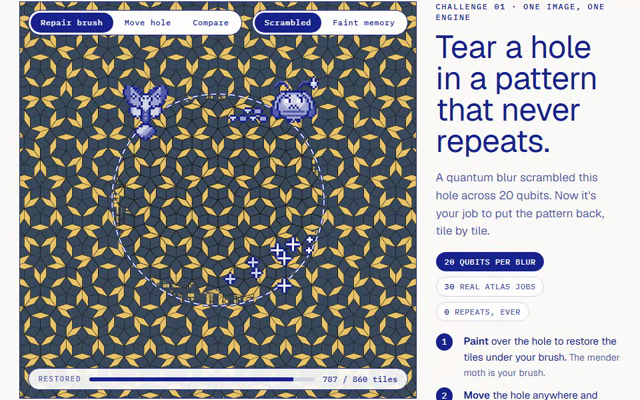</a></td><td><b><a href="https://hrahman12.github.io/What-the-noise-remembers-MOTH-QUANTUM-HACK/pieces/01-penrose-hole/">The Hole in the Penrose</a></b> Tear a hole in a pattern that never repeats.</td><td>Atlas simulator</td></tr>
<tr><td width="96"><a href="https://hrahman12.github.io/What-the-noise-remembers-MOTH-QUANTUM-HACK/pieces/15-tissue-blur/">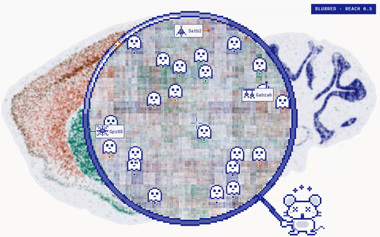</a></td><td><b><a href="https://hrahman12.github.io/What-the-noise-remembers-MOTH-QUANTUM-HACK/pieces/15-tissue-blur/">Tissue Blur</a></b> Slide a quantum lens across a mouse brain's genes.</td><td>Atlas simulator</td></tr>
<tr><td width="96"><a href="https://hrahman12.github.io/What-the-noise-remembers-MOTH-QUANTUM-HACK/pieces/22-scroll-unroll/">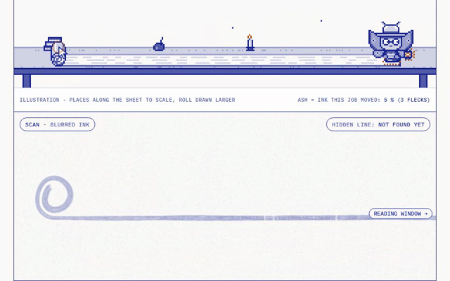</a></td><td><b><a href="https://hrahman12.github.io/What-the-noise-remembers-MOTH-QUANTUM-HACK/pieces/22-scroll-unroll/">Scroll Unroll</a></b> Unroll the scroll. Find the line hidden at its core.</td><td>Atlas simulator</td></tr>
<tr><td rowspan="4" align="center"><b>02</b> Make it audible</td><td width="96"><a href="https://hrahman12.github.io/What-the-noise-remembers-MOTH-QUANTUM-HACK/pieces/02-coda-reservoir/">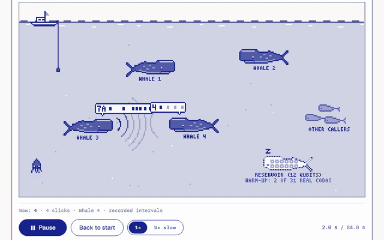</a></td><td><b><a href="https://hrahman12.github.io/What-the-noise-remembers-MOTH-QUANTUM-HACK/pieces/02-coda-reservoir/">Coda Reservoir</a></b> Hear a 12-qubit reservoir click like a sperm whale.</td><td>Atlas simulator</td></tr>
<tr><td width="96"><a href="https://hrahman12.github.io/What-the-noise-remembers-MOTH-QUANTUM-HACK/pieces/12-chirp-instrument/">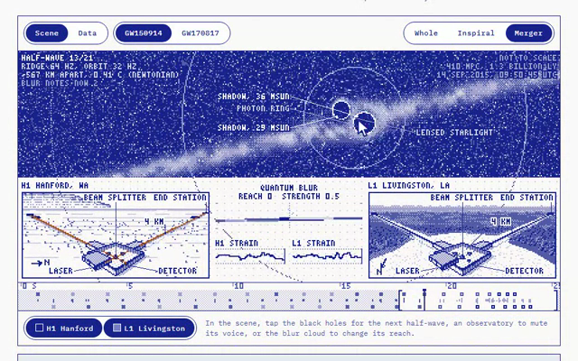</a></td><td><b><a href="https://hrahman12.github.io/What-the-noise-remembers-MOTH-QUANTUM-HACK/pieces/12-chirp-instrument/">Chirp Instrument</a></b> Play the last fifth of a second of two black holes.</td><td>Atlas simulator</td></tr>
<tr><td width="96"><a href="https://hrahman12.github.io/What-the-noise-remembers-MOTH-QUANTUM-HACK/pieces/16-busy-beaver-score/">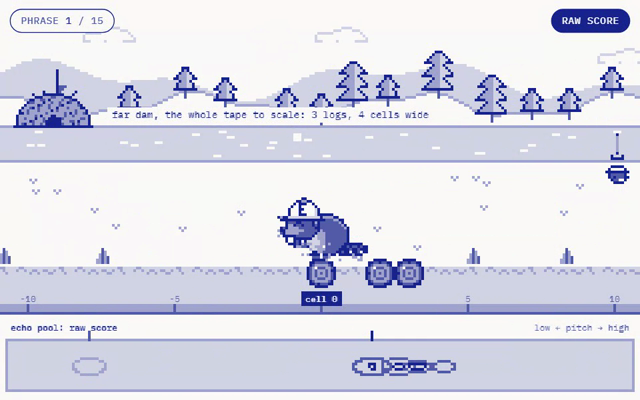</a></td><td><b><a href="https://hrahman12.github.io/What-the-noise-remembers-MOTH-QUANTUM-HACK/pieces/16-busy-beaver-score/">Busy Beaver Score</a></b> Scrub through the longest run a five-state machine can make.</td><td>Atlas simulator</td></tr>
<tr><td width="96"><a href="https://hrahman12.github.io/What-the-noise-remembers-MOTH-QUANTUM-HACK/pieces/21-quantum-nose/">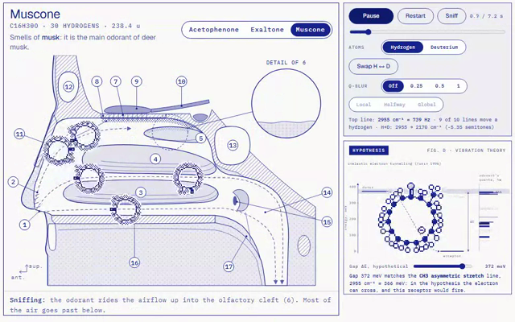</a></td><td><b><a href="https://hrahman12.github.io/What-the-noise-remembers-MOTH-QUANTUM-HACK/pieces/21-quantum-nose/">The Quantum Nose Test</a></b> Swap hydrogen for deuterium. Hear the molecule fall.</td><td>Atlas simulator</td></tr>
<tr><td align="center"><b>03</b> Three dimensions</td><td width="96"><a href="https://hrahman12.github.io/What-the-noise-remembers-MOTH-QUANTUM-HACK/pieces/03-moth-eye/">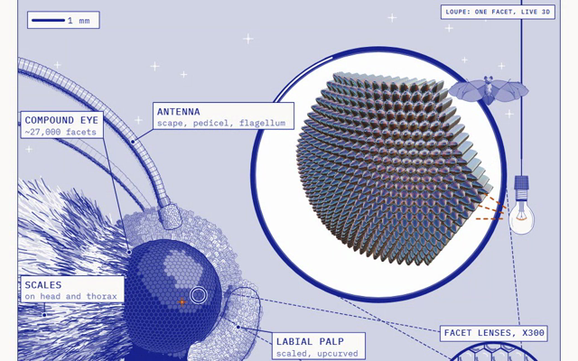</a></td><td><b><a href="https://hrahman12.github.io/What-the-noise-remembers-MOTH-QUANTUM-HACK/pieces/03-moth-eye/">Moth Eye</a></b> Hide a moth’s shiny eye from the bat.</td><td>Atlas simulator</td></tr>
<tr><td rowspan="2" align="center"><b>04</b> Moving image</td><td width="96"><a href="https://hrahman12.github.io/What-the-noise-remembers-MOTH-QUANTUM-HACK/pieces/04-magic-angle/">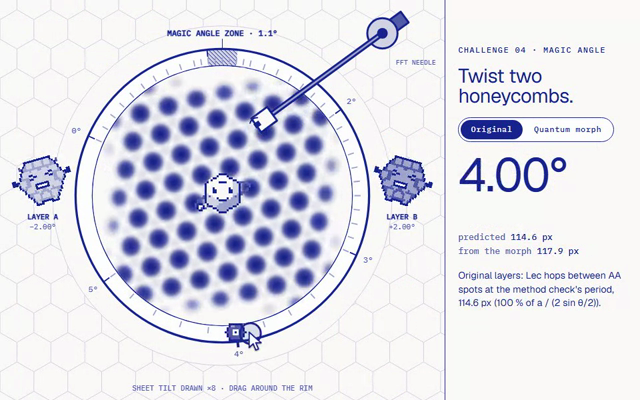</a></td><td><b><a href="https://hrahman12.github.io/What-the-noise-remembers-MOTH-QUANTUM-HACK/pieces/04-magic-angle/">Magic Angle</a></b> Twist two honeycombs. Find the order hiding in the noise.</td><td>Atlas simulator</td></tr>
<tr><td width="96"><a href="https://hrahman12.github.io/What-the-noise-remembers-MOTH-QUANTUM-HACK/pieces/17-quantum-lenia/">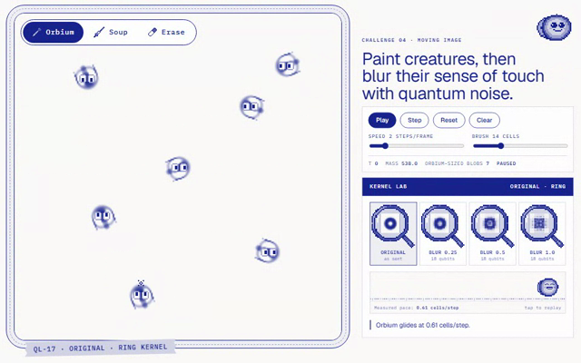</a></td><td><b><a href="https://hrahman12.github.io/What-the-noise-remembers-MOTH-QUANTUM-HACK/pieces/17-quantum-lenia/">Quantum Lenia</a></b> Paint creatures, then blur their sense of touch with quantum noise.</td><td>Atlas simulator</td></tr>
<tr><td rowspan="2" align="center"><b>05</b> Quantum game</td><td width="96"><a href="https://hrahman12.github.io/What-the-noise-remembers-MOTH-QUANTUM-HACK/pieces/05-jam-the-bat/">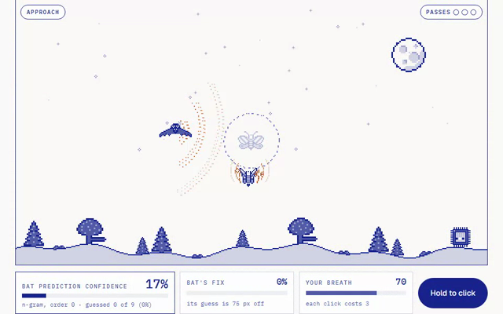</a></td><td><b><a href="https://hrahman12.github.io/What-the-noise-remembers-MOTH-QUANTUM-HACK/pieces/05-jam-the-bat/">Jam the Bat</a></b> Jam a bat that learns your rhythm.</td><td><b>IBM ibm_fez</b></td></tr>
<tr><td width="96"><a href="https://hrahman12.github.io/What-the-noise-remembers-MOTH-QUANTUM-HACK/pieces/13-moth-to-flame/">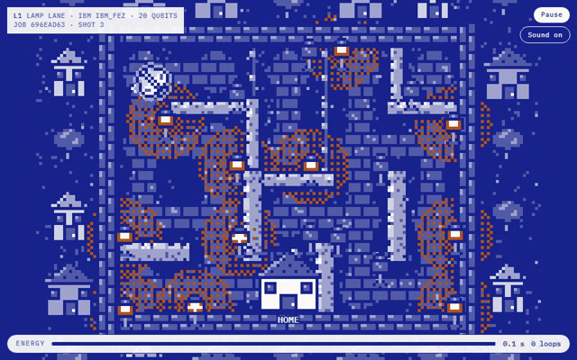</a></td><td><b><a href="https://hrahman12.github.io/What-the-noise-remembers-MOTH-QUANTUM-HACK/pieces/13-moth-to-flame/">Moth to Flame</a></b> Fly a moth home before the lamps catch it.</td><td><b>IBM ibm_fez</b></td></tr>
<tr><td align="center"><b>06</b> Daisy Chain</td><td width="96"><a href="https://hrahman12.github.io/What-the-noise-remembers-MOTH-QUANTUM-HACK/pieces/06-tweezer/">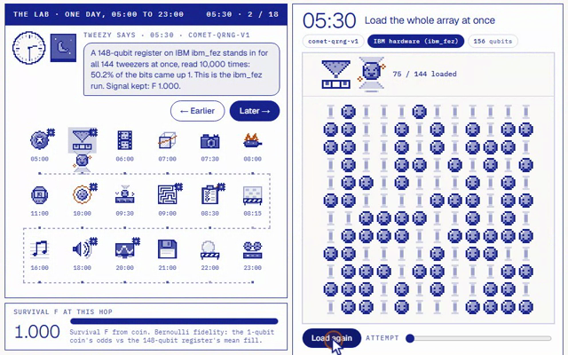</a></td><td><b><a href="https://hrahman12.github.io/What-the-noise-remembers-MOTH-QUANTUM-HACK/pieces/06-tweezer/">Tweezer</a></b> Walk one atom array through a day, engine by engine.</td><td><b>IBM ibm_fez</b> (156 qubits) + Atlas simulator</td></tr>
<tr><td rowspan="2" align="center"><b>07</b> Make a VST or AU</td><td width="96"><a href="https://hrahman12.github.io/What-the-noise-remembers-MOTH-QUANTUM-HACK/pieces/07-flavour/">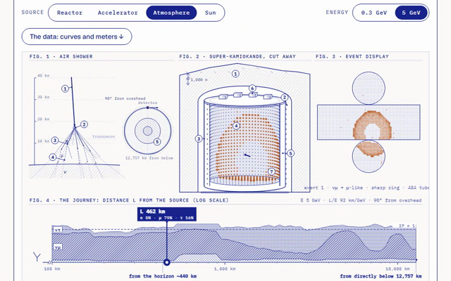</a></td><td><b><a href="https://hrahman12.github.io/What-the-noise-remembers-MOTH-QUANTUM-HACK/pieces/07-flavour/">FLAVOUR</a></b> Send a neutrino through the Earth. Hear which flavour arrives.</td><td><b>IBM ibm_fez</b></td></tr>
<tr><td width="96"><a href="https://hrahman12.github.io/What-the-noise-remembers-MOTH-QUANTUM-HACK/pieces/19-frog-chorus/">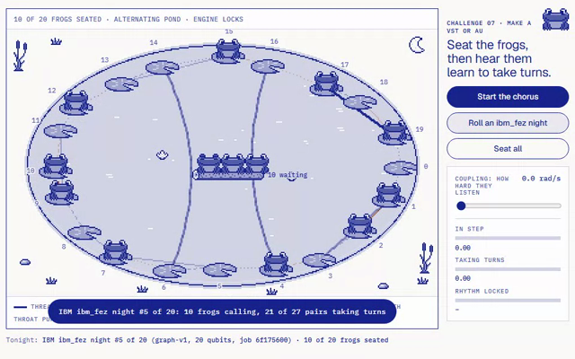</a></td><td><b><a href="https://hrahman12.github.io/What-the-noise-remembers-MOTH-QUANTUM-HACK/pieces/19-frog-chorus/">Frog Chorus</a></b> Seat the frogs, then hear them learn to take turns.</td><td><b>IBM ibm_fez</b> + Atlas simulator</td></tr>
<tr><td rowspan="2" align="center"><b>08</b> Make a web app</td><td width="96"><a href="https://hrahman12.github.io/What-the-noise-remembers-MOTH-QUANTUM-HACK/pieces/08-pbit-or-qubit/">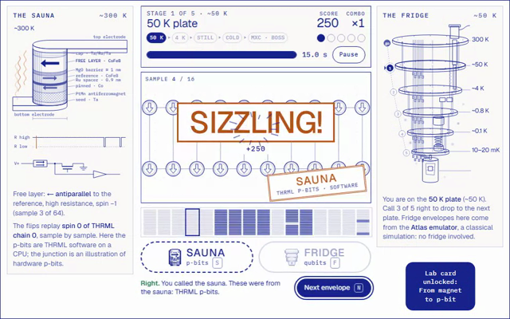</a></td><td><b><a href="https://hrahman12.github.io/What-the-noise-remembers-MOTH-QUANTUM-HACK/pieces/08-pbit-or-qubit/">p-bit or qubit?</a></b> Sauna vs Fridge: call who sent the noise.</td><td><b>IBM ibm_fez</b></td></tr>
<tr><td width="96"><a href="https://hrahman12.github.io/What-the-noise-remembers-MOTH-QUANTUM-HACK/pieces/14-hemibrain-ising/">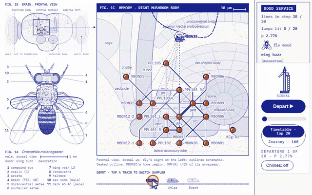</a></td><td><b><a href="https://hrahman12.github.io/What-the-noise-remembers-MOTH-QUANTUM-HACK/pieces/14-hemibrain-ising/">Fly Brain Metro</a></b> Ride the metro inside a fly's head.</td><td><b>IBM ibm_fez</b> + Atlas simulator</td></tr>
<tr><td align="center"><b>09</b> Quantum-native 1</td><td width="96"><a href="https://hrahman12.github.io/What-the-noise-remembers-MOTH-QUANTUM-HACK/pieces/09-syndrome-loom/">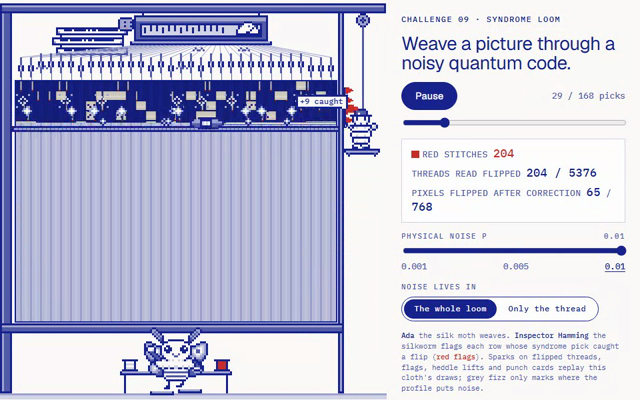</a></td><td><b><a href="https://hrahman12.github.io/What-the-noise-remembers-MOTH-QUANTUM-HACK/pieces/09-syndrome-loom/">Syndrome Loom</a></b> Weave a picture through a noisy quantum code.</td><td>Atlas simulator</td></tr>
<tr><td align="center"><b>10</b> Quantum-native 2</td><td width="96"><a href="https://hrahman12.github.io/What-the-noise-remembers-MOTH-QUANTUM-HACK/pieces/10-squeezed-chirp/">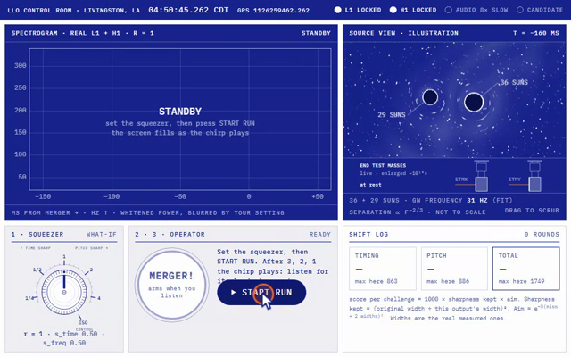</a></td><td><b><a href="https://hrahman12.github.io/What-the-noise-remembers-MOTH-QUANTUM-HACK/pieces/10-squeezed-chirp/">Squeezed Chirp</a></b> Catch the first black-hole merger ever heard.</td><td>Atlas simulator</td></tr>
<tr><td rowspan="3" align="center"><b>11</b> FQxI Challenge</td><td width="96"><a href="https://hrahman12.github.io/What-the-noise-remembers-MOTH-QUANTUM-HACK/pieces/11-maxwells-ribbon/">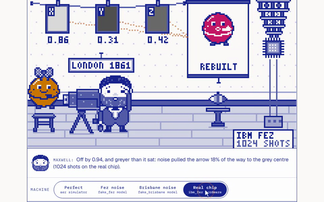</a></td><td><b><a href="https://hrahman12.github.io/What-the-noise-remembers-MOTH-QUANTUM-HACK/pieces/11-maxwells-ribbon/">Maxwell's Ribbon</a></b> Rebuild a qubit the way Maxwell rebuilt colour.</td><td><b>IBM ibm_fez</b></td></tr>
<tr><td width="96"><a href="https://hrahman12.github.io/What-the-noise-remembers-MOTH-QUANTUM-HACK/pieces/18-oldest-light/">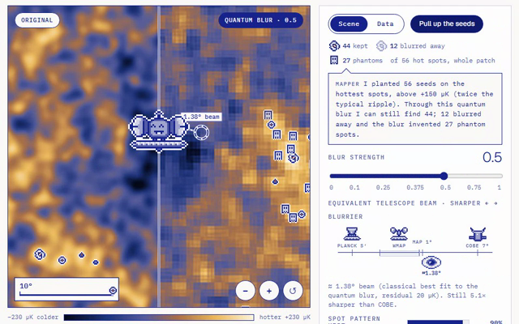</a></td><td><b><a href="https://hrahman12.github.io/What-the-noise-remembers-MOTH-QUANTUM-HACK/pieces/18-oldest-light/">Oldest Light</a></b> Blur the oldest light in the universe.</td><td>Atlas simulator</td></tr>
<tr><td width="96"><a href="https://hrahman12.github.io/What-the-noise-remembers-MOTH-QUANTUM-HACK/pieces/20-antimatter-drop/">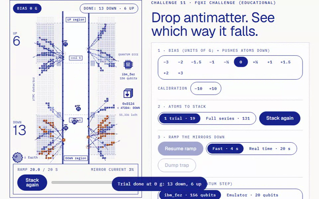</a></td><td><b><a href="https://hrahman12.github.io/What-the-noise-remembers-MOTH-QUANTUM-HACK/pieces/20-antimatter-drop/">Antimatter Drop</a></b> Drop antimatter. See which way it falls.</td><td><b>IBM ibm_fez</b></td></tr>
</tbody>
</table>

## 🎬 Every piece, in motion

Click any clip to play that piece live.

<table>
<tr>
<td width="50%" valign="top"> <b><a href="https://hrahman12.github.io/What-the-noise-remembers-MOTH-QUANTUM-HACK/pieces/01-penrose-hole/">01 · The Hole in the Penrose</a></b> Tear a hole in a pattern that never repeats.</td>
<td width="50%" valign="top"> <b><a href="https://hrahman12.github.io/What-the-noise-remembers-MOTH-QUANTUM-HACK/pieces/02-coda-reservoir/">02 · Coda Reservoir</a></b> Hear a 12-qubit reservoir click like a sperm whale.</td>
</tr>
<tr>
<td width="50%" valign="top"> <b><a href="https://hrahman12.github.io/What-the-noise-remembers-MOTH-QUANTUM-HACK/pieces/03-moth-eye/">03 · Moth Eye</a></b> Hide a moth’s shiny eye from the bat.</td>
<td width="50%" valign="top"> <b><a href="https://hrahman12.github.io/What-the-noise-remembers-MOTH-QUANTUM-HACK/pieces/04-magic-angle/">04 · Magic Angle</a></b> Twist two honeycombs. Find the order hiding in the noise.</td>
</tr>
<tr>
<td width="50%" valign="top"> <b><a href="https://hrahman12.github.io/What-the-noise-remembers-MOTH-QUANTUM-HACK/pieces/05-jam-the-bat/">05 · Jam the Bat</a></b> Jam a bat that learns your rhythm.</td>
<td width="50%" valign="top"><a href="https://hrahman12.github.io/What-the-noise-remembers-MOTH-QUANTUM-HACK/pieces/06-tweezer/">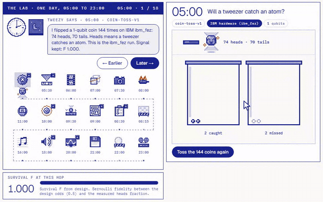</a> <b><a href="https://hrahman12.github.io/What-the-noise-remembers-MOTH-QUANTUM-HACK/pieces/06-tweezer/">06 · Tweezer</a></b> Walk one atom array through a day, engine by engine.</td>
</tr>
<tr>
<td width="50%" valign="top"> <b><a href="https://hrahman12.github.io/What-the-noise-remembers-MOTH-QUANTUM-HACK/pieces/07-flavour/">07 · FLAVOUR</a></b> Send a neutrino through the Earth. Hear which flavour arrives.</td>
<td width="50%" valign="top"> <b><a href="https://hrahman12.github.io/What-the-noise-remembers-MOTH-QUANTUM-HACK/pieces/08-pbit-or-qubit/">08 · p-bit or qubit?</a></b> Sauna vs Fridge: call who sent the noise.</td>
</tr>
<tr>
<td width="50%" valign="top"> <b><a href="https://hrahman12.github.io/What-the-noise-remembers-MOTH-QUANTUM-HACK/pieces/09-syndrome-loom/">09 · Syndrome Loom</a></b> Weave a picture through a noisy quantum code.</td>
<td width="50%" valign="top"> <b><a href="https://hrahman12.github.io/What-the-noise-remembers-MOTH-QUANTUM-HACK/pieces/10-squeezed-chirp/">10 · Squeezed Chirp</a></b> Catch the first black-hole merger ever heard.</td>
</tr>
<tr>
<td width="50%" valign="top"> <b><a href="https://hrahman12.github.io/What-the-noise-remembers-MOTH-QUANTUM-HACK/pieces/11-maxwells-ribbon/">11 · Maxwell's Ribbon</a></b> Rebuild a qubit the way Maxwell rebuilt colour.</td>
<td width="50%" valign="top"> <b><a href="https://hrahman12.github.io/What-the-noise-remembers-MOTH-QUANTUM-HACK/pieces/12-chirp-instrument/">12 · Chirp Instrument</a></b> Play the last fifth of a second of two black holes.</td>
</tr>
<tr>
<td width="50%" valign="top"> <b><a href="https://hrahman12.github.io/What-the-noise-remembers-MOTH-QUANTUM-HACK/pieces/13-moth-to-flame/">13 · Moth to Flame</a></b> Fly a moth home before the lamps catch it.</td>
<td width="50%" valign="top"> <b><a href="https://hrahman12.github.io/What-the-noise-remembers-MOTH-QUANTUM-HACK/pieces/14-hemibrain-ising/">14 · Fly Brain Metro</a></b> Ride the metro inside a fly's head.</td>
</tr>
<tr>
<td width="50%" valign="top"> <b><a href="https://hrahman12.github.io/What-the-noise-remembers-MOTH-QUANTUM-HACK/pieces/15-tissue-blur/">15 · Tissue Blur</a></b> Slide a quantum lens across a mouse brain's genes.</td>
<td width="50%" valign="top"> <b><a href="https://hrahman12.github.io/What-the-noise-remembers-MOTH-QUANTUM-HACK/pieces/16-busy-beaver-score/">16 · Busy Beaver Score</a></b> Scrub through the longest run a five-state machine can make.</td>
</tr>
<tr>
<td width="50%" valign="top"> <b><a href="https://hrahman12.github.io/What-the-noise-remembers-MOTH-QUANTUM-HACK/pieces/17-quantum-lenia/">17 · Quantum Lenia</a></b> Paint creatures, then blur their sense of touch with quantum noise.</td>
<td width="50%" valign="top"> <b><a href="https://hrahman12.github.io/What-the-noise-remembers-MOTH-QUANTUM-HACK/pieces/18-oldest-light/">18 · Oldest Light</a></b> Blur the oldest light in the universe.</td>
</tr>
<tr>
<td width="50%" valign="top"> <b><a href="https://hrahman12.github.io/What-the-noise-remembers-MOTH-QUANTUM-HACK/pieces/19-frog-chorus/">19 · Frog Chorus</a></b> Seat the frogs, then hear them learn to take turns.</td>
<td width="50%" valign="top"> <b><a href="https://hrahman12.github.io/What-the-noise-remembers-MOTH-QUANTUM-HACK/pieces/20-antimatter-drop/">20 · Antimatter Drop</a></b> Drop antimatter. See which way it falls.</td>
</tr>
<tr>
<td width="50%" valign="top"> <b><a href="https://hrahman12.github.io/What-the-noise-remembers-MOTH-QUANTUM-HACK/pieces/21-quantum-nose/">21 · The Quantum Nose Test</a></b> Swap hydrogen for deuterium. Hear the molecule fall.</td>
<td width="50%" valign="top"> <b><a href="https://hrahman12.github.io/What-the-noise-remembers-MOTH-QUANTUM-HACK/pieces/22-scroll-unroll/">22 · Scroll Unroll</a></b> Unroll the scroll. Find the line hidden at its core.</td>
</tr>
</table>

Every image, sound and number in these pieces comes from real Moth Quantum Atlas jobs (simulators and IBM hardware).

## 🔧 How it's built

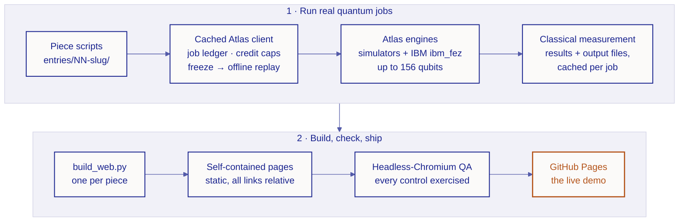

- **Real quantum jobs only.** Every quantum-derived image, sound and number replays a completed [Moth Quantum](https://mothquantum.com) Atlas job; each piece lists its job IDs. Most ran on Atlas simulators, and several ran on IBM hardware (ibm_fez, ibm_marrakesh, ibm_miami), up to a full 156-qubit chip. All 299 jobs (engine, job ID, qubits, backend) are listed in [`cache/jobs_index.json`](cache/jobs_index.json); IBM jobs that failed on IBM's side are named on their pages, not hidden.
- **You're at the controls.** Nothing plays until you click; every piece is a game, instrument, or explorable scene.
- **Honest by design.** Simulator and hardware runs are labelled, analogies are named as analogies, and each piece has a "what this does not claim" section.

<b>📁 What's in the repo</b>

 

| Folder | What's in it |
|---|---|
| `docs/` | The live demo site (GitHub Pages): the hub plus every piece, all links relative |
| `entries/NN-slug/` | Each piece: code, data scripts, deliverables, and its `web/` page source |
| `atlas/` | The cached Atlas API client (per-piece credit caps, job ledger, offline replay) |
| `common/` | Shared style, sprite helper, build, QA, demo-recording and export tools |
| `site/` | The hub page source |
| `assets/` | The emblem and banners (`python common/brand_assets.py` redraws them all) |

<b>🔁 Rebuild it yourself, data and credits</b>

 

To rebuild with your own Atlas key, copy `.env.example` to `.env` and add `MOTH_API_KEY`. Raw datasets (LIGO strain, the MERFISH mouse brain and the hemibrain connectome) aren't stored here; each piece's scripts download them from their original sources.

Each piece credits its data, sources and licences in its own `entries/NN-slug/CREDITS.md`, for example [`entries/12-chirp-instrument/CREDITS.md`](entries/12-chirp-instrument/CREDITS.md).

---

  <picture>
    <source media="(prefers-color-scheme: dark)" srcset="assets/logo-dark.svg">
    
  </picture>
   
  An independent entry to Moth Hack 2026, built on Moth Quantum's Atlas engines. Not an official Moth Quantum project.
   
  Released under the <a href="LICENSE">MIT licence</a> · © 2026 Hanah Rahman

