# "What the noise remembers"-MOTH-QUANTUM-HACK
22 playable quantum pieces for Moth Hack 2026: one signal that hides, gets lost in noise, and is rebuilt. Every image, sound and number comes from real Moth Quantum Atlas jobs, on simulators and IBM hardware (up to 156 qubits on ibm_fez). Games, instruments and explainers, from a Penrose tiling to LIGO's first chirp.

## ▶ Live demo

### **[Play all 22 pieces in your browser →](https://hrahman12.github.io/What-the-noise-remembers-MOTH-QUANTUM-HACK/)**

No install and no login. Every piece runs in the browser.

[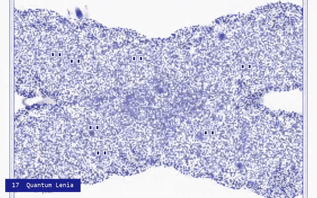](https://hrahman12.github.io/What-the-noise-remembers-MOTH-QUANTUM-HACK/)

*Nine of the pieces, played live in the browser. Click the reel to play them yourself. ([MP4 version](docs/demos/highlights.mp4))*

The home page

[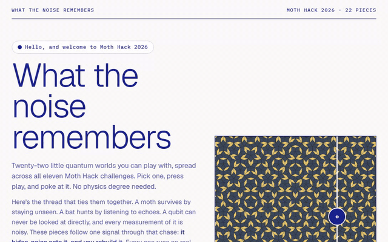](https://hrahman12.github.io/What-the-noise-remembers-MOTH-QUANTUM-HACK/)

## The 22 pieces

Every piece is its own interactive page. Click a name to play it.

| Challenge | Piece | What you do | Quantum run |
|---|---|---|---|
| 01 · One image, one engine | **[The Hole in the Penrose](https://hrahman12.github.io/What-the-noise-remembers-MOTH-QUANTUM-HACK/pieces/01-penrose-hole/)** | Tear a hole in a pattern that never repeats. | Atlas simulator |
| 01 · One image, one engine | **[Tissue Blur](https://hrahman12.github.io/What-the-noise-remembers-MOTH-QUANTUM-HACK/pieces/15-tissue-blur/)** | Slide a quantum lens across a mouse brain's genes. | Atlas simulator |
| 01 · One image, one engine | **[Scroll Unroll](https://hrahman12.github.io/What-the-noise-remembers-MOTH-QUANTUM-HACK/pieces/22-scroll-unroll/)** | Unroll the scroll. Find the line hidden at its core. | Atlas simulator |
| 02 · Make it audible | **[Coda Reservoir](https://hrahman12.github.io/What-the-noise-remembers-MOTH-QUANTUM-HACK/pieces/02-coda-reservoir/)** | Hear a 12-qubit reservoir click like a sperm whale. | Atlas simulator |
| 02 · Make it audible | **[Chirp Instrument](https://hrahman12.github.io/What-the-noise-remembers-MOTH-QUANTUM-HACK/pieces/12-chirp-instrument/)** | Play the last fifth of a second of two black holes. | Atlas simulator |
| 02 · Make it audible | **[Busy Beaver Score](https://hrahman12.github.io/What-the-noise-remembers-MOTH-QUANTUM-HACK/pieces/16-busy-beaver-score/)** | Scrub through the longest run a five-state machine can make. | Atlas simulator |
| 02 · Make it audible | **[The Quantum Nose Test](https://hrahman12.github.io/What-the-noise-remembers-MOTH-QUANTUM-HACK/pieces/21-quantum-nose/)** | Swap hydrogen for deuterium. Hear the molecule fall. | Atlas simulator |
| 03 · Three dimensions | **[Moth Eye](https://hrahman12.github.io/What-the-noise-remembers-MOTH-QUANTUM-HACK/pieces/03-moth-eye/)** | Hide a moth’s shiny eye from the bat. | Atlas simulator |
| 04 · Moving image | **[Magic Angle](https://hrahman12.github.io/What-the-noise-remembers-MOTH-QUANTUM-HACK/pieces/04-magic-angle/)** | Twist two honeycombs. Find the order hiding in the noise. | Atlas simulator |
| 04 · Moving image | **[Quantum Lenia](https://hrahman12.github.io/What-the-noise-remembers-MOTH-QUANTUM-HACK/pieces/17-quantum-lenia/)** | Paint creatures, then blur their sense of touch with quantum noise. | Atlas simulator |
| 05 · Quantum game | **[Jam the Bat](https://hrahman12.github.io/What-the-noise-remembers-MOTH-QUANTUM-HACK/pieces/05-jam-the-bat/)** | Jam a bat that learns your rhythm. | IBM ibm_fez |
| 05 · Quantum game | **[Moth to Flame](https://hrahman12.github.io/What-the-noise-remembers-MOTH-QUANTUM-HACK/pieces/13-moth-to-flame/)** | Fly a moth home before the lamps catch it. | IBM ibm_fez |
| 06 · Daisy Chain | **[Tweezer](https://hrahman12.github.io/What-the-noise-remembers-MOTH-QUANTUM-HACK/pieces/06-tweezer/)** | Walk one atom array through a day, engine by engine. | IBM ibm_marrakesh |
| 07 · Make a VST or AU | **[FLAVOUR](https://hrahman12.github.io/What-the-noise-remembers-MOTH-QUANTUM-HACK/pieces/07-flavour/)** | Send a neutrino through the Earth. Hear which flavour arrives. | IBM ibm_fez |
| 07 · Make a VST or AU | **[Frog Chorus](https://hrahman12.github.io/What-the-noise-remembers-MOTH-QUANTUM-HACK/pieces/19-frog-chorus/)** | Seat the frogs, then hear them learn to take turns. | IBM ibm_fez + Atlas simulator |
| 08 · Make a web app | **[p-bit or qubit?](https://hrahman12.github.io/What-the-noise-remembers-MOTH-QUANTUM-HACK/pieces/08-pbit-or-qubit/)** | Sauna vs Fridge: call who sent the noise. | IBM ibm_fez |
| 08 · Make a web app | **[Fly Brain Metro](https://hrahman12.github.io/What-the-noise-remembers-MOTH-QUANTUM-HACK/pieces/14-hemibrain-ising/)** | Ride the metro inside a fly's head. | IBM ibm_fez + Atlas simulator |
| 09 · Quantum-native 1 | **[Syndrome Loom](https://hrahman12.github.io/What-the-noise-remembers-MOTH-QUANTUM-HACK/pieces/09-syndrome-loom/)** | Weave a picture through a noisy quantum code. | Atlas simulator |
| 10 · Quantum-native 2 | **[Squeezed Chirp](https://hrahman12.github.io/What-the-noise-remembers-MOTH-QUANTUM-HACK/pieces/10-squeezed-chirp/)** | Catch the first black-hole merger ever heard. | Atlas simulator |
| 11 · FQxI Challenge | **[Maxwell's Ribbon](https://hrahman12.github.io/What-the-noise-remembers-MOTH-QUANTUM-HACK/pieces/11-maxwells-ribbon/)** | Rebuild a qubit the way Maxwell rebuilt colour. | IBM ibm_fez |
| 11 · FQxI Challenge | **[Oldest Light](https://hrahman12.github.io/What-the-noise-remembers-MOTH-QUANTUM-HACK/pieces/18-oldest-light/)** | Blur the oldest light in the universe. | Atlas simulator |
| 11 · FQxI Challenge | **[Antimatter Drop](https://hrahman12.github.io/What-the-noise-remembers-MOTH-QUANTUM-HACK/pieces/20-antimatter-drop/)** | Drop antimatter. See which way it falls. | IBM ibm_fez |

## Every piece, in motion

Click any clip to play that piece live.

<table>
<tr>
<td width="50%" valign="top"><a href="https://hrahman12.github.io/What-the-noise-remembers-MOTH-QUANTUM-HACK/pieces/01-penrose-hole/">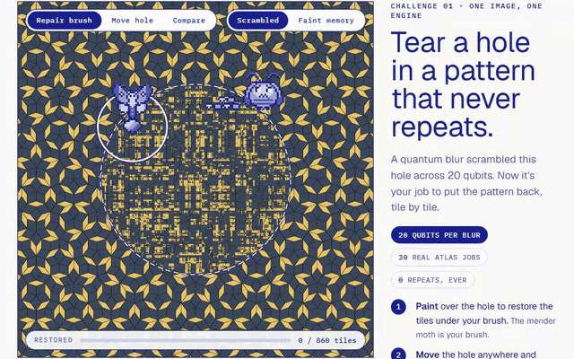</a> <b><a href="https://hrahman12.github.io/What-the-noise-remembers-MOTH-QUANTUM-HACK/pieces/01-penrose-hole/">01 · The Hole in the Penrose</a></b> Tear a hole in a pattern that never repeats.</td>
<td width="50%" valign="top"><a href="https://hrahman12.github.io/What-the-noise-remembers-MOTH-QUANTUM-HACK/pieces/02-coda-reservoir/">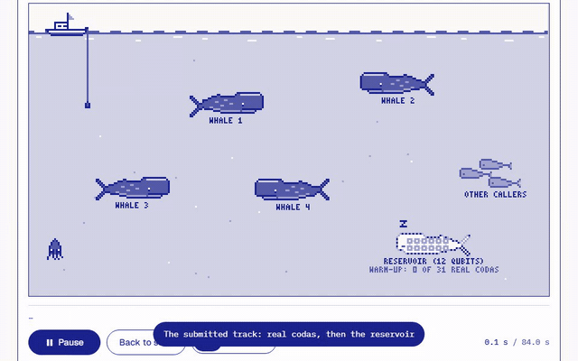</a> <b><a href="https://hrahman12.github.io/What-the-noise-remembers-MOTH-QUANTUM-HACK/pieces/02-coda-reservoir/">02 · Coda Reservoir</a></b> Hear a 12-qubit reservoir click like a sperm whale.</td>
</tr>
<tr>
<td width="50%" valign="top"><a href="https://hrahman12.github.io/What-the-noise-remembers-MOTH-QUANTUM-HACK/pieces/03-moth-eye/">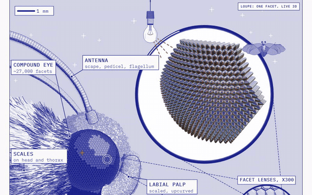</a> <b><a href="https://hrahman12.github.io/What-the-noise-remembers-MOTH-QUANTUM-HACK/pieces/03-moth-eye/">03 · Moth Eye</a></b> Hide a moth’s shiny eye from the bat.</td>
<td width="50%" valign="top"><a href="https://hrahman12.github.io/What-the-noise-remembers-MOTH-QUANTUM-HACK/pieces/04-magic-angle/">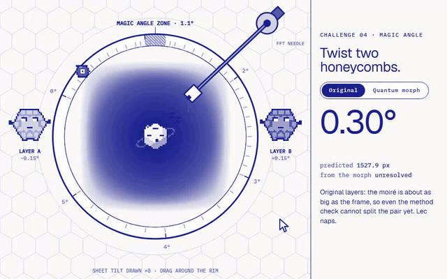</a> <b><a href="https://hrahman12.github.io/What-the-noise-remembers-MOTH-QUANTUM-HACK/pieces/04-magic-angle/">04 · Magic Angle</a></b> Twist two honeycombs. Find the order hiding in the noise.</td>
</tr>
<tr>
<td width="50%" valign="top"><a href="https://hrahman12.github.io/What-the-noise-remembers-MOTH-QUANTUM-HACK/pieces/05-jam-the-bat/">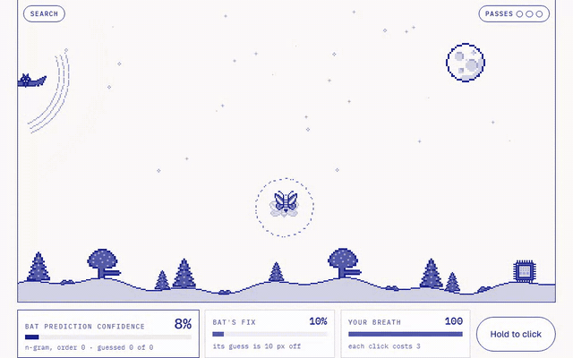</a> <b><a href="https://hrahman12.github.io/What-the-noise-remembers-MOTH-QUANTUM-HACK/pieces/05-jam-the-bat/">05 · Jam the Bat</a></b> Jam a bat that learns your rhythm.</td>
<td width="50%" valign="top"><a href="https://hrahman12.github.io/What-the-noise-remembers-MOTH-QUANTUM-HACK/pieces/07-flavour/">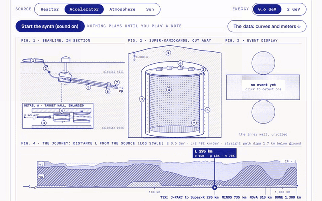</a> <b><a href="https://hrahman12.github.io/What-the-noise-remembers-MOTH-QUANTUM-HACK/pieces/07-flavour/">07 · FLAVOUR</a></b> Send a neutrino through the Earth. Hear which flavour arrives.</td>
</tr>
<tr>
<td width="50%" valign="top"><a href="https://hrahman12.github.io/What-the-noise-remembers-MOTH-QUANTUM-HACK/pieces/08-pbit-or-qubit/">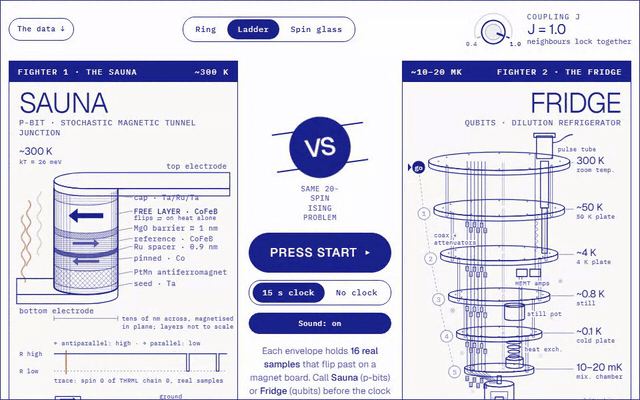</a> <b><a href="https://hrahman12.github.io/What-the-noise-remembers-MOTH-QUANTUM-HACK/pieces/08-pbit-or-qubit/">08 · p-bit or qubit?</a></b> Sauna vs Fridge: call who sent the noise.</td>
<td width="50%" valign="top"><a href="https://hrahman12.github.io/What-the-noise-remembers-MOTH-QUANTUM-HACK/pieces/09-syndrome-loom/">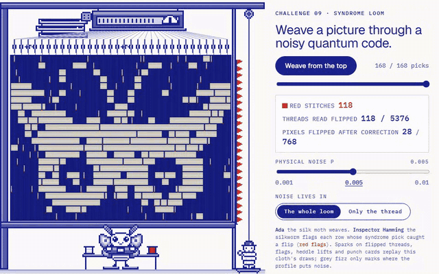</a> <b><a href="https://hrahman12.github.io/What-the-noise-remembers-MOTH-QUANTUM-HACK/pieces/09-syndrome-loom/">09 · Syndrome Loom</a></b> Weave a picture through a noisy quantum code.</td>
</tr>
<tr>
<td width="50%" valign="top"><a href="https://hrahman12.github.io/What-the-noise-remembers-MOTH-QUANTUM-HACK/pieces/10-squeezed-chirp/">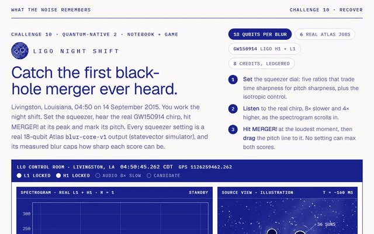</a> <b><a href="https://hrahman12.github.io/What-the-noise-remembers-MOTH-QUANTUM-HACK/pieces/10-squeezed-chirp/">10 · Squeezed Chirp</a></b> Catch the first black-hole merger ever heard.</td>
<td width="50%" valign="top"><a href="https://hrahman12.github.io/What-the-noise-remembers-MOTH-QUANTUM-HACK/pieces/11-maxwells-ribbon/">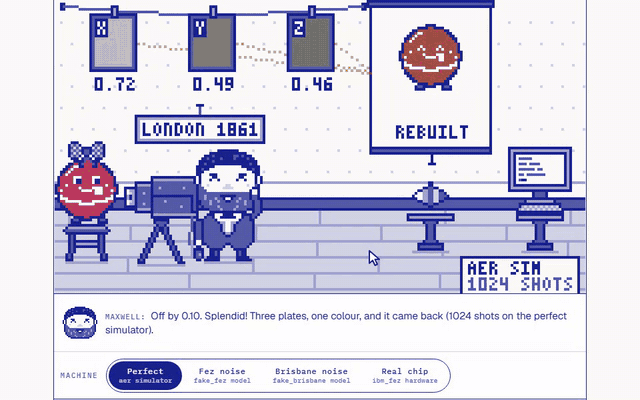</a> <b><a href="https://hrahman12.github.io/What-the-noise-remembers-MOTH-QUANTUM-HACK/pieces/11-maxwells-ribbon/">11 · Maxwell's Ribbon</a></b> Rebuild a qubit the way Maxwell rebuilt colour.</td>
</tr>
<tr>
<td width="50%" valign="top"><a href="https://hrahman12.github.io/What-the-noise-remembers-MOTH-QUANTUM-HACK/pieces/12-chirp-instrument/">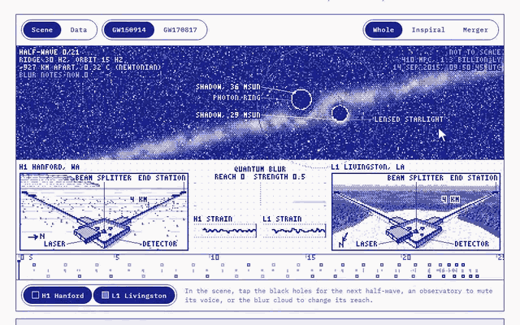</a> <b><a href="https://hrahman12.github.io/What-the-noise-remembers-MOTH-QUANTUM-HACK/pieces/12-chirp-instrument/">12 · Chirp Instrument</a></b> Play the last fifth of a second of two black holes.</td>
<td width="50%" valign="top"><a href="https://hrahman12.github.io/What-the-noise-remembers-MOTH-QUANTUM-HACK/pieces/13-moth-to-flame/">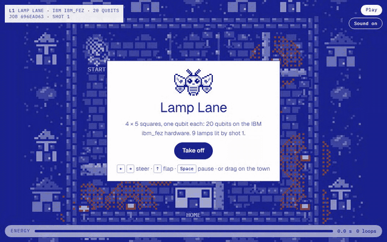</a> <b><a href="https://hrahman12.github.io/What-the-noise-remembers-MOTH-QUANTUM-HACK/pieces/13-moth-to-flame/">13 · Moth to Flame</a></b> Fly a moth home before the lamps catch it.</td>
</tr>
<tr>
<td width="50%" valign="top"><a href="https://hrahman12.github.io/What-the-noise-remembers-MOTH-QUANTUM-HACK/pieces/14-hemibrain-ising/">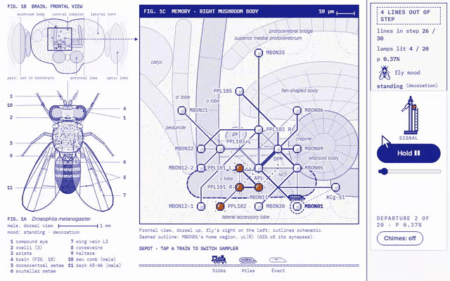</a> <b><a href="https://hrahman12.github.io/What-the-noise-remembers-MOTH-QUANTUM-HACK/pieces/14-hemibrain-ising/">14 · Fly Brain Metro</a></b> Ride the metro inside a fly's head.</td>
<td width="50%" valign="top"><a href="https://hrahman12.github.io/What-the-noise-remembers-MOTH-QUANTUM-HACK/pieces/15-tissue-blur/">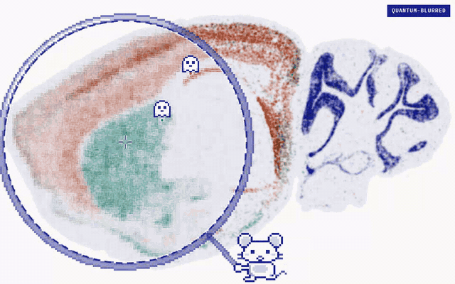</a> <b><a href="https://hrahman12.github.io/What-the-noise-remembers-MOTH-QUANTUM-HACK/pieces/15-tissue-blur/">15 · Tissue Blur</a></b> Slide a quantum lens across a mouse brain's genes.</td>
</tr>
<tr>
<td width="50%" valign="top"><a href="https://hrahman12.github.io/What-the-noise-remembers-MOTH-QUANTUM-HACK/pieces/16-busy-beaver-score/">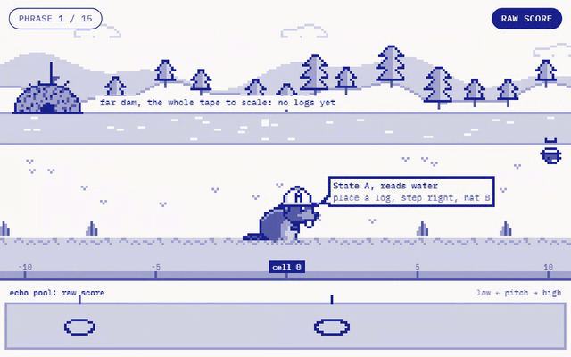</a> <b><a href="https://hrahman12.github.io/What-the-noise-remembers-MOTH-QUANTUM-HACK/pieces/16-busy-beaver-score/">16 · Busy Beaver Score</a></b> Scrub through the longest run a five-state machine can make.</td>
<td width="50%" valign="top"><a href="https://hrahman12.github.io/What-the-noise-remembers-MOTH-QUANTUM-HACK/pieces/17-quantum-lenia/">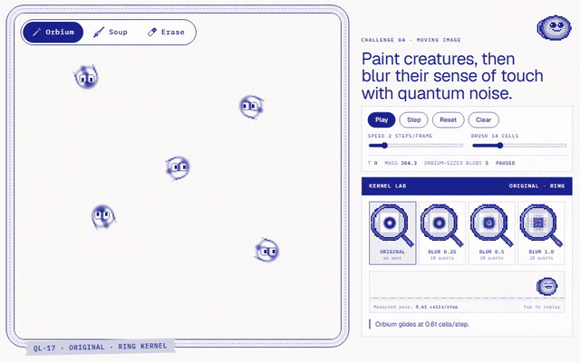</a> <b><a href="https://hrahman12.github.io/What-the-noise-remembers-MOTH-QUANTUM-HACK/pieces/17-quantum-lenia/">17 · Quantum Lenia</a></b> Paint creatures, then blur their sense of touch with quantum noise.</td>
</tr>
<tr>
<td width="50%" valign="top"><a href="https://hrahman12.github.io/What-the-noise-remembers-MOTH-QUANTUM-HACK/pieces/18-oldest-light/">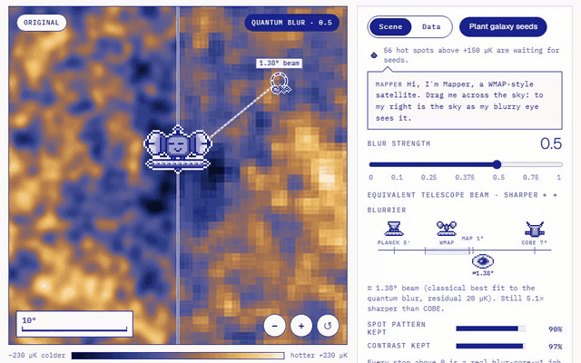</a> <b><a href="https://hrahman12.github.io/What-the-noise-remembers-MOTH-QUANTUM-HACK/pieces/18-oldest-light/">18 · Oldest Light</a></b> Blur the oldest light in the universe.</td>
<td width="50%" valign="top"><a href="https://hrahman12.github.io/What-the-noise-remembers-MOTH-QUANTUM-HACK/pieces/19-frog-chorus/">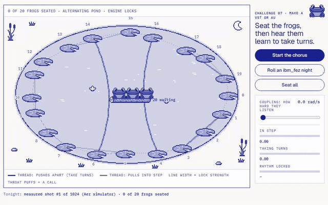</a> <b><a href="https://hrahman12.github.io/What-the-noise-remembers-MOTH-QUANTUM-HACK/pieces/19-frog-chorus/">19 · Frog Chorus</a></b> Seat the frogs, then hear them learn to take turns.</td>
</tr>
<tr>
<td width="50%" valign="top"><a href="https://hrahman12.github.io/What-the-noise-remembers-MOTH-QUANTUM-HACK/pieces/20-antimatter-drop/">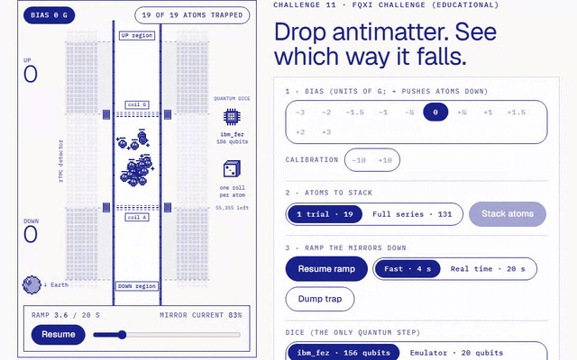</a> <b><a href="https://hrahman12.github.io/What-the-noise-remembers-MOTH-QUANTUM-HACK/pieces/20-antimatter-drop/">20 · Antimatter Drop</a></b> Drop antimatter. See which way it falls.</td>
<td width="50%" valign="top"><a href="https://hrahman12.github.io/What-the-noise-remembers-MOTH-QUANTUM-HACK/pieces/21-quantum-nose/">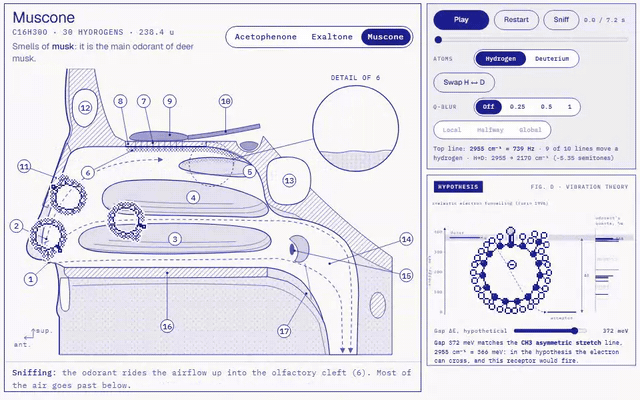</a> <b><a href="https://hrahman12.github.io/What-the-noise-remembers-MOTH-QUANTUM-HACK/pieces/21-quantum-nose/">21 · The Quantum Nose Test</a></b> Swap hydrogen for deuterium. Hear the molecule fall.</td>
</tr>
<tr>
<td width="50%" valign="top"><a href="https://hrahman12.github.io/What-the-noise-remembers-MOTH-QUANTUM-HACK/pieces/22-scroll-unroll/">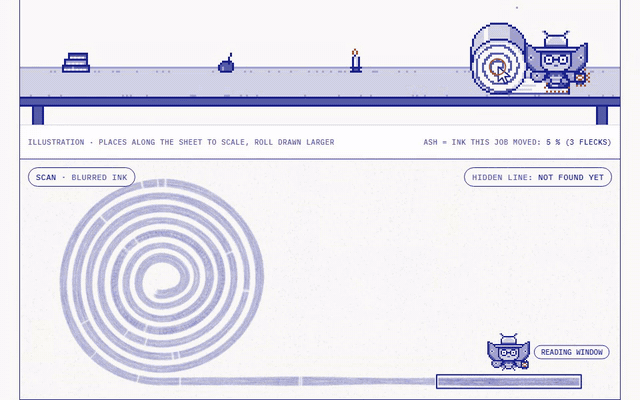</a> <b><a href="https://hrahman12.github.io/What-the-noise-remembers-MOTH-QUANTUM-HACK/pieces/22-scroll-unroll/">22 · Scroll Unroll</a></b> Unroll the scroll. Find the line hidden at its core.</td>
</tr>
</table>

Every image, sound and number in these pieces comes from real Moth Quantum Atlas jobs (simulators and IBM hardware).
Independent entry to Moth Hack 2026; not an official Moth Quantum project.

## How it's built

- **Real quantum jobs only.** Every quantum-derived image, sound and number replays a completed [Moth Quantum](https://mothquantum.com) Atlas job; each piece lists its job IDs. Most ran on Atlas simulators, and several ran on IBM hardware (ibm_fez, ibm_marrakesh, ibm_miami), up to a full 156-qubit chip. All 291+ jobs (engine, job ID, qubits, backend) are listed in [`cache/jobs_index.json`](cache/jobs_index.json); IBM jobs that failed on IBM's side are named on their pages, not hidden.
- **You're at the controls.** Nothing plays until you click; every piece is a game, instrument, or explorable scene.
- **Honest by design.** Simulator and hardware runs are labelled, analogies are named as analogies, and each piece has a "what this does not claim" section.

| Folder | What's in it |
|---|---|
| `docs/` | The live demo site (GitHub Pages): the hub plus every piece, all links relative |
| `entries/NN-slug/` | Each piece: code, data scripts, deliverables, and its `web/` page source |
| `atlas/` | The cached Atlas API client (per-piece credit caps, job ledger, offline replay) |
| `common/` | Shared style, sprite helper, build, QA, demo-recording and export tools |
| `site/` | The hub page source |

To rebuild with your own Atlas key, copy `.env.example` to `.env` and add `MOTH_API_KEY`. Raw datasets (LIGO strain, the MERFISH mouse brain and the hemibrain connectome) aren't stored here; each piece's scripts download them from their original sources.

An independent entry to Moth Hack 2026, built on Moth Quantum's Atlas engines. Not an official Moth Quantum project.
