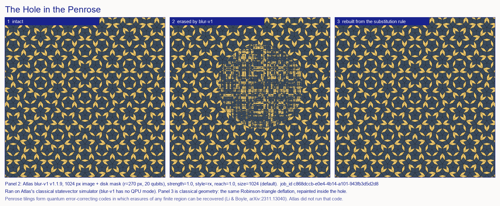

# The Hole in the Penrose

**Moth Hack 2026 · Challenge 01 — One image, one engine**



A Penrose tiling never repeats, yet every finite patch of it appears again and again across the
plane. Li & Boyle showed that this makes Penrose tilings quantum error-correcting codes: an erasure
of *any* finite region can be diagnosed and corrected from what surrounds it.

This piece erases a disk from a Penrose tiling with Atlas's **Quantum Blur** (`blur-v1`), applied
only inside a mask, and sets it beside the same patch rebuilt from the tiling's own substitution rule.

At full strength and full reach, the blur does not smear the hole. It rewrites it on a square
grid: the blocky pattern in panel 2 is the shape of the engine's Gray-coded qubit register showing
through, a periodic ghost inside an aperiodic pattern. At low strength and zero reach
(`out/blur_s0.3_rx_r0.0.png`) the original stars are still faintly visible.

## Play it

Interactive version: https://claude.ai/artifact/R49GmBq67MFTjLfe238rJF. Paint the pattern back with a brush, drag the hole to any of 9 computed positions, wipe to compare, flip through the 12-job sweep, switch from Scene to Data to take the cast off the canvas, and share a link to your exact view. Below the scene, six titled sections hold the rest: How to play, The data (hero.png and sweep.png redrawn live from the downloaded job images, plus a table of all 30 jobs; pick any one to load it; the page's figures add the dashed hole ring, and Figure 2 shows each job's 541 px box around the hole where sweep.png shows the full 1024 px frame), How it was made, The science, What this does not claim, and Jobs and credits. Just above the footer, links go to the previous and next pieces, to the hub of all 22, and to any piece by number. The piece is silent: it has no audio. The source is in `web/` (`web/template.html` + `build_web.py`); `qa/e2e.cjs` walks the whole journey in a headless browser.

### The cast

The page opens on a scene, not a chart. Two pixel-art moths in the shared ink palette (`web/sprites.json`,
drawn with `common/inksprite.js` on a device-resolution overlay at integer scale) live on the tiling:

- **The mender** is the repair brush. It carries a rhomb tile, flaps faster while you paint, flies around
  the hole during "Restore the rest", perches on the compare handle, and does a little hop when the
  pattern is whole. Restored tiles pop in with a sparkle. Its mascot export is `web/img/mascot.png`.
- **The nibbler** sits on the rim looking guilty, side-eyeing you. It startles (and sweats) when the
  mender comes close, chomps whenever a new engine job fills the hole, and flees when every tile is back.

Only one thing the moths show is data: the nibbler's belly (slim or plump) and its crumb pile come from a
classical measurement of each downloaded job image against the original, made in `build_web.py`: the
share of hole pixels whose colour moved by more than 10 % of full scale in any channel, and the mean
largest-channel shift. The 9 "scrambled" jobs change 52–54 % of hole pixels (mean shift 28–30 %), so the
nibbler is plump with a big pile; the 9 "faint memory" jobs change 39–40 % (mean shift 13 %), so it stays
slim. The readout prints both numbers for the job on screen. Everything else the moths do is decoration.

### How the page stores the engine images

blur-v1 only touches pixels inside the mask: outside the hole every downloaded output is bit-identical to
`intact.png`. So the page ships `img/intact.webp` once plus a lossless 541 × 541 WebP crop of each job
around its hole, and draws crop-over-original. The full downloaded PNGs stay outside the page folder, in
`out/` (sweep) and `out/positions/` (the 18 hole-position jobs). `build_web.py` asserts, for all 30 jobs, that this rebuilds
the downloaded PNG pixel for pixel. That cut the page from about 16 MB to 7.5 MB.

## Engine and parameters

- **Engine:** `blur-v1` v1.1.9, the only engine used
- **Input image:** `intact.png`, a 1024×1024 Penrose P3 tiling generated by `tiling.py`
- **Mask:** `mask.png`, a white disk of r = 270 px. Its 541 px bounding box needs ⌈log₂ 541⌉ × 2 = **20 qubits**, which is blur-v1's maximum. White = blurred; black = untouched
- **Hero parameters:** `strength = 1.0`, `style = rx`, `reach = 1.0`, `size = 1024` (default)
- **Hero job:** `c868dccb-e0e4-4b14-a101-943fb3d5d2d8`
- **Full 12-job sweep:** [PARAMS.md](PARAMS.md) and [sweep.png](sweep.png)

## What is quantum, what is classical

| Step | Kind |
|---|---|
| Tiling generation (`tiling.py`): Robinson-triangle deflation, 7 iterations | classical |
| Mask (`mask.py`) | classical |
| Blur inside the hole (`run_blur.py` → blur-v1) | quantum circuit, **run on Atlas's classical statevector simulator**. blur-v1 has no QPU mode |
| Rebuild (`rebuild.py`): re-run the same deflation, repaint the half-rhombs touching the hole | classical geometry; diff vs intact inside the mask = 0.00 % |

**What this claims:** a Penrose tiling's local recoverability is a theorem (Li & Boyle 2023). Panel 2
is a real, downloaded blur-v1 output, and its job ID is listed above and in `out/jobs.csv`.

**What it does not claim:** Atlas did not encode, protect or correct anything. The rebuild in panel 3
is a cartoon of recovery: it uses the generating rule, not a decoder reading the surrounding tiles.
Li & Boyle's Penrose code lives on the infinite plane, with finite-torus variants only for the
Ammann–Beenker and Fibonacci tilings, and whether it is usefully "quantum" is debated.

## Reproduce

```bash
pip install numpy pillow requests
python tiling.py && python mask.py
python run_blur.py        # needs MOTH_API_KEY in ../../.env; cached jobs re-run free and offline
python rebuild.py && python compose.py
python run_positions.py  # 18 jobs for the page (cached) -> out/positions/, web/positions.json
python build_web.py      # web/index.html, crops, files.json, mascot, out/sweep.json (MOTH_FREEZE=1 safe; deterministic)
```

Every completed job is cached under `../../cache/blur-v1/`, so `run_blur.py` replays without
network access once the sweep has run.
