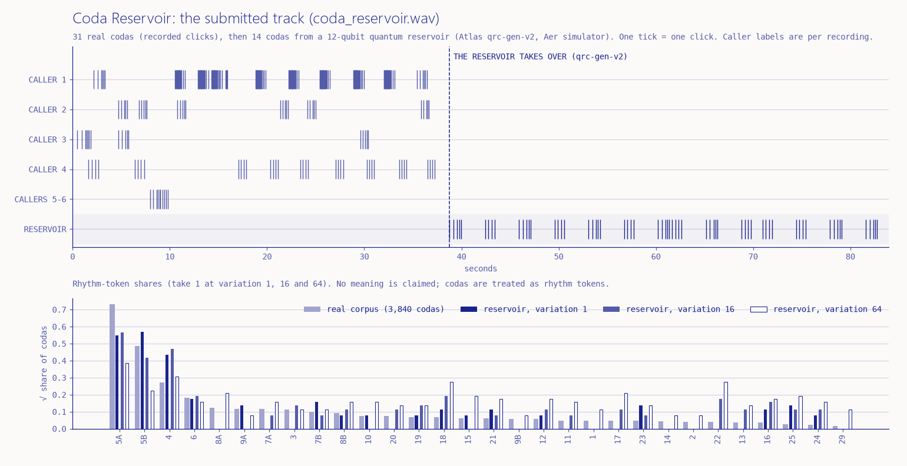

# Coda Reservoir

**Moth Hack 2026 · Challenge 02, Make it audible** · part of *What the Noise Remembers* (all 22 pieces are equal entries)



**Hear a 12-qubit reservoir click like a sperm whale.** A quantum reservoir (Atlas `qrc-train-v2` at
12 qubits, the engine maximum) was trained on the rhythm tokens of 3,840 real codas recorded off Dominica.
`qrc-gen-v2` then generated new click trains from it. The deliverable, `coda_reservoir.wav`, opens with a
real exchange between six labelled callers and hands over mid-conversation to the reservoir.

**No meaning is claimed; codas are treated as rhythm tokens.**

## Listen and play

- **Audio file (the deliverable):** [`coda_reservoir.wav`](coda_reservoir.wav), 83.96 s, 44.1 kHz, 16-bit
  stereo, 316 clicks, peak -1.01 dBFS.
  - **0.5 to 37.3 s:** 31 real codas from one recording (`sw061b002_14375`), at their recorded times and
    inter-click intervals, with callers 1 to 6 panned apart.
  - **37.3 to 38.8 s:** a 1.5 s pause.
  - **38.8 to 84.0 s:** 14 codas from qrc-gen-v2 job `d94c4495-fd40-4e98-81c9-8f3736edf66b`. Before
    generating, the engine warmed its reservoir up on exactly those 31 real tokens. The reservoir sits in the centre.
- **Interactive player:** `web/index.html` (the lead publishes it). The controls:
  - *Listen to*: **Real codas**, **Reservoir**, or **Real → reservoir** (the WAV).
  - For real codas, a whale label (All, 1, 2, 3 or 4).
  - For the reservoir, a variation level (0.25, 0.5, 1, 2, 4, 16, 64) and a take (seed 1 or 2). Every
    combination is a separate, real qrc-gen-v2 job.
  - Play and pause, back to start, ½× slow, a position slider, and drag or arrow keys on the timeline.

  **Scene first.** The page opens on a pixel-art sea, with the graphs in their own section below it. The cast lives
  in `web/sprites.json`, in the shared ink palette, and is drawn with the shared `common/inksprite.js` helper
  at whole-number scale with smoothing off:
  - four sperm whales for caller labels 1 to 4, a small far pod for the other callers, and the reservoir as a
    dotted whale built from 12 qubit dots (one per reservoir qubit);
  - at every click time in the track, the caller's head lights up and a ring goes out from its nose, and a
    bubble spells the coda: its token, then one dot per click spaced by the real timing (dots fill as they sound);
  - whales that are not in the chosen track turn pale. In the handoff, the reservoir sleeps and counts the
    31 real codas it was warmed up on, then wakes at the real split time ("the reservoir takes over");
  - tap a whale to hear only that caller label, tap the pod for all real callers, the reservoir for its
    tracks, or the research boat for the submitted track (keys 1 to 4, A, R and H on the focused scene); a tap
    on open water plays or pauses, like Space.

  What is data and what is decoration is labelled on the page: light, ring and bubble timings are the real
  click times; swimming, the boat, a tappable squid and the pattern on the 12 dots are decoration (the dots are
  not measured qubit states). The hub mascot `web/img/mascot.png` is the same whale, exported with
  `common/mascot.py` by `build_web.py`.

  **Titled sections below the sea**, always visible: *How to play* (the three steps and the keys); *The data*
  (its own Play button and clock, then the click timeline drawn lane by lane, whales 1 to 4, other whales and
  the reservoir, lighting up as they sound; a live histogram comparing the rhythm tokens played so far with the
  real corpus, with running statistics and a tap-to-read bar readout; and the *Does it sound like whales?*
  comparison table), each graph with its caption; *The submitted audio*; *How it was made* (drawers on the
  reservoir and on the sound); *The science*; *What this does not claim*; and *Jobs and credits* (all 14 job
  IDs, each generation job with a Listen button that loads and plays its track, plus data, paper and engine
  credits). The words and graphs of the pre-sprite page are kept verbatim; `history/restore_report.md` maps
  each one to its place.
  *Copy link to this moment* shares the exact track and position (for example `#res-v64-k1-t30.0`).

  Below the instrument, **The submitted audio** panel plays the deliverable itself on the page: an MP3 copy
  of `coda_reservoir.wav` (`web/audio/coda_reservoir.mp3`, 192 kbps, made with the bundled ffmpeg by
  `compose_audio.py`). It has Play/Pause, Stop, a position slider and a strip showing all 316 clicks of
  the track (real callers above, the reservoir's continuation below), with a playhead. Nothing loads or
  sounds until you press Play, and only one of the two players sounds at a time.

  The page follows the shared paper-and-ink look (`common/brand.css`): warm paper, one ultramarine ink,
  square panels, pill buttons and hairline rules. The timeline, histogram and strip are drawn in the same
  ink, with the reservoir in solid ink and real codas in the lighter ink. `hero.png` uses the same look; it is a
  static figure of the submitted track and its token shares (made by `figure.py` from the same events), not the
  pixel-art sea, which lives on the page only. Nothing plays until you press Play.

  **Connected to the set.** The brand bar links to the *What the Noise Remembers* hub. Above the footer, the
  shared navigation from `common/nav.py` (inserted by `build_web.py` at the `<!--NAV-->` marker) links to the
  previous piece (01), the hub ("All 22 pieces") and the next piece (03), and has a "Jump to any piece" list.

## Workflow summary

| # | Step | Where it ran | Script | Output |
|---|---|---|---|---|
| 1 | **Data.** `sperm-whale-dialogues.csv` from Zenodo record 10.5281/zenodo.10817697 (CC BY 4.0, verified on the record page). It holds 3,840 codas in 219 recordings, each with REC, nClicks, Duration, ICI1..ICI28, Whale and TsTo. Only the first nClicks-1 ICIs are used. | classical | (download) | `data/` |
| 2 | **Tokenise.** token = click count + rhythm letter. The letter comes from our own k-means (k-means++, 20 restarts, seed 3617) on duration-normalised ICIs, fitted per click count. A count is split only if it has at least 60 codas, the silhouette is at least 0.45 and every cluster has at least 8 members. Result: **30 tokens**. 5-click codas split into `5A` (2,047, two long gaps then three short) and `5B` (902, fast and even); 7, 8 and 9 clicks also split in two. | classical | `tokenise.py` | `out/tokens.json` |
| 3 | **Train.** `qrc-train-v2` on all 3,840 tokens in recording order: `num_qubits` 12, `sample_length` 16, `washout` 4, `mode` order, `sample_fraction` 0.125, `epochs` 100, `shots` 3000, `mixing` 0.7, `num_random_gates` 10, `seed` 3617. Job `ca93fb54-f7d5-4b58-b540-de8137d57536` took 2,133 s. The engine's own training loss fell from 7.46 to 0.10 over 100 epochs. That is measured on training windows, not held-out data. | **quantum circuit on Atlas's Qiskit Aer simulator** (no QPU mode) | `run_reservoir.py` | model state (2.7 MB, in cache) |
| 4 | **Generate.** 13 `qrc-gen-v2` jobs. Each loads the pristine trained state by reference (`input_files.state` = the training job's `state` output asset ID). Seven variation levels (0.25 to 64) with `random_seed` 1, a second take (seed 2) at 0.25 to 4, and one "handoff" job warmed up on the WAV's 31 real codas. Every job asks for 160 tokens and gets 160. | **Aer simulator** | `run_reservoir.py` | `out/jobs.json`, `out/status/` |
| 5 | **Lay out time.** Real codas keep their recorded ICIs and start times, and silences over 2.5 s are capped at 2.5 s. Generated tokens play as the token prototype (mean normalised rhythm × median duration). The silence before each one is drawn from the real end-to-start silences, clipped to 0.3–2.5 s, with a seeded RNG. Classical baselines and metrics are computed here too. | classical | `build_events.py` | `out/events.json` |
| 6 | **Synthesise.** One synthetic broadband click (a 0.5 ms decaying noise burst through 2.2 kHz and 0.9 kHz resonators, normalised) placed at every click time. Callers are equal-power panned, a small synthetic reverb is added, and the mix is normalised to -1 dBFS. The click is **pitched down for audibility**: half its energy lies below about 2.7 kHz and 90% below 6.8 kHz (measured). Only the click's colour changes; timing is real-time 1:1. No recordings are used. | classical | `synth.py`, `compose_audio.py` | `coda_reservoir.wav`, `web/audio/coda_reservoir.mp3` |
| 7 | **Page.** Inlines the events, the exact click samples and the reverb impulse, so the page sounds like the WAV. It replays cached job outputs and never calls Atlas. | classical | `build_web.py` | `web/index.html` |

## Engines, parameters and qubits

- **qrc-train-v2 (QRC Train)**, 1 job, 5 credits. **12 qubits.** This is the schema maximum. A free probe
  with `num_qubits: 13` returned HTTP 422 "maximum: got 13, want 12" (`out/probe_13_qubits.txt`). The
  returned model state echoes `"num_qubits": 12` and `"input_dimension": 12`, and its readout is a
  4,096 × 30 matrix (4,096 = 2^12).
- **qrc-gen-v2 (QRC Generate)**, 13 jobs, 1 credit each. Each reuses that 12-qubit model, so every
  generation job also runs on **12 qubits**.
- **Total:** 14 completed jobs, **18 of 20 credits** (ledgered by `atlas.client`). No hardware was used:
  these engines run on the Atlas Qiskit Aer simulator only.
- Every job ID and parameter is listed in [PARAMS.md](PARAMS.md).

## Quantum vs classical

| Part | Kind |
|---|---|
| Coda data, tokenisation, k-means | classical |
| Reservoir steps during training (qrc-train-v2) | quantum circuit, **simulated** (Qiskit Aer on Atlas) |
| Readout training inside qrc-train-v2 (weights on the measured outcomes) | classical, inside the engine |
| Reservoir steps during generation (qrc-gen-v2) | quantum circuit, **simulated** (Qiskit Aer on Atlas) |
| Softmax sampling of the next token inside qrc-gen-v2 (`variation` = temperature) | classical, inside the engine |
| Timing of generated codas (token prototypes, silence draws) | classical |
| Click synthesis, pitch-down, panning, reverb, mixing | classical |
| Baselines (independent draws, Markov chain) and all statistics | classical |
| Interactive page (WebAudio playback, the pixel-art scene, drawing) | classical, in your browser |

## What we found

- **The variation setting changed less than expected.** Every take used a fixed `random_seed`:
  - **0.25 and 0.5:** identical, coda for coda, for both seeds.
  - **1:** the same as 0.25 and 0.5 for its first 155 codas (seed 1) or 93 codas (seed 2).
  - **2 and 4:** share their first 64 codas (seed 1) and are identical for seed 2.

  In this range the seed mattered more than the temperature. That is consistent with a very confident readout,
  though we have not inspected the logits. We added **16** and **64**, where the output finally loosens. At 64,
  all 30 tokens appear, only 11% of codas repeat the previous type (real: 61%), and 43% of adjacent pairs
  never occur in the real data.
- **Every default warm-up opens the same way:** `25`, then `16` (or `25` at variation 64).
- **The classical Markov chain is closer to the real data than any reservoir take** on our measures. Its mean
  total-variation distance from the real token mix is 0.130, against 0.145 to 0.300 for the reservoir at
  variation ≤ 4. The reservoir's same-type repeat rate (47–73%) brackets the real 61%. The Markov chain matches
  61% exactly and never produces an unseen pair. We report this rather than claim the reservoir models codas better.
- **The handoff.** After warming up on the real stretch, the reservoir's first 10 codas alternate `5A` and `4`.
  Throughout the real stretch, caller 4's `4` codas are interleaved with `5A` codas from callers 2 and 3. This
  is an observation about one sample, not evidence of anything general.

## What this claims, and what it does not

- **Claims:**
  - Every reservoir sequence is a real, ledgered Atlas job, and its job ID is shown on the page and in PARAMS.md.
  - The WAV's real section uses the recorded ICIs and times. Its reservoir section is the token sequence the
    engine returned, played through a classical renderer.
- **Does not claim:**
  - **No meaning is claimed; codas are treated as rhythm tokens.** Nothing here translates, decodes or speaks whale.
  - No quantum advantage. The reservoir ran on a classical simulator of a quantum circuit, and a classical
    Markov chain does at least as well on our statistics.
  - Our 30 tokens are not the rhythm types of Sharma et al.
  - The reservoir has no notion of who is calling; its codas sit in one lane in the centre.
  - The click is synthetic and does not model a real sperm-whale click's spectrum.

## Data notes

- **Whale labels are per recording.** The `Whale` column holds only 11 labels across 219 recordings, while the
  paper estimates at least 60 whales in the DSWP data. So "whale 2" means "the caller labelled 2 in that
  recording", not one animal. The page says so wherever you pick a whale.
- **Near-zero ICIs.** Nine codas contain ICIs of 1–7 µs (near-duplicate click annotations). We keep the data as
  published; each such pair sounds as one louder click.
- **Corpus size.** The paper describes a time-ordered DTag dataset of 3,948 codas. The repository's
  `sperm-whale-dialogues.csv` has 3,840 rows, and we use exactly those.

## Reproduce

```bash
pip install numpy scipy matplotlib requests imageio-ffmpeg     # all pre-installed here
python tokenise.py
python run_reservoir.py probe train sweep handoff takes   # needs MOTH_API_KEY in ../../.env; cached jobs replay free
python build_events.py && python compose_audio.py && python build_web.py && python figure.py && python make_docs.py
node web/test_page.js                                     # unit tests for the page logic
(cd ../.. && node common/qa/qa_page.cjs entries/02-coda-reservoir 5100)   # headless page QA -> qa/
(cd ../.. && node common/qa/deadcontrols.cjs entries/02-coda-reservoir 6230)   # every control does something
node qa/e2e.cjs 6240                                      # end-to-end journey with assertions -> qa/e2e.json
```

With `MOTH_FREEZE=1` set, every script reproduces these outputs from `../../cache/` and `out/status/` without
submitting a job.

## Files

- `coda_reservoir.wav`: the deliverable. `hero.png`: the figure above.
- `tokenise.py`, `codas.py`, `run_reservoir.py`, `build_events.py`, `synth.py`, `compose_audio.py`,
  `build_web.py`, `figure.py`, `make_docs.py`: the pipeline.
- `out/`: tokens, job records, the engines' status responses, events and WAV info.
- `data/`: the CSV, the upstream README and saved copies of the Zenodo licence page.
- `web/`: `template.html`, `index.html`, `files.json`, `sprites.json` (the pixel cast and its 3x5 font),
  `img/mascot.png`, `audio/coda_reservoir.mp3`, `test_page.js`.
- `qa/`: the page QA report (`report.json`) and its desktop, phone and after-clicks screenshots; the
  dead-control report (`deadcontrols.json`; its two remaining flags are checked false positives: the detector
  drags on the sea after an earlier link has scrolled it out of view, and moves the WAV slider to End and
  straight back to Home; in view, the same drag plays or pauses, and End alone moves the WAV clock to 84.0 s);
  and `e2e.cjs`, a Playwright walk through the whole journey (no autoplay, nav links, proof chips against
  piece.json, play and pause, the handoff, every track picker against the job IDs in PARAMS.md, tapping whales
  and open water, the sea and every restored graph drawn as non-empty canvases, the timeline and histogram
  redrawing as the track plays, The data section, every titled section, the drawers, the jobs table's Listen
  buttons, the share link restored on reload, and the submitted-WAV player), with its result in `e2e.json`.
- [PARAMS.md](PARAMS.md) lists the jobs, [CREDITS.md](CREDITS.md) the data, paper and software, and
  `piece.json` the hub metadata.
