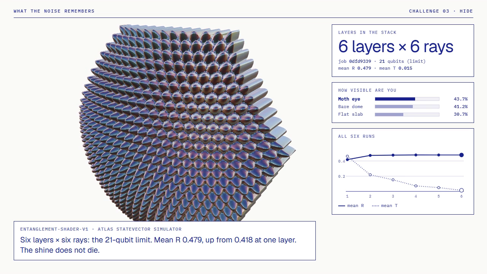
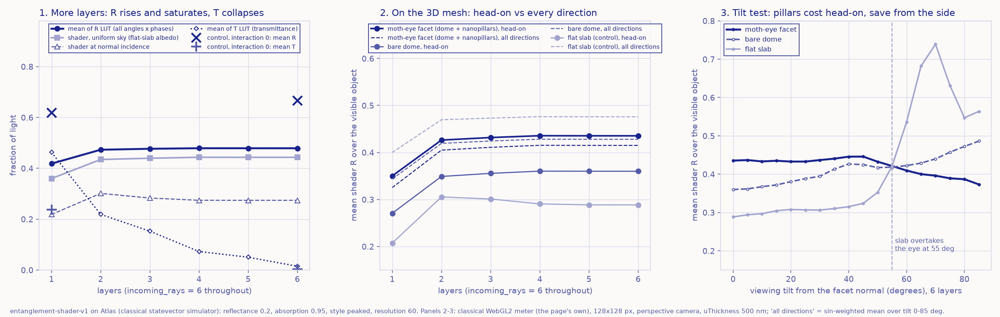

# Moth Eye

**Moth Hack 2026 · Challenge 03, Three dimensions** · *What the Noise Remembers* · Hide



A night-flying moth's eye is carpeted with nanopillars about 200 nm apart, and they stop it glinting
at predators. This piece builds a procedural moth-eye facet (a domed hexagon covered in a hexagonal
array of paraboloid nanopillars), plus a bare dome and a flat-slab control. It shades all three with
Atlas's **Entanglement Shader**, a quantum collision model of light in a stack of conducting sheets,
and asks one question: **does the shine die as you add layers?**

**It doesn't.** We report that as measured:

| | 1 layer | 6 layers (21-qubit limit) |
|---|---|---|
| mean of the engine's R table (60×60, all angles × phases) | 0.418 | 0.479 |
| mean of the engine's T table | 0.463 | 0.015 |
| same, nonlinear interaction **off** (control runs), mean R | 0.619 | 0.666 |
| moth-eye facet seen head-on (page meter) | 0.350 | 0.435 |
| flat slab seen head-on (page meter) | 0.207 | 0.288 |
| moth-eye facet, averaged over every viewing direction | 0.325 | 0.415 |
| flat slab, averaged over every viewing direction | 0.400 | 0.476 |

- More layers make the stack **slightly more reflective**, and the change stops after about four layers.
  What collapses is transmission: the film becomes an opaque, slightly shinier mirror.
- Switching the engine's nonlinear interaction off raises R further (and lowers T), so in this engine
  the interaction terms hold reflectance down, not the layer count. That direction matches the remark
  in the paper behind the engine: at interaction strength 1 its chosen interaction structure favours
  transmission, while weak interaction gives the generic rise of reflectance with layers. The paper
  used different parameters, so we only compare the direction.
- The nanopillars change *where* the shine goes. Head-on they make the facet brighter than a flat
  slab, because you see the pillar walls near grazing, where the table climbs towards 1. Past about
  55° of tilt the slab turns into a mirror (up to 0.74) and the pillared facet stays near 0.40.
  Averaged over every direction a predator could look from, the pillared facet is about 13 % dimmer
  than the slab. That is a geometric-optics effect, not the real moth-eye mechanism (see below).

## Use it

The interactive page is `web/index.html`, in the shared brief-page look (paper and one ultramarine ink).
It opens on an **engraved scientific plate** (see *The plates* below): a hawkmoth's head in profile on a
twig, with its compound eye, labial palp, coiled proboscis, antenna and scales labelled. A magnifier
callout zooms from the eye to its hexagonal facet lenses at ×300 (with a 30 µm scale bar), and a second
callout zooms from one facet into the round **loupe**, which holds the live three.js facet covered in
corneal nipples (24 across instead of the real ~150; the loupe's label says so). An incandescent lamp hangs
where the light pad points, and a big brown bat flies at your viewing angle. Nothing big moves until you
do. The film plays on the page too, in a `<video>` player that starts only when you press play (the film is
silent, so the page makes no sound).

1. **Orbit** the eye in the loupe: drag it, pinch or scroll to zoom, or focus it and use the arrow keys and +/−.
   The bat flies along its arc to your viewing tilt (level with the loupe = head-on, overhead = grazing).
2. **Move the lamp** on the light pad (arrow keys work too), or drag across the sky; the bulb follows.
   *Torch test* puts the lamp behind the bat's head.
3. **Stack layers** from 1 to 6. Each step swaps in the lookup tables of a different real Atlas run,
   and ten dots of lamp light replay how the run's mean R and T split them (back, through, the rest).
   At 1 and 6 layers you can also switch the nonlinear interaction off (the control runs).
4. **Compare**: moth eye, bare dome, flat slab, or eye and slab side by side. *Raw R* shows the engine
   shader's output with no scene lighting.

**What the bat sees** (the meter under the scene) re-renders each geometry off-screen from your exact
viewpoint and averages the engine reflectance over the pixels it covers: the fraction of a uniform sky's
light the object sends back toward the bat. An engraved bat's head (the meter) opens its eyelid in eight
steps with that number (shut at 22 %, wide at 72 %). "Hidden" (< 32 %), "Glimpsed" and "Spotted" (≥ 50 %)
are our own bands; the flying bat swoops toward the loupe when the meter crosses into "Spotted". *Flash* is
the share of the surface that mirrors the lamp straight at the bat, and it draws the glint on the moth's
eye. Everything else in the scene (the bat's wingbeat, the stars, the marching lamp rays) is decoration,
and the page says so under the scene.

**Below the scene**, titled sections hold the rest (restore pass, 5 Oct 2026: the words and graphs of the
earlier page are back, verbatim, see `history/inventory.md` and `history/restore_report.md`):
*The data* (always visible: reflectance and transmittance against layers with the controls, the tilt test
with its own *Sweep the tilt* button, the R lookup table of the current run, and the verdict), *The real
eye, plate by plate*, *The film*, *The science*, *How it was made*, *What this does not claim* and *Jobs and
credits* (every run, each loadable with one press). The meter carries the earlier per-geometry bars again.
*Copy link to this view* stores the whole state in `#token`; old links ending `_vD` open at *The data*.
In the layer plot each column of four points is one run, so a click anywhere in a column (or Enter on it)
loads that run. At the foot of the page, the shared navigation (`common/nav.py`, inlined by `build_web.py`)
links to the previous piece, the hub of all 22 pieces and the next piece, with a jump list of every piece.

### The plates (realism pass, 5 Oct 2026)

The user asked for the subject to be drawn as it really is, so the cartoon cast (a big-eyed moth, a
cartoon bat, a smiling bulb) is retired; its script and sprites are kept for reference in
`qa/make_sprites.cartoon-cast.py` and `qa/sprites.cartoon-cast.json`. `make_plates.py` now draws every
illustration as an SVG ink engraving in the shared palette (ink tones on paper, orange only for light):
hatching, scale-by-scale and hair-by-hair texture, hairline leaders and numbered callouts. Nothing is
traced from or embedded from a photo; every shape is generated from geometry written down from published
descriptions and measurements (sources in CREDITS.md):

| Plate | What it shows | Numbers it follows |
|---|---|---|
| `head` (the scene) | a hawkmoth (Sphingidae) head in profile, facing right: scaled head capsule, compound eye, upcurved labial palp, coiled proboscis (two galeae zipped into one tube), scape, pedicel and annulated flagellum with sensilla, collar and thorax hair-scales, fore- and midleg with tarsomeres and claws, on a twig | *Manduca sexta*: ~27,000 facets of ~30 µm → a ~1.85 mm eye radius; drawn in millimetres with a 1 mm scale bar. The facet mesh on the head is ~5× coarser than real so it reads on screen (the page says so) |
| `mosaic` (inset) | the eye surface at ×300: hexagonal facet lenses, each a low dome | 30 µm facets, with a 30 µm scale bar |
| loupe | the live three.js facet covered in corneal nipples | nipples ~200 nm apart; 24 across the facet instead of ~150 |
| `bat` (3 wingbeat frames) | a flying big brown bat (*Eptesicus fuscus*) seen from below: forearm, thumb claw, digits 2–5, wing membranes with elastin bundles, tail membrane with calcar, short round-tipped ears with tragus, open mouth | span ~330 mm (published 325–350 mm); ears ~12 mm |
| `face` (the meter) | the same bat's head in profile: short ribbed ear, rounded tragus, bare broad snout with a glandular swelling, fleshy lips, open mouth with canines (*E. fuscus* calls through its mouth) | ears 12–13 mm with rounded tips; the page draws the eye and its 8-step lid |
| `bulb` | a clear incandescent lamp in a lampholder: envelope, coiled tungsten filament on lead-in and support wires, glass stem, screw base | A60 envelope, E27 base |
| `omma` (Plate I) | four ommatidia of a superposition eye cut lengthwise: corneal lens with its nipples, crystalline cone, pigment cells, clear zone, rhabdoms, tracheal tapetum, basement membrane; parallel rays from one point meeting on one rhabdom | 30 µm facets to scale, depth compressed; nine retinula cells per ommatidium in *Manduca* |
| `nipples` (Plate II) | the corneal nipple array, top view with a 5–7 defect between domains, and a side view at the same scale as a 500 nm wave of green light, with the graded index from air (n = 1) to cornea (n ≈ 1.5) | 180–240 nm spacing, up to ~250 nm tall |

`build_web.py` inlines `web/data/plates.json` (SVG fragments plus anchors) into the page. The one pixel
sprite left is the hub mascot: `make_sprites.py` rasterises the same head geometry (96 × 96, five ink
tones, framed as a loupe) into `web/sprites.json`, and `common/mascot.py` renders it to
`web/img/mascot.png` at 2× (192 × 192). The page still inlines `common/inksprite.js` (its palette is shared
by the scene code). `prefers-reduced-motion` freezes the bat's wingbeat, the lamp rays and the glint flash.

## The brief's deliverables

- **`moth_eye.mp4`**: 52 s, 1280×720, 30 fps. The shader on the 3D mesh, rendered offline frame by
  frame by `render/render.cjs`. It uses the same WebGL2 code as the page (`web/src/core.js`), running
  in headless Chrome (GPU, ANGLE/D3D11), and pipes PNG frames into ffmpeg/libx264. The film steps
  through layers 1→6 (each a real run), shows the raw engine output, then puts the eye beside the
  slab from head-on to grazing. It is silent and uses the same paper-and-ink look as the page.
  `make_web_media.py` re-encodes it smaller for the page (`web/video/moth_eye.mp4`, H.264, crf 28) and
  writes the poster frame (`web/img/film-poster.webp`) and `hero.png` from the 6-layer shot.
- **`reflectance_vs_layers.png`** (below): (1) engine R and T against layers, with the controls; (2) the same
  LUTs on the 3D mesh, head-on and averaged over directions; (3) the tilt test at 6 layers. It is drawn in the
  page's paper-and-ink look. *The data* on the page draws the same numbers live: mean R and T against layers
  with the interaction-off controls' mean R, the moth-eye head-on value and the flat-slab sky value, and the tilt
  test (eye, dome and slab from head-on to 85°) for whichever run you pick. Only the shader-at-normal-incidence
  line, the controls' mean T and the per-run all-directions averages are in this PNG alone (the page's verdict
  quotes the 6-layer averages).
- The raw engine outputs: each run's ZIP (GLSL, HLSL, OSL, Marmoset .frag, MaterialX and the R/T
  EXR/HDR tables) is in `out/jobs/<tag>.zip`, unpacked next to it.



## Engine, parameters, qubits

- **Engine:** `entanglement-shader-v1` (Atlas), 1 credit per run, classical **statevector simulator**
  (the engine has no QPU mode). It returns a ZIP of shaders and two 60×60 float32 lookup tables, R and
  T, indexed by interlayer phase (columns) and incidence angle (rows, 0 to 90°).
- **Fixed parameters:** `reflectance` 0.2, `absorption` 0.95. `interaction` 1, `style` "peaked" and
  `resolution` 60 are left at the engine defaults.
- **Sweep:** `layers` 1, 2, 3, 4, 5, 6 with `incoming_rays` fixed at 6, so only the layer count changes.
  **Controls:** `interaction` 0 at 1 and 6 layers.
- **Finding the maximum (probing).** Layers and rays share a 21-qubit budget, and the engine checks it
  only once a job starts, not at submission. So every probe was a real, ledgered job (see PARAMS.md).
  The failure messages give the largest allowed ray count for each layer count: 21 layers allows −5,
  8 allows 5 and 7 allows 5. The engine also needs `incoming_rays ≥ layers`, so 7 or more layers is
  impossible. At 6 layers, 6 rays ran and 7 rays were rejected ("at most 6"). **6 layers × 6 rays is
  the largest valid stack, and it sits exactly at 21 qubits**: one more ray, which is one more qubit
  (each mode is one qubit in the model), breaks the budget.
- **Qubits per run:** the engine reports no per-job qubit count. The 6×6 run is 21, as established above.
  For the smaller runs we fit the engine's messages with *q = rays + layers − ⌊layers/4⌋ + 10*. It
  reproduces all five probe outcomes (`tests/test_core.cjs` checks this), which gives ≈17, 18, 19, 19
  and 20 qubits for 1–5 layers. That fit is ours, not documented by the engine, so the page labels those
  values "about".

## What is quantum, what is classical

| Step | Where it ran |
|---|---|
| R/T lookup tables (collision-model circuits, 6 sweep runs and 2 controls) | **quantum circuits simulated on Atlas's classical statevector simulator** |
| Budget probes (4 rejected jobs, 1 completed) | Atlas validation at job start |
| Mesh: dome, hexagonal paraboloid nanopillars, flat slab (`geometry.py`, `web/src/core.js`) | classical |
| Shading: the engine's own GLSL, ported line by line to WebGL2 (`texelFetch` bilinear, REPEAT/CLAMP) | classical (GPU); checked against a NumPy port to within 0.5/255 |
| Meter, tilt test, head-on and all-direction averages | classical arithmetic on the downloaded LUTs |
| Night sky, lamp and tone mapping in "Night scene" | classical, our own artistic choice |
| Film (`render/render.cjs`), plot (`plot.py`) | classical |

## What this claims and what it doesn't

**Claims:** every reflectance and transmittance number comes from lookup tables downloaded unchanged
from the eight Atlas jobs listed in PARAMS.md. The 6×6 stack is the largest the engine accepts under its
21-qubit budget. Within this model, adding layers does not reduce reflectance.

**Does not claim:**
- This is an **analogy**. Real moth eyes suppress reflection because their nanopillars are smaller
  than the wavelength. Arriving light sees a graded refractive index, not separate surfaces
  (Clapham & Hutley 1973). The engine models a stack of thin conducting sheets with quantum-optical
  interactions. Shading pillars facet by facet is geometric optics, which breaks down at the real
  pillar scale. Our facet is only 24 pillar pitches across so you can see the pillars.
- The tilt result (pillars dimmer from the side, brighter head-on) is a property of this geometric
  model. It does not explain real moth eyes.
- No quantum hardware was used and no quantum advantage is claimed. The engine's description says
  "no classical shader can replicate" its output. We neither test nor repeat that claim.
- Some table values exceed 1 (2.7–6.5 % of bins, near grazing). The engine documents its output as
  HDR, and we use the values unclipped.

## Reproduce

```bash
pip install numpy matplotlib OpenEXR          # OpenEXR 3.x was installed for this piece (EXR reader)
python record_probes.py      # re-reads the 5 probe jobs' status (GET only); keeps out/probes.json offline
python run_shader.py         # 8 shader jobs; cached in ../../cache/entanglement-shader-v1/, free and offline on re-run
python analyze.py            # LUT stats -> out/reflectance.json, web/data/luts.json
python build_web.py          # web/index.html and render/render.html
cd render && npm install && node measure_views.cjs && cd ..   # GPU meter at fixed tilts -> out/view_sweep.json
python plot.py               # reflectance_vs_layers.png (+ view averages into out/reflectance.json)
python build_web.py          # rebuild with the tilt data
node render/render.cjs       # moth_eye.mp4 (needs Chrome; set CHROME=... if it is not in the default path)
python make_web_media.py     # web/video/moth_eye.mp4 (smaller page copy), web/img/film-poster.webp, hero.png
python make_plates.py        # the engraved plates -> web/data/plates.json (+ previews in qa/plates/)
python make_sprites.py       # the mascot sprite (the head plate, rasterised) -> web/sprites.json
python ../../common/mascot.py web/sprites.json mothhead web/img/mascot.png --scale 2
python build_web.py          # final page build; writes web/files.json (two media files + the mascot)
node common/qa/qa_page.cjs entries/03-moth-eye 5740   # from the project root: headless page QA -> qa/
node common/qa/deadcontrols.cjs entries/03-moth-eye 6200   # from the project root: every control changes something
node entries/03-moth-eye/qa/e2e.cjs 6210   # from the project root: the end-to-end journey (Playwright) -> qa/e2e.json
node render/shots.cjs 5741   # review screenshots at 1280 px and 375 px -> qa/shot-*.png
node tests/test_core.cjs && node render/check_gpu.cjs && node render/check_page.cjs
```

`render/package.json` pins `puppeteer-core` 24 and `three` 0.134.0. The film loads that local three.js
r134 build, which is the same version the page loads from cdnjs. Every completed Atlas job is cached, so with
`MOTH_FREEZE=1` the whole pipeline replays without submitting anything.
