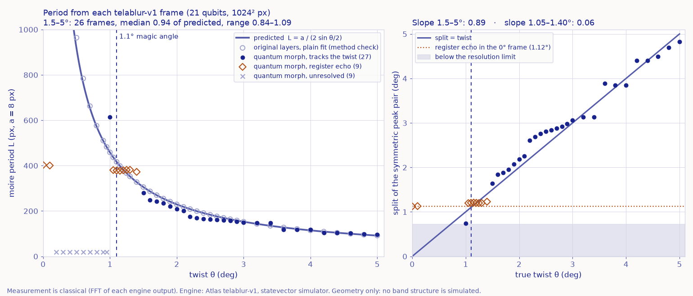

# Magic Angle

**Moth Hack 2026 · Challenge 04: Moving image · What the Noise Remembers (Hide)**

> Twist two honeycombs. Find the order hiding in the noise.



Lay one honeycomb lattice on another and twist it by a degree or so, and a much larger moiré superlattice
appears. Its period is L = a / (2 sin θ/2). Near θ ≈ 1.1°, the "magic angle", twisted bilayer graphene
superconducts (Cao et al., Nature 2018).

This piece puts the two layers into **one 21-qubit quantum state** with Atlas's `telablur-v1`: 20 qubits
address the 1024 × 1024 pixels and 1 selector qubit says "layer A or layer B". It runs that morph at 45
twist angles from 0° to 5°. The morph scrambles the bilayer into speckle. A classical FFT then reads
each frame's moiré period back out of the noise and checks it against a / (2 sin θ/2).

**What the noise remembers:** from 1.5° to 5°, all 26 frames give a period that tracks the twist (median
0.94 of the prediction, range 0.84 to 1.09). **What it forgets:** near 1.1° the reading locks onto an
echo of the qubit register. The untwisted frame shows the same echo, a symmetric peak pair 1.12° apart.
By coincidence that sits on the magic angle itself, so here the magic angle is *not* resolved.

## Deliverables

| File | What |
|---|---|
| `magic_angle.mp4` | **The brief's deliverable.** 30 s, 1920×1080, 30 fps, H.264. Original vs quantum-morph moiré side by side, a raw 1:1 crop of each engine frame, on-screen θ, predicted and measured period, the status of each reading, and the plot building up. Same brief-page look as the page; it shows the measurement views only, not the page's turntable cast (Ay, Bee, Lec, Echo), which is interactive and lives on the page. One wording differs: the film badges only the 1.10° frame "MAGIC ANGLE" (with "register echo (also in the 0° frame)" beside it, and its end card says the magic angle is not resolved), while the page marks 1.0–1.2° as the "magic angle zone · not resolved". |
| `measurement_plot.png` | Measured period vs a / (2 sin θ/2) for all 45 frames (left), and the split the FFT found vs the true twist (right). |
| `web/index.html` | The interactive instrument (built by `build_web.py`; media in `web/img/` and `web/video/`, publish map in `web/files.json`). |
| `web/sprites.json` | The pixel-art cast, made by `make_sprites.py` in the shared ink palette and inlined into the page; `web/img/mascot.png` is Lec, exported with `common/mascot.py`. |
| `web/video/magic_angle_web.mp4` | The same film re-encoded for the page (1920×1080 H.264 CRF 24, about 2.2 MB, no audio track), played in a `<video controls>` element. Nothing plays until the user presses play. |
| `PARAMS.md` | Every job: params, qubits, backend, job_id, measured period and status. |
| `out/measure.json` | Every frame's angular profile, both measurement rules, the method check, and the summary. |
| `qa/e2e.cjs` | The end-to-end journey test (Playwright): turntable, keys, slider, sources, lens, sweep, Frame / Data, the restored sections and both charts, the jobs table, drawers, share link and reload, the film, and the shared nav. |

## Play it

The page opens on a **scene**, not a chart: a twist turntable drawn in pixel art, with the real engine frame on the record.

- **Spin the turntable.** Drag around its rim (or use the slider, arrow keys, Home / End). The rim is the twist dial from 0° to 5°, one tick per real frame; 1.1° sits at 12 o'clock under a hatched **magic angle zone** (1.0–1.2°). Everything snaps to the 45 computed angles.
- **The cast** (`make_sprites.py` → `web/sprites.json`, drawn with the shared `common/inksprite.js`):
  - **Ay and Bee**, the two honeycomb layers (image1, image2), stand either side and turn by −θ/2 and +θ/2. Their tilt is drawn 8× so it is visible; the tags under them give the true angles. They strain while you drag, and their faces follow the reading below.
  - **The tone arm** is the classical FFT read-out. Needle down: a period was read (the symmetric-pair rule on the morph, the method check on the original). Skipping, with **Echo**, a little register ghost: the frame is flagged null. Lifted: unresolved.
  - **Lec, the electron** (the hub mascot, `web/img/mascot.png`) hops between AA spots, where the layers are in register, on a lattice built from the period that was actually read: `a / (2 sin θ/2)` geometry scaled to the FFT's L on the morph, or to the method check's L on the original. The unit tests check that these spots are where the two layers' first-shell Bragg phases agree. Nothing read: Lec naps. Echo: Lec gets dizzy. Lec is a cartoon; no electrons are simulated.
  - Poke Ay, Bee or Lec for a hop. Blinks, bobs and hop timing are decoration; moods follow `out/measure.json`. Motion stops under `prefers-reduced-motion`.
- **Original / Quantum morph** flips the record between the two input layers and the telablur output (hold Space on the picture to peek at the other one). **Lens: Moiré envelope / Raw pixels** switches the record between the classical FFT band-pass of the full frame and the centre 384 × 384 px of raw pixels.
- **Frame** shows the full square engine frame with a 3× magnifier (drag on it) and the raw-crop box. **Data** brings the two result charts into the stage, next to the slider: the angular profile of the current frame with the pair the FFT found, and the period against twist for all 45 frames (click to jump). The same two charts always sit, with their captions, in **The data** section below the hero.
- **Sections below the hero** (all visible, titled): *How to play* (the three steps, keys and clicks, the cast), *The data · How the twist is read* (both charts), *The film*, *The science* and *How it was made* (drawers), *What this does not claim*, and *Jobs and credits* (every sweep job, each angle a link to that frame; engine, papers, cast and fonts).
- **Live readout:** θ, predicted L (px and nm-equivalent for graphene), the period read from the morph and its status (tracks the twist / register echo / unresolved), the method check, the job ID and the engine, plus a one-line caption of what the cast is showing and why.
- **Play the sweep** (user-started, pausable) and **Copy link to this view** (`#t1.10-morph-env`, plus `-frame` or `-data` when that view is open). Opening the link restores the twist, source, lens and view.
- **Move on:** the shared navigation above the footer links to the previous piece (03 Moth Eye), the hub (all 22 pieces) and the next piece (05 Jam the Bat), with a list of every piece.
- **The film:** `magic_angle.mp4` plays on the page from its own controls or the **Play the film** pill (pause with the same button). It is silent: the piece has no audio deliverable.

**Look.** The page and the film follow the Moth Hack brief-page style from `common/brand.css`: warm paper, one ultramarine ink, mono labels, hairlines, square panels, pill buttons. The moiré envelope maps are a classical display layer, so they are re-shown on a paper → ink ramp (`palette.py` inverts the 4-stop ramp `measure.py` wrote and maps the same 0–1 value onto paper → ink; deep ink = the layers in phase, AA stacking). The raw engine pixels are never recoloured. Orange marks only the register echo.

## Engine, parameters, qubits

- **Engine:** `telablur-v1` (Quantum Teleblur), the only engine used. Credits: 1 per job. 49 jobs, 49 of the 50-credit cap.
- **Inputs:** `image1` = honeycomb layer A at 15° − θ/2, `image2` = layer B at 15° + θ/2, both 1024 × 1024 RGB (grey), made by `lattice.py`. The lattice is a sum of Gaussian atoms (a = 8 px, σ = 1.1 px) written as a Fourier series cut below Nyquist, so the pixel grid cannot add a moiré of its own.
- **Params (all 45 frames):** `strength` 0.25, `direction` full, `size` 1024 (one pass for the whole frame), other params at defaults, no mask.
- **Qubits: 21 per job.** The region is the whole 1024 × 1024 frame, so log₂1024 + log₂1024 = 20 pixel qubits, plus 1 selector qubit. This is computed from the engine's documented rule at its documented ceiling (`size` ≤ 1024). The engine returns only the image and does not report a qubit count.
- **Timing:** the first (timing) frame took 9.8 s at full 1024 px, so no step-down was needed. Sweep frames took 11–30 s each on the Atlas simulator.
- **Hardware:** none. telablur-v1 runs on Atlas's classical statevector simulator.

## How the setting was chosen (5 probe jobs at 1.10°)

| strength | bilayer | result |
|---|---|---|
| 0.5 | symmetric (±θ/2) | Timing frame. A 4 px register pattern dominates the spectrum, and the lattice is gone. |
| 0.1 | symmetric | Honeycomb visible. "Layer B" Bragg peaks as strong as A, but see below. |
| 0.25 | symmetric | Speckle. |
| 0.1 | 15° offset | Honeycomb visible, but true layer B carries only 2 % of A's Bragg power, while the register's mirror copy of A is 30× stronger than B. |
| 0.25 | 15° offset | Speckle, but layer B carries 34 % of A's Bragg power. **Chosen.** This job is also the sweep's 1.10° frame. |

**The mirror trap.** telablur also applies a blur rotation to the pixel qubits (its `direction` parameter selects which). In our probes the scramble grew with `strength`. The engine docs don't say how the register is coded, but the mirror copies we measured are what a Gray-coded register produces (as in blur-v1): each pixel is mixed with mirror-image partners within blocks. With a symmetric twist, layer B (+θ/2) is *exactly* the mirror image of layer A (−θ/2), so mirror copies of A looked like a successful morph. Rotating the whole bilayer by 15°, halfway between the honeycomb's mirror lines, moves every mirror copy 30° away in Fourier space. After that, a Bragg peak at 15° + θ/2 can only have come from image2. `analyse_probes.py` gives the numbers.

## How the period is measured (classical, `measure.py`)

1. Hann window, FFT zero-padded to 4096.
2. Read the power along arcs of radius |G| from 10° to 20°, for all 18 Bragg vectors below 0.45 cycles/px (5 shells). Average within and across shells to get one angular profile per frame. Layer A should peak at −θ/2 and layer B at +θ/2.
3. **Symmetric-pair rule:** score every split 2δ by profile(−δ) × profile(+δ) and take the best, for δ ≥ the untwisted frame's own peak width (0.36°). A best pair stuck on that limit is *unresolved*. The ring radius gives the lattice constant a_m, and L_m = a_m / (2 sin(θ_m/2)), the same as 4π / (√3 |G_B − G_A|). The rule never reads the frame's angle.
4. **Null check:** the 0° frame has no twist, yet the rule finds a pair 1.124° apart there, made by the register. Frames whose split is within 0.18° of that are flagged *null* (register echo).
5. **Method check:** a plain two-Gaussian fit on the classical overlay (A + B)/2 of the inputs, which the engine never touched, is within 9.1 % of the prediction from 0.4° up, and within 0.6 % from 0.8° up.

**Result (45 frames):**

| Range | Status | What the morph gives |
|---|---|---|
| 0.0°, 0.1° | null | the register's own 1.12° pair |
| 0.2°–0.95° | unresolved | the layer peaks merge (pattern near or beyond frame size) |
| 1.00° | ok | 614 px vs 458 predicted (1.34×, an outlier) |
| **1.05°–1.40° (magic angle)** | **null** | split stuck at 1.20–1.23° (slope 0.06 vs ideal 1): the register echo, not the twist |
| **1.5°–5.0°** | **ok, 26 frames** | **median 0.935 of a / (2 sin θ/2), range 0.837–1.092, slope 0.89.** Reads 8–16 % short between 1.6° and 2.5°. |

**Revision, declared.** The first rule tried on the morph was a free two-Gaussian fit. It was within 10 % of the prediction in only 8 of 45 frames, because the register's satellites outshine layer B. We then switched to the symmetric-pair rule and added the null check, *after* seeing that failure. Both rules' outputs are kept in `out/measure.json` (`naive` vs `pair`), and the plot shows only the second.

**A fingerprint worth noting.** The morph frames show extra power exactly on the 15° bisector (visible across the sweep in the angular profiles). Adding amplitudes before squaring, (√A + √B)², creates sum-frequency terms G_A + G_B there. In our check the amplitude model has 15× to 4000× more bisector power than a plain average in the higher shells. That is consistent with telablur's documented amplitude-level mixing. We did not prove it is the only cause.

## Quantum vs classical

| Step | Kind |
|---|---|
| Honeycomb layers (`lattice.py`), band-limited Fourier series | classical |
| Morph of layer A into layer B, 21 qubits (`run_telablur.py`, `run_probe.py`) | quantum circuit, **run on Atlas's classical statevector simulator** (no hardware mode) |
| Bragg-peak analysis, period measurement, null check (`measure.py`, `analyse_probes.py`) | classical |
| Moiré envelope maps (fixed band-pass, same for both sources) | classical post-processing |
| Video (`make_video.py`): 0.2 s crossfades between real frames | classical display (labelled on screen) |
| Page: original raw view drawn in the browser from the same formula | classical |

## What this claims, and what it does not

**Claims:** every morph image is a real, downloaded telablur-v1 output, and its job ID is listed. Each job used 21 qubits by the engine's documented rule. The period numbers are what the declared rule reads from those outputs, including where it fails.

**Does not claim:** no band structure, electrons, flat bands or superconductivity are simulated. This is geometry only, and nothing here explains why 1.1° is magic. Nothing about the geometry is special at 1.1°. The quantum step does not compute the moiré and has no advantage: it scrambles the bilayer, and classical Fourier analysis recovers what survives. The register's echo landing near 1.12° is a coincidence of this register and lattice, not physics of graphene. Nothing ran on quantum hardware.

## Reproduce

```bash
python lattice.py              # 90 input images (a = 8 px), classical
python run_probe.py            # 5 probe jobs (cached: free and offline once run)
python run_telablur.py --workers 4   # 45 sweep jobs (cached)
python analyse_probes.py       # probe table -> out/probe_notes.json
python measure.py              # FFT measurement + moiré maps -> out/measure.json   (~6 min)
python write_params.py && python plot_measure.py
python make_video.py           # magic_angle.mp4
python make_sprites.py         # the pixel-art cast -> web/sprites.json
python build_web.py && node web/test_page.js   # recolours the maps, re-encodes the film, inlines the sprites and the shared nav, exports the mascot
node qa/e2e.cjs 6270          # end-to-end journey in headless Chromium (serves web/ locally)
```

Needs `MOTH_API_KEY` in `../../.env` only for jobs not yet in `../../cache/telablur-v1/`. With
`MOTH_FREEZE=1` every script replays from the cache and refuses new jobs; this was verified (see piece.json).

## Verification (build guide section 7, run on 4-5 Oct 2026)

1. Every script was re-run with `MOTH_FREEZE=1` (`lattice.py`, `run_probe.py`, `run_telablur.py`, `analyse_probes.py`, `measure.py`, `write_params.py`, `plot_measure.py`, `make_video.py`, `build_web.py`). No new job was submitted: still 49 ledgered jobs and 49 credits for this piece (`a.spent()` = 49.0). All 45 frames, 5 probes, the probe notes, PARAMS.md and the measurement summary came out identical. `out/jobs.csv` lost a wall-clock column so that replays are byte-identical.
2. `web/index.html` has zero non-ASCII bytes, and its one inline script parses with `new Function`.
3. All 137 files the page references (135 frame images, the film and its poster) exist and are listed in `web/files.json`. Total with the page is 13.92 MB; the largest file is the 2.2 MB film.
4. `node web/test_page.js`: 69 assertions on the page's pure logic (snapping, the prediction against Python, share-link parsing, status counts against the summary).
5. The page makes no `fetch` or XHR calls. Its only URLs are Google Fonts, the hub link, the shared nav's links to the published pieces (claude.ai), and the SVG namespace.
6. README and page copy re-read against the honesty rules. Engine behaviour that the docs don't state (the Gray-coded register, the strength-driven scramble) is labelled as our inference from the probes.
7. Restyle pass (5 Oct 2026): page, film and plot moved to the brief-page look. `make_video.py`, `plot_measure.py` and `build_web.py` were re-run with `MOTH_FREEZE=1`; no job was submitted (`a.spent()` still 49.0) and the measurement files were not touched. `node common/qa/qa_page.cjs entries/04-magic-angle 5140` reports `ok: true` (no console errors, no failed requests, no overflow at 375 px, only Google Fonts as external hosts). The piece has no audio files; the QA's `sound_started` flag is set only because the silent film plays when its button is clicked. Screenshots are in `qa/`.
8. Sprite pass (5 Oct 2026): the page became scene-first (the turntable, Ay, Bee, Lec and Echo), with the full frame and the two result charts behind a Scene / Frame / Data toggle; the duplicate chart section under the hero was folded into Data. `make_sprites.py` and `build_web.py` were run with `MOTH_FREEZE=1`; no job was submitted and the measurement files were not touched. `node web/test_page.js` now runs 132 assertions (adds the dial mapping, the AA-spot lattice against the layers' Bragg phases, the cast's link to each frame's reading, and the sprite palette). `node common/qa/qa_page.cjs entries/04-magic-angle 5440` reports `ok: true`; screenshots are in `qa/`.
9. Integration pass (5 Oct 2026): the shared piece-to-piece navigation (`common/nav.py`) is inserted at the template's `<!--NAV-->` marker, just before the footer; the brand bar links the hub. `build_web.py` was run twice with `MOTH_FREEZE=1` and every file in `web/` came out byte-identical, and identical to the page that was there before (no hand edits). `node common/qa/deadcontrols.cjs entries/04-magic-angle 6260`: 19 visible controls, none dead. `node qa/e2e.cjs 6271`: all 19 journey steps pass (drag the rim to a period the FFT reads, keys and slider snap to real frames, Original / Quantum morph, Space peek, lens, sweep play / pause, Jump to 1.1°, Frame magnifier, Data plot jump and profile probe, every drawer, copy link and reload with the hash, the silent film plays and pauses, prev / hub / next links, no errors or failed requests). `node web/test_page.js`: 166 assertions. Every job ID on the page (45 frames + 5 probes, 49 unique) is in `../../cache/telablur-v1/` and the ledger (49 jobs, 49 credits), and matches PARAMS.md, `out/jobs.csv` and `out/probes.csv`. `web/files.json` lists all 138 files the page and the hub use (135 frame images, the film, its poster and the mascot); 13.98 MB with the page. `node common/qa/qa_page.cjs entries/04-magic-angle 6280` reports `ok: true`, and `python common/qa/crosslinks.py` reports no problem for this piece.
10. Restore pass (5 Oct 2026): every paragraph, caption, list item and graph of the pre-sprite page (`history/template.pre_sprite.html`) is back with the same words, under titled sections below the scene (inventory in `history/inventory.md`, item-by-item map in `history/restore_report.md`). The two charts sit in *The data · How the twist is read* again (the Data view borrows them into the stage); the earlier three steps, the dashed 1.1° notch on the slider and the "1.1° magic" plot label are back; *What this does not claim* is a visible section; a *Jobs and credits* section lists every sweep job. The brand bar and the film read "Challenge 04" (all entries are equal); `make_video.py` was re-run with `MOTH_FREEZE=1` for that one text change. No job was submitted and the measurement files were not touched. `build_web.py` twice gives a byte-identical page; `node web/test_page.js` 166 assertions; `node qa/e2e.cjs 6273` 20 steps pass; `node common/qa/deadcontrols.cjs entries/04-magic-angle 6285` 65 controls, none dead; `node common/qa/qa_page.cjs entries/04-magic-angle 6281` reports `ok: true`; `python common/qa/crosslinks.py` reports no problem for this piece.
11. Connection check after the restore (5 Oct 2026): the shared nav and the hub link were already in place; `build_web.py` run twice with `MOTH_FREEZE=1` gives byte-identical output, identical to the restored page. `node common/qa/deadcontrols.cjs entries/04-magic-angle 6260`: 65 controls tested, no errors; it flags the profile canvas once, a false positive: the Data view borrows the chart cards into the stage, so the checker drags the same canvas twice with the same gesture on the same frame and the probe lands on the same angle. Moved elsewhere first, the same drag changes the page; the controls the checker skipped because of that DOM shift (the turntable, the full frame, Raw pixels, Show the charts here again) each change the page too. `node qa/e2e.cjs 6271`: 20 steps pass (now also Page Up / Page Down on the slider). Every job ID on the page (49) is in `../../cache/telablur-v1/` and the ledger, and matches PARAMS.md, `out/jobs.csv` and `out/probes.csv`; every deliverable path exists; `web/files.json` lists all 137 files the page references plus the hub mascot (13.99 MB with the page). `node common/qa/qa_page.cjs entries/04-magic-angle 6280`: `ok: true`, no overflow at 375 px, `sound_started` from the silent film. `python common/qa/crosslinks.py`: no problem for this piece. All earlier text is still on the page (only the brand bar's "04 / 11" became "Challenge 04", on purpose).
