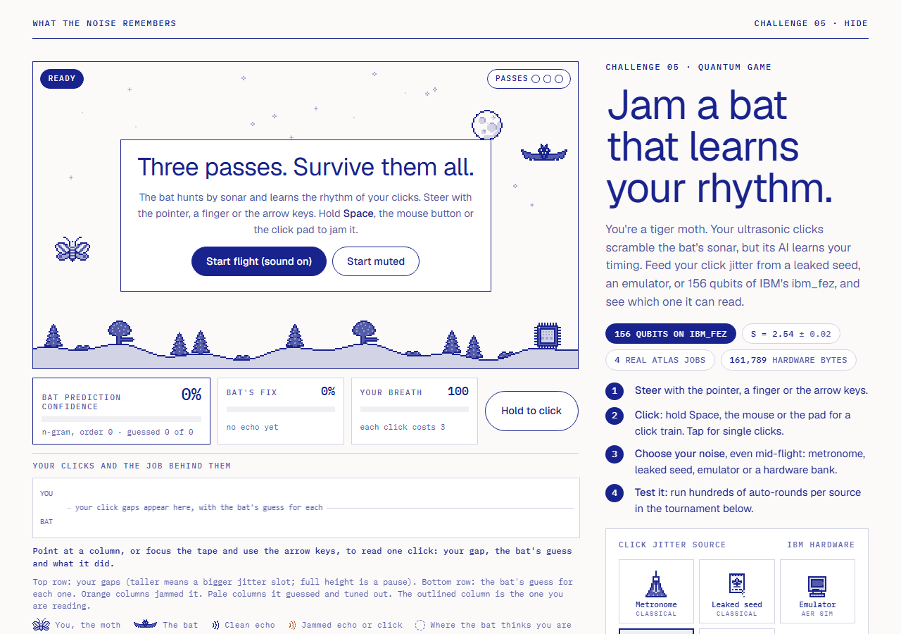

# Jam the Bat

**Moth Hack 2026 · Challenge 05: Quantum game** · *What the Noise Remembers*, Challenge 05 · Hide



You're a tiger moth, *Bertholdia trigona*. A bat hunts you by sonar, and your ultrasonic clicks jam it.
But this bat has an AI: an order-3 n-gram that listens to the gaps between your clicks and learns your
rhythm. Every click's timing jitter comes from a source you pick, even mid-flight:

- a **metronome** (no jitter),
- a **seeded PRNG whose seed is printed on screen** (leaked, so the bat replays it),
- an **emulator bank**: Atlas `comet-qrng-v1` on the Qiskit Aer simulator, an uncertified classical baseline,
- **hardware banks**: Atlas `comet-qrng-v1` on IBM **ibm_fez** and **ibm_marrakesh**, each using **148 register +
  8 Bell-witness = 156 qubits, every qubit on the chip**.

The game: steer, decide when to click (hold for a train, tap for one click), and survive three attack passes
through search, approach and terminal buzz. A live meter shows the bat's prediction confidence. A tournament
then runs hundreds of auto-rounds per source under the same rule, as a labelled classical simulation.

**The result, stated plainly.** A metronome or a leaked seed gets you eaten (0 of 500 autopilot rounds survive).
A secret-seed PRNG, the emulator bank and both hardware banks are level: 63.6 %, 64.6 %, 63.2 % and 62.6 %
over 500 rounds (χ² homogeneity p = 0.93), and 63.5 %, 64.8 % and 64.7 % for the PRNG, fez and marrakesh banks over 4,000 rounds
(p = 0.45). The bat can't tell good sources apart, and the game says so. What the quantum source adds is
where the bits came from, not a better score.

## Play it

`web/index.html` is the whole game: one self-contained page with no external requests except Google Fonts.
The lead publishes it as an artifact. Nothing moves until you press **Start**, and sound is optional.

| Control | Desktop | Touch |
|---|---|---|
| Steer | move the mouse over the sky, or arrows / WASD | drag on the sky |
| Click (jam) | hold **Space** or the left mouse button | hold the **Hold to click** pad |
| Pause / resume | **P** or Esc, or the Pause button | Pause button |
| Sound | **Start flight (sound on)** or **Start muted**; **Mute sound** toggles it any time | same |
| Noise source | buttons beside the game, switchable mid-flight | same |
| Read one click | point at a column of the click tape under the stage, or focus it and use ← → | tap a column |

Before the first flight the control row's button reads **Start flight**, and pressing the click pad (or Space / Enter
on the focused sky) also starts one. **Pause** appears only while a round is live, and the end card offers **Fly again**.

**Sound** is synthesised in the page with Web Audio (bat calls, your clicks, pass cues), pitched down so you can hear it.
There are no audio or video files to ship. Nothing sounds until you press Start, and Pause or Mute silences it.

**The scene is the hero.** The sky is ink pixel art in the shared palette (`web/sprites.json`, drawn with
`common/inksprite.js` at whole-number device-pixel scale with smoothing off): a striped tiger moth with a 4-frame flap,
a bat with 6 flight frames, a moon, stars and a treeline. The sprites react to the real game state only:

| What you see | What it means (from `web/core.js` state) |
|---|---|
| Ink sonar arcs from the bat | a clean echo: it heard where you are |
| Broken orange arcs, dizzy bat with stars | that call came back jammed |
| Orange zap stars on the moth | your click was one the bat mispredicted |
| Bat swoops, mouth open | it predicted that click (tuned it out), or it is in the terminal buzz |
| Pale ghost moth in a dotted ring | the bat's estimate of your position; the ring tightens with its fix |
| The noise-maker on the ridge | the source you picked: the metronome ticks, the seed packet leaks a seed (sealed when the bat ignores the seed), and the emulator screen or the IBM chip lights the **actual 3-bit slot** each click used |

The noise-makers are also the source picker and the row icons of the tournament. Under the stage, all visible: the click
tape (your gaps against the bat's guesses) with its legend (You, the moth · The bat · Clean echo · Jammed echo or click ·
Where the bat thinks you are), the job readout, and the illustrated who's-who. Below the game the page is organised in
titled sections: **How to play** (the game rule), **Test it** (the bat tournament), **The data** (what came off the chip:
the per-qubit P(1) map, drawn as a chip package, and the CHSH gauge), **How it was made** (what the quantum engine did),
**The science** (why a tiger moth), **What this does not claim**, and **Jobs and credits** (the four-job table and the
credits). The words and graphs of the pre-sprite page are all there; `history/restore_report.md` maps each one.
The warm accent is used only for the flash of a jamming click, green only for the brief escape sparkle.
The hub mascot is the moth, `web/img/mascot.png`, rendered by `common/mascot.py` from the same sprite file.

Page QA: `node common/qa/qa_page.cjs entries/05-jam-the-bat 6310` reports `ok: true` and `sound_started: true`
(screenshots in `qa/`). `node entries/05-jam-the-bat/qa/e2e.cjs 6300` walks the whole journey in headless Chromium with
real mouse and key input (start with sound, mute and unmute, pause, switch source mid-flight, fly a round to its end,
tape, legend, readout and cast visible, the tape and the sky actually drawn, read the tape, share, Fly again, reload
with the link, stop a tournament part-way, the 500-round tournament matched against `out/tournament.json` with every
bar and whisker drawn, the chip map's 156 shaded cells and the CHSH gauge's three S values checked against
`piece.json`, Start muted, the click pad, Restart from the pause card and the control row, Enter and P on the sky,
every titled section and graph visible, no "bonus" wording, and the nav) and writes `qa/e2e.json`.
`node common/qa/deadcontrols.cjs entries/05-jam-the-bat 6290` finds no dead control (`qa/deadcontrols.json`).

The page ends with the shared piece-to-piece nav (previous piece, all 22 pieces on the hub, next piece, and a jump
list), which `build_web.py` injects from `common/nav.py` at the `<!--NAV-->` marker.

The **Copy link** buttons encode the source, seed, whether the bat has the seed, and (after a round) your
result in the `#` fragment, for example `#fez-5eed2009-1-x3.41.4`. The page says it cannot verify a shared result.

## Engine, jobs and qubits

Engine: **`comet-qrng-v1` v1.0.0** (Atlas). It prepares every register qubit in |+⟩ and measures 10,000 shots. It estimates a conservative per-bit
min-entropy with NIST SP 800-90B estimators at 99 % confidence, subtracts log2(10,000!) ≈ 118,458 bits
because only counts come back (shot order is lost), and Toeplitz-extracts bytes 2^-64-close to uniform
given that budget. With `bell_witness: true` it adds 4 CHSH Bell pairs (8 qubits) in the same job.

| Run | Where | Qubits (register + witness) | h / bit | Budget (bits) | Bytes | CHSH S ± σ | Atlas job |
|---|---|---|---|---|---|---|---|
| `fez_148p8` | **IBM ibm_fez** (QPU) | **148 + 8 = 156** | 0.574 | 730,889 | **91,345** | **2.543 ± 0.015** | `ea258824-af68-40a1-8758-a5a37c74e899` |
| `mar_148p8` | **IBM ibm_marrakesh** (QPU) | **148 + 8 = 156** | 0.461 | 563,684 | **70,444** | 2.728 ± 0.015 | `6a60b547-a73d-4957-8c5e-3f643aa41022` |
| `emu_20p0` | Qiskit Aer (emu) | 20 + 0 = 20 | 0.936 | 68,779 | 8,581 | none | `8650be46-e961-4ebe-bea1-56502b041342` |
| `emu_12p8` | Qiskit Aer (emu) | 12 + 8 = 20 | 0.938 | **0** | **0** | 2.837 ± 0.014 | `14c90fa7-56a4-43de-a975-96aa8322ba6a` |

- **How the qubit counts are known:** each job's own `provenance.circuit` reports `n_rand` and `n_total`.
  On both QPU runs `initial_layout` maps the 156 circuit qubits onto physical qubits 0–155, every
  qubit of the 156-qubit Heron chip. The emulator runs sit at the engine's 20-qubit emu cap.
- **Hardware:** IBM job ids `db1iukqvog1s73fi6kog` (ibm_fez) and `db1iupmegvvc73bhmjrg` (ibm_marrakesh).
  The engine reports 5 QPU seconds each.
- **Grades** (the engine's words): QPU runs `hardware-accounted` on the `modelled-independence` tier. The
  assumption-free budget is 0 bits for every run. Emu runs are `simulator-baseline`.
- **Why `emu_12p8` gave 0 bytes:** 12 qubits × 10,000 shots × h ≈ 112,550 bits is less than the 118,458-bit
  shot-order penalty. So the emulator bank comes from a 20-qubit register (`emu_20p0`), and `emu_12p8` supplies
  the emulator's noiseless S value.
- **Credits:** 4 jobs × 5 = **20 of the 45-credit cap**.

Full parameters: [PARAMS.md](PARAMS.md). Raw counts stay in `../../cache/comet-qrng-v1/`. `out/<run>.json` holds
each job's full result minus the raw counts.

## What is quantum, what is classical

| Step | Kind |
|---|---|
| Born-rule sampling of 148 (or 20) qubits in \|+⟩, plus the CHSH witness | **quantum**: IBM ibm_fez / ibm_marrakesh hardware, or the Aer emulator (classical simulation) |
| Min-entropy estimate, Toeplitz extraction, commitment, pulse hash | classical, inside the engine |
| Cutting bytes into 3-bit jitter slots (MSB first) | classical (`slotsFromBytes` in `web/core.js`) |
| PRNG source (mulberry32) and metronome | classical |
| Flight, sonar, echoes, the bat's n-gram, breath, strikes | classical game logic (`web/core.js`), a cartoon, not a sonar model |
| Sprites and their reactions | classical drawing code, driven only by that game state and the slots actually used |
| Tournament | classical simulation of the same rule (`sim.js`, and the page's Run button) |

## The game rule

While you hold, gaps between clicks are **70 ms + slot × 12 ms**, where the slot (0–7) is the next 3 bits of
the chosen source. A tap fires one click after a jitter delay. The bat maps each gap to one of 12 symbols (8 slots +
4 pause lengths) and predicts the next symbol with an **order-3 n-gram**. It backs off to shorter contexts until one has ≥ 4
examples, with add-½ smoothing. A click it predicted is tuned out. A click it got wrong jams its echoes
for 160 ms. Clean echoes give it your position and raise its fix. Jammed echoes leave it chasing a stale guess.
In the terminal buzz it strikes at its guess (caught if you're within 24 px) or breaks off when its fix
drops below 20 %. Clicks cost breath. With the seed leaked, the bat has the PRNG seed and counts your clicks, so it
knows every next slot and only guesses whether you keep holding. Timings are stretched and the calls are pitched down
for human play.

## The tournament (classical simulation)

Autopilot moth: holds its clicks once the bat is within 330 px, flies across the bat's path, dives late.
Bat noise is seeded by round number and identical for every source. Bank slots are read in order and
never reused. `node sim.js 500 --long 4000 --json out/tournament.json`:

| Source | Survived 3 passes (500 rounds) | 95 % CI | Bat guessed right |
|---|---|---|---|
| Metronome (no jitter) | 0 / 500 (0 %) | 0–0.8 % | 92.4 % |
| PRNG, seed leaked to the bat | 0 / 500 (0 %) | 0–0.8 % | 93.8 % |
| PRNG, seed kept secret | 318 / 500 (63.6 %) | 59.3–67.7 % | 11.3 % |
| Emulator bank (Aer) | 323 / 500 (64.6 %) | 60.3–68.7 % | 11.4 % |
| ibm_fez bank | 316 / 500 (63.2 %) | 58.9–67.3 % | 11.6 % |
| ibm_marrakesh bank | 313 / 500 (62.6 %) | 58.3–66.7 % | 11.0 % |

Unpredictable sources: χ² = 0.46, df 3, **p = 0.93**. Over 4,000 rounds (the emulator bank is too small):
PRNG secret 63.5 %, ibm_fez 64.8 %, ibm_marrakesh 64.7 %, χ² = 1.61, df 2, p = 0.45. The page's Run button
runs the identical code and reproduces the 500-round numbers exactly.

Bank smoke tests (`bank_checks.py`, classical, not a certification): monobit p = 0.58 / 0.40 / 0.43,
byte χ²(255) p = 0.52 / 0.30 / 0.40, 3-bit slot χ²(7) p = 0.87 / **0.020** / 0.51 for emu / fez / mar.
That's one p ≈ 0.02 among nine tests, unremarkable at that count.

## What this claims, and what it doesn't

- **Claims:** the banks are real `comet-qrng-v1` outputs, with job ids above. The fez and marrakesh banks
  came from measurements of 148 qubits on IBM hardware in jobs whose CHSH witness pairs scored S = 2.543 ± 0.015
  (35 σ above 2) and 2.728 ± 0.015. Predictable click timing loses to a learning bat. Unpredictable timing
  from any good source survives equally well.
- **Does not claim certified randomness.** The CHSH value is a *fidelity witness* on four separate pairs on the
  same chip, with fixed settings, no space-like separation and fair sampling assumed. That is the engine's own
  caveat. It is not device-independent certification (compare Pironio et al., Nature 2010) and says nothing
  directly about the 148 register qubits. The byte budget rests on a named assumption (no dependence beyond
  pairwise correlations, tested only by collision counts). The assumption-free budget is 0 bits.
- **Does not claim a quantum advantage.** The hardware bank doesn't beat the emulator or a secret-seed PRNG,
  and an n-gram can't distinguish them. The bytes are also public: they ship in the page, so a bat that read the
  page could replay them exactly like the leaked seed.
- **Biology:** Corcoran et al. showed sonar jamming. They did not show that bats learn click rhythms. That part is a game mechanic.
- The emulator bank is classical pseudo-randomness, labelled as an uncertified baseline everywhere.

## Reproduce

```bash
python run_comet.py              # 4 comet-qrng-v1 jobs; cached, so re-runs are free and offline
python bank_checks.py            # classical smoke tests -> out/bank_checks.json
node sim.js 500 --long 4000 --json out/tournament.json
node test_core.js                # 13 unit tests of the game rule
python build_web.py              # -> web/index.html (ASCII, sprites + shared nav inlined), web/img/mascot.png, web/files.json
node qa/e2e.cjs 6300             # end-to-end journey in headless Chromium (Playwright from common/qa/node_modules)
```

`MOTH_FREEZE=1 python run_comet.py` replays everything from the cache and refuses any new submission.
Python: numpy, scipy (already installed). Node 24. No extra packages.
