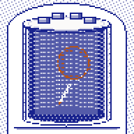
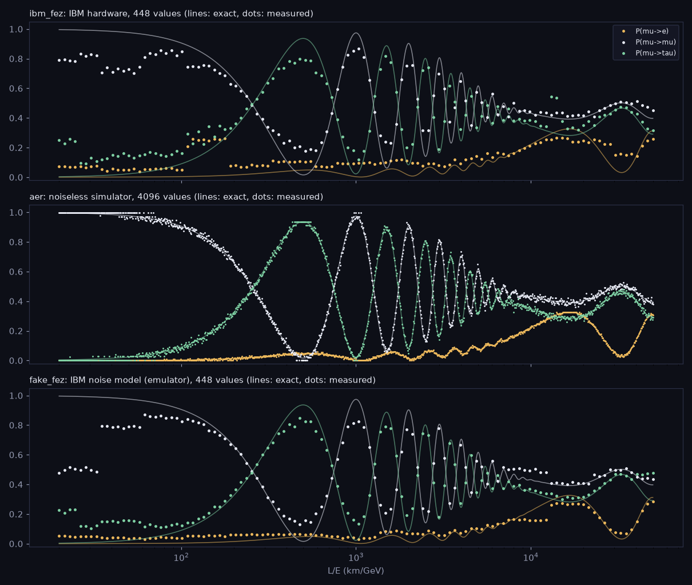

# FLAVOUR · neutrino flavour synth

**Moth Hack 2026 · Challenge 07: Make a VST or AU** · *What the Noise Remembers*, Challenge 07 · Hide

> Send a neutrino through the Earth. Hear which flavour arrives.





A muon neutrino is born as one flavour and arrives as a mix of three. The fraction that would show up
as an electron, muon or tau neutrino swings with **L/E**, the distance travelled divided by the energy.
With two flavours this is exactly a qubit: the mixing angle is a fixed change of basis, travel is a phase
rotation between the two mass states, and detection is a measurement in the flavour basis.

FLAVOUR is a synth built on that. It has three wavetable oscillators, **e**, **mu** and **tau**, and a
**JOURNEY (L/E)** control. Each oscillator's loudness is that flavour's probability at the current L/E, and
its waveform is a slice of the flavour curve itself. The curves were computed classically, then written onto
qubits with Moth Atlas **qpixl-v1** and measured back on 14 machines: a real IBM chip (**ibm_fez**), 12 IBM
noise models and a noiseless simulator. **CHIP** picks whose measurement you hear. **MIX** fades from the
exact curves to the measured ones, so what you hear changing is what each machine's noise did.

### The plate (the browser version)

The page opens on a scientific plate drawn as ink engravings of the real objects (original SVG drawings in
the shared ink palette, `web/plate.js`, made from published descriptions; no photograph is traced or
embedded). Every part is numbered, and the key under the plate names it:

| On the plate | The real thing | Driven by |
|---|---|---|
| **Fig. 1, the source.** Reactor (4 MeV): a pressurized-water reactor cut away (prestressed-concrete containment with its steel liner, polar crane, steam generators, pressurizer, vessel and core, cooling tower, turbine hall). Accelerator (0.6 or 2 GeV): a Fermilab NuMI-style beamline in section (Main Injector, the proton line diving at 58 mrad, target hall with an enlarged detail of the graphite target and the two magnetic horns, the 675 m helium decay pipe, hadron absorber, muon alcoves, dolomite). Atmosphere (0.3 or 5 GeV): a cosmic-ray air shower over an altitude scale, and the Earth cut through to scale. Sun (10 MeV): the Sun cut away (core, radiative zone, convective zone, photosphere) and the Earth 1 AU away | Where the neutrino is born, which fixes its flavour and energy | your choice |
| **Fig. 2, the detector.** Super-Kamiokande cut away under Mt. Ikeno: the 39.3 × 41.4 m stainless-steel tank, the inner wall of 50 cm PMTs (drawn about one in four), the outer-detector gap, the four electronics huts on the lid | The water-Cherenkov far detector of T2K | drawing |
| **Fig. 3, the event display.** The inner wall unrolled (top cap, barrel, bottom cap), each dot a PMT; the last event's lit tubes, also shown on the cut-away wall with the lepton's track | A sharp-edged ring is muon-like, a fuzzy one electron-like, several rings a tau decaying; a few-MeV positron or electron lights only a few dozen tubes. Geometry is real (Super-K's inner size, the 42° Cherenkov angle); the hit pattern is a sketch | the flavour drawn at your distance |
| **Fig. 4, the journey.** Distance L on a log scale with real baselines: Daya Bay far hall 1.65 km, JUNO 52.5 km, KamLAND ~180 km; T2K 295 km, MINOS 735 km, NOvA 810 km, DUNE 1,300 km; air showers from overhead (~15 km), the horizon (~440 km) and directly below (12,757 km); Mercury, Venus and the Earth at 1 AU | L, and L/E = L / E | dragging (or arrow keys) |
| The stacked bands along the journey | P(→e), P(→mu), P(→tau) at every distance | the measured curves of the chosen chip mixed by MIX (accelerator, atmosphere); classical curves (reactor, Sun) |
| The dashed ΣP = 1 line | Exact probabilities add up to 1; measured values were read out one by one, so they over- or under-fill | the same values |
| A detection (key, detector click, ×100) | One neutrino interacting as one flavour | a classical random draw weighted by those values |
| "No ring: below threshold" | A muon needs ~110 MeV and a tau ~3.5 GeV to be made | the source energy |
| The orange path in the Earth (atmosphere) | The zenith angle your path length implies | your distance |
| Noise squares on each chip | Mean rms error of its measured curves against the exact ones | `rms` in the bundle |
| Dark markers in the bands while notes are held | Each voice's own distance under FLIGHT | the synth voices |

Reactors and the Sun make electron-flavoured (anti)neutrinos, which no chip measured: every chip measured
muon-born curves. For those two sources the bands, the detections and the sound use classical curves from
the same `physics.py` (the reactor row for antineutrinos on the same L/E grid; the Sun's fully averaged
vacuum value, 55 % νe, with the real Sun's lower MSW value named in a drawer), and the page says so. With
the reactor selected, the readout also puts the classical P(ν̄e→ν̄μ) beside the chip's measured
P(νμ→νe), which CPT symmetry makes equal. Below the plate, titled sections carry the earlier page's words
and graphs (see `history/restore_report.md`): **How to play**, **The data** (the curves with every measured
dot, draggable and always drawn, plus the level meters and each oscillator's live waveform), the demos, the
plugin, **How it was made**, **The science**, **What this does not claim** and **Jobs and credits** (the job
table, where each machine's name puts that chip on the synth). The gelato pun from an earlier version survives only as a one-line legend (the plugin's editor
still uses those labels). Small pixel icons (the 50 cm PMT keys, ring icons, chips) and the hub mascot
`web/img/mascot.png` come from `make_sprites.py` → `web/sprites.json` (`common/mascot.py`).

## Deliverables (the brief: a music plugin + audio examples of it in use)

| What | Where |
|---|---|
| JUCE 8 plugin source (VST3 / AU / Standalone) | `plugin/` (`CMakeLists.txt`, `Source/`, `Resources/flavour_curves.json` embedded as BinaryData) |
| CI build + validation (macOS VST3 + AU, Windows VST3, pluginval, auval) | `.github/workflows/flavour-plugin.yml` |
| Audio examples | `audio/flavour_sweep.wav`, `audio/flavour_chip_compare.wav`, `audio/flavour_pad.wav` |
| Browser version of the synth (same knobs, Web Audio) | `web/index.html` (built by `build_web.py`) |
| Job table, qubits, credits | `PARAMS.md`, `piece.json` |

**Honest status of the plugin binaries:** this machine has no desktop C++ toolchain (no MSVC, Xcode or GCC; CMake only as part of the Android SDK), so
**no plugin binary was built, loaded in a DAW or run through pluginval here**. The binaries come from the
GitHub Actions workflow, which runs when this folder is pushed as a repository (the workflow assumes
`entries/07-flavour/` is the repo root). Two weaker C++ checks were possible here with the only compiler
on the machine, the Android NDK's clang (`tests/cpp/run_checks.sh`):

- `PluginProcessor.cpp` and `PluginEditor.cpp` type-checked with **0 errors** against the real JUCE 8.0.8
  headers (`clang -fsyntax-only`). That is a compile check, not a link or a run. The editor was later
  re-themed for the gelateria (paper-and-ink colours; the labels JOURNEY, RECIPE, CONVEYOR, SCOOP-IN,
  MELT, VOLUME, KITCHEN and MENU; one header `fillRect`). That edit changed only colour constants, label
  strings and that one call, and it was **not** re-type-checked, because the JUCE headers are no longer
  on this machine. Parameter IDs and names, which hosts see, did not change.
- The engine headers (`FlavourData.h`, `FlavourEngine.h`) were compiled into a static test program against
  a small JUCE stand-in (`tests/cpp/shim`) and run under WSL. Its wavetables match the Python replica to
  2.3e-4 on all 1,512 test cases. Its 26 s sweep render matches `synth.py` sample by sample to 1.3e-4
  (0.06 % of peak).

The demo WAVs were rendered by the Python replica (`synth.py`), which matches that C++ engine, from the
same embedded data. They were **not** recorded from a compiled plugin.

## Play it

- **Browser:** open `web/index.html` (published by the lead as an artifact). Pick a source (Reactor,
  Accelerator, Atmosphere, Sun) and an energy, drag along the journey (or focus the plate and use the arrow
  keys, Home and End), then detect: play a PMT key (an A minor pentatonic, A2 to G4; computer keys A to ;,
  Z / X shift octave), click the detector or the event display (or press Enter on the plate), or *Hold a
  drone*. Each key press is one neutrino. *Detect ×100* draws 100 silently, so you can watch the tally
  approach the curves. Reactor and Sun have one energy each, shown as a label ("4 MeV · fixed", "10 MeV ·
  fixed") rather than a button. The section **The data** has the curves (drag them, or focus them and use the
  arrow keys, to set any L/E; leaving the current source's range moves you to a muon-neutrino source that
  reaches it), the meters and the waveforms: click a waveform (or focus it and press Enter) to hear that one
  oscillator alone for about a second, at a fixed level so its shape is audible. *Copy link to this sound*
  saves chip, L/E, mix, model, flight, source and energy in the URL `#token`; opening the link restores them,
  also in a tab that already shows the page (old gelateria links still open). *Stop all sound* silences
  every voice, the drone, a waveform being auditioned and the demos. The three demo WAVs play on the page as
  MP3s (`web/audio/`), each with its own Play/Pause, Stop and scrubber; the chip-compare demo also has one
  button per machine that jumps to that machine's turn. Nothing sounds before a click, and the plate only
  moves while a note sounds (or briefly when a ring lands). At the foot of the page, the shared navigation
  links the previous piece (06), the hub and the next piece (08), with a list of all 22.
- **Plugin vs page.** The plugin is the synth only: the same engine, curves, chips and knobs. The page's
  plate (the four sources and their energies, the real baselines, Super-Kamiokande, detections, rings and
  the tally), the reactor and Sun's classical electron-flavour curves, the waveform audition, the demo
  players and the section text are on the page only. The plugin's editor is drawn in the same paper-and-ink
  colours as the page, but it keeps the gelateria-era knob labels (below), which the page no longer uses.
- **Plugin:** load FLAVOUR as an instrument and send it MIDI. Knobs (the editor still shows the gelateria-era label;
  in brackets the parameter name hosts see, which is unchanged):

| Knob | Range | What it does |
|---|---|---|
| JOURNEY (L/E) | 20 to 50,000 km/GeV, log | The point on the curves |
| KITCHEN (CHIP) | ibm_fez, aer, fake_fez, fake_marrakesh, fake_torino, 9 × 127-qubit Eagle noise models | Whose measured curves you hear |
| RECIPE (MIX) | 0 to 1 | 0 = exact classical curves, 1 = that chip's measured curves |
| MENU (MODEL) | 3 flavours / 2 flavours | e, mu, tau from P3, or e and mu from the 2-flavour approximation P2 |
| CONVEYOR (FLIGHT) | 0 to 0.5 decades/s | Each held note flies outward in L/E (each voice has its own L/E) |
| SCOOP-IN, MELT, VOLUME (ATTACK, RELEASE, GAIN) | | Linear envelope and level |

You can also drag across the curve display in the plugin's editor to set L/E.

### The engine (identical maths in C++, JavaScript and Python)

Per voice, per block of 256 samples:

1. `u = log10(L/E)` = the knob + FLIGHT × seconds since note-on, clamped to the axis.
2. `curve = (1 − MIX) · exact + MIX · measured(CHIP)`, linearly interpolated in `u`.
3. **Level** of each flavour = `curve(u)`, clamped to [0, 1].
4. **Waveform**: 64 samples of the same curve across a 0.5-decade window around `u`, minus their mean,
   mirrored into a 128-sample cycle and divided by its peak. Harmonics 1 to min(63, 0.45·sr/f) are rebuilt
   on a 256-sample table (band-limited). Smooth physics gives rounded waves; measurement noise gives
   jagged ones, which you hear as brighter, buzzier harmonics.
5. Oscillators: **e** at 1.5 f (a fifth above the key), **mu** at f, **tau** at 0.5 f (an octave below).

`plugin/Source/FlavourEngine.h`, the first inline script of `web/template.html`, and `synth.py` are the three
implementations. They are tested against each other (see Verification).

### Audio examples

All three are 44.1 kHz mono 16-bit WAVs, peak-normalised to −1 dBFS, rendered by `render_demos.py`.

- **`flavour_sweep.wav`** (26 s): one held A3 while L/E sweeps 20 → 50,000 km/GeV over 24 s, on the
  ibm_fez (real hardware) curves. mu fades into tau (an octave down) at the first atmospheric maximum
  (~490 km/GeV), beats through the fast atmospheric wiggles, then e (a fifth up) swells near the solar
  maximum (~16,600 km/GeV).
- **`flavour_chip_compare.wav`**: the same A3 + E4 phrase, flying outward from 2,500 km/GeV at
  0.18 decades/s, repeated every 3.4 s on: exact (MIX 0), aer, fake_fez, fake_torino, fake_brisbane,
  fake_kyoto, ibm_fez. The cue sheet is in `out/demos.json`.
- **`flavour_pad.wav`**: Am, F, C, G with slow attacks. Every chord starts at 300 km/GeV and flies
  outward at 0.12 decades/s, on the ibm_fez curves.

## Engine, parameters and qubits

- **Engine:** `qpixl-v1` (Moth Atlas, Interwoven QPIXL), the only engine used. 1 credit per job.
- **Values:** four curves on one log-spaced L/E axis (20 to 50,000 km/GeV), concatenated
  `[P2(mu→e) | P3(mu→e) | P3(mu→mu) | P3(mu→tau)]`, each divided by its own maximum so it spans [0, 1].
  The decoded output is multiplied back by those maxima. Nothing else is done to it (`dynamic_range` = none).
- **Shots:** 8192 on every job. Emulated runs use 8192 per data-qubit group.
- **aer (noiseless simulator): 4096 values** = 4 curves × 1024 points. 4096 = 2¹², so the documented
  QPIXL rule counts **12 address qubits + 1 data qubit = 13 qubits**. The engine runs it as data-qubit
  groups. The decoded values scatter by 0.014 around the exact ones, which matches about 512 shots per
  value (8192 / 16), i.e. 16 values (4 address qubits) per data-qubit group. That last point is our
  inference, not a number the engine reports.
- **IBM chips:** when we sent 4096 values, the engine refused and reported each chip's data-qubit
  capacity: **448** (fake_fez), **378** (fake_torino), **360** (fake_brisbane). Each chip then got
  4 curves × floor(capacity / 4) points: 112 points (448 values) on fez and marrakesh, 94 (376) on torino,
  90 (360) on the nine 127-qubit Eagle models. Job progress showed 64, 56 and 54 data-qubit groups
  ("gcells") on those lattices. The engine does not report how many physical qubits a circuit touched,
  so we don't claim a number for that.
- **Real hardware:** `mode = "qpu"`, `backend_name = "ibm_fez"`, 448 values, 8192 shots, run as one joint
  circuit. The result reports backend `ibm_fez`, IBM job `db1j26hb694s73dsbm90` and 4 s of QPU time.

Every job ID, its qubit count and how we know it, and its error vs the exact curves are in
[PARAMS.md](PARAMS.md). **Credits:** 30 of the 45-credit cap are ledgered. That covers the 14 jobs used, 3
capacity probes that the engine rejected, and 13 submissions lost to backend failures (`engine_timeout` /
"Stream removed") when we first ran the chips in parallel. Every later job ran one at a time.

**What the noise remembers.** On ibm_fez the measured errors come in blocks. The correlation between
neighbouring errors is 0.88 (fake_fez: 0.87; noiseless aer: 0.06). The error jumps at boundaries
every 4 values are about twice those inside a block (0.067 vs 0.034 in normalised units on ibm_fez).
That fits each block of values sharing one data qubit, whose own miscalibration shifts them together.
This is our analysis of the decoded outputs (`analyze_noise.py`, `out/noise_stats.json`). You can
see it as steps in the dots on the page and hear it as steps in the waveforms.

## What is quantum, what is classical

| Step | Where it runs | Kind |
|---|---|---|
| Oscillation probabilities (`physics.py`): PMNS matrix, vacuum formula, 5 % Gaussian L/E smearing | this laptop, numpy | **classical** |
| Encode the curves as qubit rotations and measure them back (`run_qpixl.py` → qpixl-v1) | Atlas: aer simulator | quantum circuit, **classically simulated, noiseless** |
| Same, on `fake_*` machines | Atlas: IBM noise models | quantum circuit, **classically simulated with a model of that chip's noise** |
| Same, on `ibm_fez` | **IBM Heron r2 hardware** | **quantum hardware** |
| Bundle, synth engine, plugin, browser synth, demo rendering | laptop / your DAW / your browser | **classical** DSP over the measured numbers |

## What this claims, and what it doesn't

**Claims.** The two-flavour formula P(νμ→νe) = sin²2θ · sin²(1.267 Δm² L/E) has the same form as a
qubit's Rabi oscillation. The three-flavour curves use NuFIT 6.0's best-fit values. Every measured curve
in the plugin, the page and the WAVs is a decoded engine output whose job ID is listed, and only ibm_fez
is real hardware.

**Does not claim.**
- No neutrino is simulated on a quantum computer. The physics is classical; qpixl-v1 only encodes the
  curves into qubits and measures them back. What differs between chips is qubit and readout noise (real on
  ibm_fez, modelled on `fake_*`), not neutrino physics.
- No quantum advantage.
- Vacuum oscillations only: matter (MSW) effects are ignored, so the curves are not a prediction for T2K,
  NOvA, DUNE or the Sun, and the baselines are distances only. The accelerator energies (0.6 and 2 GeV) are
  T2K-like and NOvA-like peak energies, not full spectra.
- The plate is an illustration. A detection is a classical random draw weighted by the measured (or, for
  the reactor and the Sun, classical) values at that distance, not a detector simulation; the rings only show
  how a water-Cherenkov detector tells a muon from an electron; the thresholds are simple cuts on the source
  energy. The drawings are original, made from published descriptions, and not to scale (the beamline's
  slope is drawn steeper than 3.34°).
- Parameters are one global-fit variant (normal ordering, IC19 without SK atmospheric data). δCP and the
  θ23 octant are still uncertain.
- The 2-flavour curve is the leading-order approximation `sin²2θ_eff = sin²θ23 · sin²2θ13` with Δm²31,
  not a separate experiment.
- The measured 3-flavour probabilities need not sum to 1. Each value is measured independently, and the
  page shows the drift ("Σ P").
- The plugin binaries are not built here (see above).

## Physics parameters

NuFIT 6.0 (Esteban et al., JHEP 12 (2024) 216, arXiv:2410.05380), Table 1, normal ordering,
"IC19 without SK atmospheric data", best fit: sin²θ12 = 0.307, sin²θ23 = 0.561, sin²θ13 = 0.02195,
δCP = 177°, Δm²21 = 7.49 × 10⁻⁵ eV², Δm²31 = +2.534 × 10⁻³ eV². Checked against the arXiv PDF.

## Reproduce

```bash
pip install numpy matplotlib requests imageio-ffmpeg
python physics.py          # classical curves + unitarity checks
python run_qpixl.py        # qpixl-v1 jobs, one at a time; needs MOTH_API_KEY in ../../.env.
                           # Cached jobs replay free and offline (MOTH_FREEZE=1 refuses new ones)
python bundle.py           # -> plugin/Resources/flavour_curves.json
python analyze_noise.py    # -> out/noise_stats.json (error structure per machine)
python render_demos.py     # -> audio/*.wav, web/audio/*.mp3, out/demos.json
python make_sprites.py     # -> web/sprites.json (PMT keys, ring icons, chips, the Super-K mascot; pure drawing)
python ../../common/mascot.py web/sprites.json mascot web/img/mascot.png --scale 2
python build_web.py        # -> web/index.html (inlines web/plate.js), web/files.json
python make_docs.py        # -> PARAMS.md, piece.json, curves.png

# plugin (needs CMake >= 3.22 and Xcode or Visual Studio 2022; JUCE is fetched)
cmake -S plugin -B build -DCMAKE_BUILD_TYPE=Release
cmake --build build --config Release
```

On macOS the CI build is unsigned. After downloading, clear the quarantine flag (`xattr -dr com.apple.quarantine FLAVOUR.component`) or sign it yourself.

## Verification run for this build

- `MOTH_FREEZE=1` re-runs of every script (`physics.py`, `run_qpixl.py`, `bundle.py`, `analyze_noise.py`,
  `render_demos.py`, `build_web.py`, `make_docs.py`) reproduce every output byte for byte (SHA-1 checked),
  with no new jobs and no new ledger entries.
- `web/index.html` is pure ASCII, all three inline scripts parse (engine, `common/inksprite.js`, the
  plate from `web/plate.js`), and every referenced file is in `web/files.json` (plus the hub mascot
  `img/mascot.png`).
- `tests/test_logic.js`: the browser engine matches `synth.py` (levels exactly, waveforms to about 6e-8) on
  every test case. It also checks the `#token` round trip, rejection of bad tokens, and that the exact
  3-flavour probabilities sum to 1.
- `tests/test_page.js` (headless Chromium via Playwright from `common/qa`) restores an old gelateria
  `#token`, switches every source and energy (checking the reactor's classical curves, the CPT readout and
  the Sun's vacuum average), drags along the journey and moves with the arrow keys, detects from a key, the
  detector (click and Enter) and a computer key, checks that 2,000 detections land within 5 % of the curves,
  checks the thresholds, the Cherenkov angle (41.4° for n = 1.334) and the event sketch (muon, electron and
  few-MeV events), clicks every chip, the model, all knobs and the drone, drags the Data-view curves out of
  the reactor's range, shares and stops, and loads the phone layout, with no page or console errors.
- `tests/cpp/run_checks.sh`: see the plugin status above. That is the C++ type-check against JUCE 8.0.8
  headers, plus the engine test program run under WSL and compared with `synth.py` (`tests/compare_cpp.py`).
- The page reaches no external host except Google Fonts. Audio is three relative MP3 files.
- Page QA (`node common/qa/qa_page.cjs entries/07-flavour 6220`, headless Chromium): `ok: true`, no console
  errors or failed requests, no overflow at 1280 or 375 px, all three MP3s decode, no sound before a click,
  and the ten PMT keys, the drone, the three waveforms and all three demo Play buttons start sound
  (`sound_started: true`).
- `build_web.py` run twice gives a byte-identical `web/index.html` and `web/files.json`. The shared set
  navigation (`common/nav.py`) sits just before the footer: previous piece 06, the hub, next piece 08, and a
  list of all 22. The brand bar links the hub.
- `qa/e2e.cjs` (`node entries/07-flavour/qa/e2e.cjs 6210`; writes `qa/e2e.json`) walks the whole journey with
  real mouse and keyboard input on a local server that, like a real host, serves byte ranges. It loads
  silent, checks the proof chips against `piece.json`, picks every source and energy, drags the neutrino along
  the beamline, starts the synth and holds a key (sound starts; one neutrino is detected), clicks the detector
  until a ring lights, runs Detect ×100 until the tally is within 5 % of the curves, swaps chips, Mix, model,
  Flight (a held note flies outward), the L/E knob and the drone, checks both restored graphs render, drags
  and arrow-keys the curves, auditions a waveform, stops all sound, plays, stops, scrubs and cues every demo,
  opens every drawer and section, checks the earlier words and the job table against `PARAMS.md`, shares a
  link and reloads it (and opens a second link in the same tab), checks the prev / hub / next links, and
  loads the phone layout, with no page errors and no external host but Google Fonts.
- `node common/qa/deadcontrols.cjs entries/07-flavour 6200`: of 97 controls, it flags 9, all checked by hand
  or in `qa/e2e.cjs` and all working. ibm_fez and fake_brussels were already selected when it clicked them.
  Flight and two demo scrubbers start at their minimum, and its End-then-Home lands back there. It drags the
  curves and the three waveforms without scrolling them into view. Two controls that really did nothing were
  fixed: the reactor's and the Sun's single energy is now a label, not a button, and the waveforms now play
  their oscillator. Two more bugs were fixed: a seek that a host without byte ranges can't take no longer
  leaves the demo clock showing the wrong time, and a shared link opened in a tab that already shows the
  page now applies.
- The page follows the shared brief-page look (`common/brand.css`: paper, one ink, square panels, pill
  buttons, hairlines). The plate and the sprites use only the shared ink palette, with the warm accent only
  for light and heat (the reactor core, the Sun's core, the target flash, Cherenkov light on the PMTs). The
  plate is SVG drawn at the page's real pixel width, so text stays crisp from 375 px up, in three layouts
  (three figures over the journey; two figures, the journey, then the event display; or stacked). In
  The data section the flavour colours are the kit's own ink, `--warn` (nu-e) and `--good` (nu-tau).
