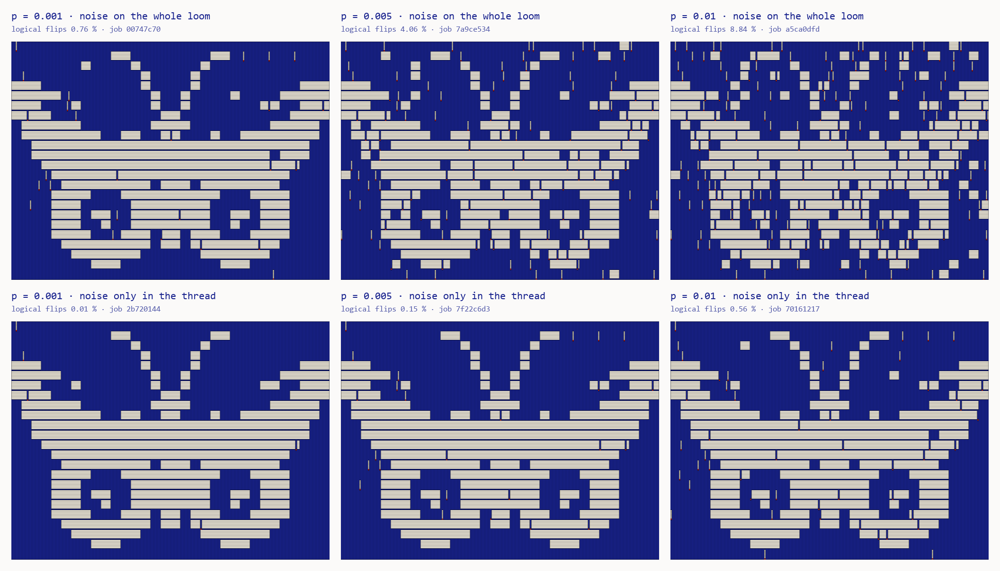

# Syndrome Loom

**Moth Hack 2026 · Challenge 09 · Quantum-native 1**: a repo for a quantum application that runs a
process on media, built on the Atlas API.



`loom` is a pip-installable Python package that weaves an image through a quantum error-correcting
code. Every pixel becomes a **Steane codeword of 7 threads**. Noise measured on Atlas **tamagotchi-v1**
flips threads, and every bit-flip syndrome is woven in as a **red weft stitch** under the thread it
points at. The output is a real **WIF 1.1** weaving draft, a shaded woven preview and a report that
compares logical and physical flip rates at each noise level.

```bash
pip install .                      # or: pip install -e .   (needs numpy, pillow)
loom weave input.png --p 5e-3      # -> out/draft.wif, out/render.png, out/report.md
```

## Play it

The interactive loom is in `web/index.html` (built by `build_web.py`). It opens on an illustrated
Jacquard loom in ink pixel art: punched cards on the head, harness cords and heddles, the cloth, a beater,
a shuttle, and two characters. **Ada**, a silk moth, works the treadles and throws the shuttle.
**Inspector Hamming**, a silkworm in a cap, rides a lift up the right post and plants a red flag beside
every row whose syndrome pick caught a flip. Everything that looks like a measurement replays this
cloth's sampled draws: the punched cards and heddle lifts follow the real lift plan, a spark marks each
flipped thread as its band is woven, the flags count the rows with red stitches, and Ada cheers or sighs
at the measured verdict (logical flip rate below or above p). A grey fizz on the machinery (noise on the
whole loom) or on the warp (noise only in the thread) is decorative and only shows where the profile puts
noise. An optional loom sound (Web Audio, off until you switch it on) ticks each pick, clacks each band
and chimes when a row is flagged (and once when you switch it on). The logical-vs-physical chart sits in
**The data**, a titled section below the loom, and the stage's **Data** toggle shows a live copy of it beside
the dial. Below the loom the page is organised in titled sections: How to play, The data, The science, How
it was made, What this does not claim, and Jobs and credits.

Turn the noise dial: each notch replays a real tamagotchi-v1 job, and the gauge on the loom follows it.
Weave from the top or scrub through the picks. Switch between the threads as read and after correction,
and click any block: the inspector rides to it and reads its syndrome, and the block inspector below shows
its 7 bits and how it decodes (a logical flip is invisible to the syndrome, and Ada says so). Change the
width (24, 32 or 48 blocks) to re-weave the moth, or load your own image, which is woven in your browser
from the engine's recorded rates. Then copy the WIF draft to the clipboard or copy a link to the view (the
link keeps the profile, p, seed, view, codewords and width). The page and the CLI share a seeded PRNG, so
for the demo moth the page rebuilds `out/draft.wif` byte for byte, and the CLI's `--width 24` and
`--width 48` drafts too (checked by `web/verify_page.py`). Previous / next links and a list of every piece
in the set sit at the foot of the page.

The cast's pixels live in `web/sprites.json` and are drawn by the shared `common/inksprite.js`, both
inlined at build time; `web/img/mascot.png` (Ada with her shuttle) is rendered from the same pixels.

## The CLI

```
loom weave INPUT [--p 5e-3] [--profile loom|thread] [--width 32] [--seed 1]
                 [--view received|corrected] [--codewords plain|measured]
                 [--threshold N] [--invert] [--cell 8] [--out out] [--json]
loom rates       # print the engine-measured table
```

- `--p` must be a calibrated level: 0.001, 0.005 or 0.01. Any other value is refused, because there's no
  job behind it.
- `--profile loom` puts noise p on every gate, idle step and readout. `--profile thread` puts it on
  idle steps and readout only, so the loom's gates are clean.
- `--view received` shows the threads as read, with single flips visible. `corrected` shows them after
  Hamming correction, where only logical errors remain as inverted pixels.
- `--codewords plain` weaves 0000000 and 1111111 so the picture shows. `measured` weaves a random member
  of the right coset, which is what a Z readout of a Steane block really returns. The picture vanishes
  into parity.

**The cloth.** Each pixel is a block of 7 warp ends. Each image row is a band of 6 code picks plus 1 red
syndrome pick. The ink-blue warp shows on dark pixels and the unbleached weft on light ones. A flipped thread is
a 6-pick stripe in its block, and the red float sits under it in the syndrome pick. The demo moth is
32 × 24 pixels, so the draft is 224 ends × 168 picks. It's a jacquard-style liftplan with one shaft per
end (straight draw) and red picks listed in `[WEFT COLORS]`. Pick 1 is the top of the image.

## What is quantum, what is classical

| Step | Where | Kind |
|---|---|---|
| Steane encoding, transversal X, one syndrome-extraction (SE) round with in-circuit Hamming correction, readout, under noise p | Atlas `tamagotchi-v1` (`engine/run_calibration.py`) | quantum circuit on the **Qiskit Aer stabilizer simulator**; no hardware, no QPU mode |
| Binarise the image (Otsu) | `loom/image.py` (or your browser) | classical |
| Choose codewords, sample flips and syndromes from the measured rates, Hamming-decode | `loom/weave.py`, `loom/steane.py`, seeded mulberry32 | classical |
| WIF 1.1 draft, shaded render, report | `loom/wif.py`, `loom/render.py`, `loom/report.py` | classical |

The quantum step runs once. Its measured rates ship in `loom/data/calibration.json`, and the loom
samples from them. No circuit runs per pixel.

## Engine, parameters and qubits

- **Engine:** `tamagotchi-v1` (code `steane`, `method = "stabilizer"`), 0 credits per run. Every job is
  ledgered under piece `09-syndrome-loom` with a credit cap of 5. Spent: 0 credits.
- **Calibration grid:** 2 profiles × p ∈ {0.001, 0.005, 0.01} × {one SE round, no SE round} = 12 jobs.
  Each job has `n_logical = 256`, which is **1,792 physical data qubits** (7 × 256), with 64 shots and
  16,384 block samples. Actions are X on every odd-indexed logical, so stored 0s and stored 1s are
  measured side by side, then `["SE", [0..255]]`.
- **Size ladder:** the same circuit at p = 0.005 completed with n_logical = 64, 128, 256 and 512. The
  largest completed job held **512 logical qubits = 3,584 physical data qubits**. It ran 8 shots
  (4,096 block samples) and gave 4.32 % logical flips, in line with the 256-block grid job's 4.06 %.
  Wall time per shot grows roughly as n³: about 0.07 s at n = 64, 0.46 s at 128, 3.7 s at 256 and
  29 s at 512. A 1,024-logical job (7,168 data qubits, 2 shots, `191803b3-afb4-4706-bfb6-0b5eea975c85`)
  was submitted. It was still running after 50 minutes on the shared, single-file engine queue when
  this was written, so it isn't counted anywhere. Re-running `engine/run_calibration.py` resumes it.
  n = 2,048 wasn't attempted. The grid uses n = 256 because a 64-shot job at that size takes about
  4 minutes, which keeps the 12-job grid inside an hour on a queue shared with other pieces.
- **Qubit counting:** 7 data qubits per Steane logical. That count follows from the code, and the engine
  reports `n_logical`. The engine also allocates ancillas for syndrome extraction but doesn't document
  how many, so they aren't counted anywhere here.
- **Probes:** small jobs that pin down what the output fields mean. Readout noise alone gives about 21p²
  logical errors, so the final readout is Hamming-decoded. `syndromes_detected` counts bit-flip and
  phase-flip syndromes as separate events: at p_meas = 0.5 it gave 1.757 per block, against
  2 × (1 − 0.5³) = 1.75. All job IDs are in [PARAMS.md](PARAMS.md).
- **In all:** 30 completed jobs (12 grid, 4 size ladder, 14 probes), the `jobs` count in `piece.json` and
  on the page.

## Logical vs physical flip rates (measured)

| profile | p | logical flips, 1 SE round | logical flips, no SE round | logical vs p |
|---|---|---|---|---|
| whole loom | 0.001 | 0.763 % | 0.336 % | 7.6 × worse than p |
| whole loom | 0.005 | 4.06 % | 2.00 % | 8.1 × worse |
| whole loom | 0.01 | 8.84 % | 4.49 % | 8.8 × worse |
| only the thread | 0.001 | 0.012 % (2 of 16,384) | 0 of 16,384 | 8 × better |
| only the thread | 0.005 | 0.153 % | 0.037 % | 3.3 × better |
| only the thread | 0.01 | 0.555 % | 0.183 % | 1.8 × better |

These numbers say two things.

1. **Where the noise lives decides whether the code helps.** When only stored threads and readout are
   noisy, a Steane-coded bit fails less often than p at every level. When every gate is noisy too, the
   coded bit fails 8 to 9 times more often than p. This syndrome round isn't fault tolerant: one faulty
   CX can put two errors in a block.
2. **One round costs more than it catches here.** The twin jobs with no SE round always did better. They
   skip the round's own noisy steps, and the final readout is decoded anyway. Repeated rounds pay off
   only when errors pile up between them. These jobs store each bit for a single step.

`loom weave` writes this table, with job IDs, the syndrome event rate and an inferred per-thread rate,
into every `report.md`.

## What this claims, and what it doesn't

- **Claims:** every rate the loom uses was measured in a completed tamagotchi-v1 job, listed by ID. The
  weave, the WIF and the render follow from those rates by classical code you can read and test.
- **Doesn't claim:** no quantum hardware was used, and the simulator is classical (stabilizer
  formalism). No circuit runs per pixel. The engine reports aggregate counts, not per-shot records, so
  the loom draws each pixel's syndrome and logical flip **independently** from the marginal rates, which
  drops their real correlation. Red stitches are drawn at **half** the engine's X+Z syndrome count, on
  our assumption that bit-flip and phase-flip syndromes are equally likely. Which thread flipped is drawn
  uniformly, because the engine doesn't report it. Your own image on the page is never uploaded, and no
  new job runs for it. Nothing here suggests a quantum advantage.

## Reproduce

```bash
pip install numpy pillow pytest           # pytest was installed for this piece
python make_demo.py                       # demo/moth.png (synthetic)
python engine/run_calibration.py          # the quantum step; cached jobs replay free and offline
python engine/fetch_job_times.py          # wall times from the job metadata (API read, no jobs)
python engine/write_params.py             # PARAMS.md
loom weave demo/moth.png --p 5e-3         # or: python -m loom weave ...
python make_gallery.py                    # out/gallery.png
python -m pytest                          # the test suite
python build_web.py && python web/verify_page.py && node web/smoke_test.js web/index.html
node qa/e2e.cjs 6360                      # end-to-end journey in headless Chromium (Playwright from common/qa)
```

With `MOTH_FREEZE=1`, every script replays from `../../cache/tamagotchi-v1/` and refuses to submit
anything new. Add `LOOM_LADDER_MAX=512` to `run_calibration.py` to replay without waiting on the
still-running 1,024-logical ladder job. That was the verified replay for this build. `engine/probe.py` and `engine/probe_size.py` are the exploratory probes, kept for the record.
