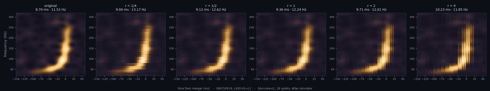

# Squeezed Chirp

**Moth Hack 2026 · Challenge 10, Quantum-native 2: a Python notebook showing how we used
the Atlas API to build a workflow that makes media.** Part of *What the Noise Remembers*, Challenge 10 · Recover.



> **Catch the first black-hole merger ever heard.** (the page: *LIGO Night Shift*)

LIGO hears further by squeezing light: it makes one quadrature of the laser's quantum noise quieter by
making the other louder, and since O4 a 300 m filter cavity rotates that trade with frequency
(Ganapathy et al., *Phys. Rev. X* 13, 041021, 2023). This piece plays with an **analogy** to that
trade. It takes the real GW150914 strain from GWOSC, makes a spectrogram of the chirp, and blurs it with
Atlas's quantum blur (`blur-core-v1`). The blur strength is set separately on the time axis and the
frequency axis, at a fixed product `s_time × s_freq = 0.25`. We then measure the chirp ridge's width
in time and in frequency, and resynthesise each version as sound.

**Result.** Moving the squeeze ratio `r = s_time / s_freq` from 1/4 to 4 moves the blur from one axis to
the other. The ridge's time-width rises from 9.00 to 10.23 ms (the original is 8.70 ms) while its
frequency-width falls from 13.17 to 11.85 Hz (original 11.52 Hz). The trend holds for three different
measurement windows. The product of the widths is **not** constant: it is lowest at r = 1 and rises at
both ends.

## Deliverables

| What | Where |
|---|---|
| **The notebook (the brief's deliverable)**, executed with saved outputs and ipywidgets sliders | [`squeezed_chirp.ipynb`](squeezed_chirp.ipynb) |
| Static reading view of the same notebook (no scripts) | `web/notebook.html` |
| Interactive game page, LIGO Night Shift | `web/index.html` (source `web/template.html`, built by `build_web.py`) |
| WAVs: original + 5 squeezes (Griffin-Lim, 8× slower, 4× higher) | `out/audio/*.wav` |
| Figures | `hero.png`, `out/panels.png`, `out/widths_vs_ratio.png` |
| Measurements | `out/widths.json`, job table `out/jobs.json`, ledger in the notebook (Step 8) |

What differs between them: the page uses the set's paper-and-ink look and draws its figures live from the six real
grids. The static figures (`hero.png`, `out/panels.png`, `out/widths_vs_ratio.png`) and the figures inside the
notebook are matplotlib outputs (`analysis.py` and the executed notebook) and keep their earlier dark style with a warm
colour map; they show the same data and the same measured widths. `web/notebook.html` takes the paper-and-ink look for its text and
chrome (its ipywidgets sliders need a running kernel, so it shows a note in their place) and links back to the page.

## Play: LIGO Night Shift

The page (`web/index.html`) is a game. You are the operator in the Livingston control room at 04:50:45 CDT on
14 September 2015 (09:50:45 UTC, GPS 1126259462.4), the moment GW150914 arrived. One round at a time, started
by you; nothing plays until you press it.

1. **Set the squeezer.** A hardware-style dial picks one of the six real cached `blur-core-v1` outputs: the five
   constant-product ratios r = s_time / s_freq = 1/4, 1/2, 1, 2, 4, plus the isotropic control (ISO, which matched
   r = 1 exactly, so it plays r = 1's audio). Drag the knob, tap a detent, or use the arrow keys. Under it: the
   most each score can be at this setting, two meters, and the "squeeze ellipse" of the blur this output added.
2. **Listen.** START RUN counts 3, 2, 1, then plays that output's real Griffin-Lim audio (8× slower, 4× higher)
   while the spectrogram scrolls in up to a NOW line, the two lensed black holes spiral in and merge on the real
   chirp's time axis, and the end test masses in the live strip swing with the real ridge power. Pause and Abort
   work throughout.
3. **Timing challenge.** Hit the big MERGER! button (or tap the screen, or press the space bar) at the loudest
   moment. It is scored against the loudest moment of the chirp in the *original* real spectrogram: the
   power-weighted centre of the moments whose 20 to 340 Hz power is within 5 % of the loudest, −0.39 ms (the
   original audio is loudest at +1.6 ms; `build_web.py` asserts they agree within 4 ms). The tolerance is
   2 × that output's real measured time-width (18.0 to 20.5 ms).
4. **Pitch challenge.** Drag the line on the screen (or ▲ ▼, or the arrow keys) to the chirp's pitch at that
   moment and lock it. The truth is the power-weighted centre frequency of the strongest cells (at least 80 % of
   their moment's maximum) at the loudest moments, 131.3 Hz; the tolerance is 2 × the real measured
   frequency-width (23.7 to 26.3 Hz).

Score per challenge = 1000 × (original width ÷ this output's width)² × e^(−½ (miss ÷ tolerance)²). Because the
blur keeps s_time × s_freq fixed, the time-sharp settings cap timing high and pitch low, and the reverse:

| Setting | Timing cap | Pitch cap | Best total |
|---|---|---|---|
| r = 1/4 | 934 | 765 | 1699 |
| r = 1/2 | 908 | 833 | 1741 |
| r = 1 (and ISO) | 863 | 886 | 1749 |
| r = 2 | 801 | 921 | 1722 |
| r = 4 | 723 | 946 | 1669 |

No setting can max both, so the game teaches the squeezing trade-off by feel. A catch inside the window raises an
**event-candidate alert card** (your logged UTC/GPS time, how early or late, against the published GW150914
values). The **shift log** keeps the round's scores, a best per setting (in this browser's local storage, wrapped
in try/catch; Reset scores wipes it) and seven achievements, whose claims `tests/test_page.js` checks against the
real caps: *Stopwatch* (timing 870+, only r = 1/4, 1/2), *Perfect pitch* (pitch 890+, only r = 2, 4),
*Heisenberg's choice* (both 800+, only the balanced middle), *First catch*, *Gold-plated*, *Control run* and
*Full sweep*. Replay shows the true peak and its window; Next round resets.

On phones the order is squeezer, screen, then the MERGER deck directly under the screen; START scrolls the screen
and the button into view together, and every control is a large tap target.

**Below the game**, titled sections that are always visible: *How to play*, *The data*, *The real detector*
(the plates), *How it was made*, *The science*, *What this does not claim* and *Jobs and credits*. **The data**
section is the original instrument, restored word for word from the earlier page: the squeeze slider with its
ticks, the spectrogram with Blurred / Original / Change and the two cuts, the width readouts with their bars and
the ridge-spread glyph, a play row for each WAV plus Stop, the measured-ridge overlay, a copy-link token, the
time and frequency profiles (click along either to move its cut), the trade chart against the classical
Gaussian reference, and live versions of the README figures (`hero.png` and `out/widths_vs_ratio.png`). The
dial and the data room follow each other between rounds, and the job table under *Jobs and credits* lists all
eight paid jobs (six completed, two failed) with a button that turns the dial to each completed one.

### Real-life art

Every drawing is original, made from published facts (sources in CREDITS.md), in the shared ink palette:

| Art | What it shows | What drives it |
|---|---|---|
| **Source view** (canvas) | GW150914's two black holes as dark shadows with lensed photon rings, bending a star field; after merger one 62-sun hole rings down | Shadow sizes from the published masses (36, 29, 62 suns); the orbit follows a Newtonian chirp f = A (t_c − t)^(−3/8) fitted to the measured ridge, separation ∝ f^(−2/3), in sync with the audio clock. Illustration, not a GR simulation; no accretion disc. |
| **Live strip** | ETMX and ETMY hanging on their fibres, the arm beams arriving | They swing apart and together with the real ridge power of your output × the fitted chirp phase, enlarged ~10¹⁵×. |
| **Plate I** (SVG, projected in the page) | LIGO Livingston from the north-north-east: corner station, two 4 km arms at 90° under concrete covers, end stations, access roads, loblolly-pine forest with logged stands; a true-north plan (X arm 252.3°, Y arm 162.3°, from GWOSC's detector constants) and a section through an arm (1.2 m tube, stiffening ring, support, slab, arched cover) | Static; numbered key. |
| **Plate II** (SVG) | The O1 interferometer in plan: laser, input mode cleaner, power-recycling mirror, beam splitter, ITMs, 4 km Fabry-Perot arms, ETMs, beam tubes, BSC/HAM chambers, signal-recycling mirror, output Faraday isolator, output mode cleaner, photodetectors, the what-if squeezer (OPO, PPKTP, 532 nm pump) injecting at the output port, and a ring of free test particles | The ETMs, the photodetector glow and the ring move with the same real signal; the squeezer's ellipse follows the dial. |
| **Plate III** (SVG) | ETMX on its quadruple pendulum: frame, blade springs, top mass, upper intermediate mass, fused-silica penultimate mass, four silica fibres, the 40 kg test mass with the beam, the reaction chain behind, the isolation platform | The test mass swings with the real signal. |
| **Mascot** (`web/img/mascot.png`, 192 px) | The black-hole pair, lensed, from the same lensing rule | `make_sprites.py` → `web/sprites.json` → `common/mascot.py`. |

Tap any number on a plate, or in its key, to find the part.

## Engine, parameters and qubits

- **Engine:** Atlas `blur-core-v1` (Quantum Blur Core), 1 credit per run, statevector simulator. It has
  no QPU mode. Schema saved in `engine_schema.json`.
- **Input:** a 257 × 257 grid of integers 0–999 (time × frequency, axis 0 = time).
- **Qubits: 18 per job.** The engine pads each axis to the next power of two, so 257 × 257 uses a
  512 × 512 register, 9 + 9 = 18 qubits. We know this two ways: the documented rule
  (⌈log₂ 257⌉ × 2) and the engine's own status for every job: "Recovered 18-qubit grid from measurement".
  A quarter of the register's grid points carry data; the rest is zero padding (entry 01 does the same
  with its 541 px hole on a 1024 register).
- **Params:** `strength = [s_time, s_freq]` with `s_time × s_freq = 0.25` at r ∈ {1/4, 1/2, 1, 2, 4},
  plus an isotropic control with scalar `strength = 0.5`; `reach = 0`, `style = "x"`, `max_qubits = 24`,
  no `shots` (exact probabilities).
- **Jobs:** 6 completed, all used. 2 more failed (see below). Every job is in [PARAMS.md](PARAMS.md).
- **Credits:** 8 of the 12-credit cap ledgered (`a.spent()`): 6 completed jobs and 2 failed ones.

### Why 18 and not 24 (measured, then documented)

| Grid | Qubits | What happened |
|---|---|---|
| 4096 × 4096 | 24 | The 47.7 MB request was rejected with HTTP 413 `request body is too large limit=1048576 bytes`. This was a free probe (`probe_payload.py`, `out/probes.json`). |
| 2048 × 2048 | 22 | The 12 MB body is over the same 1 MiB cap (size measured locally, not sent). |
| 640 × 640 | 20 | The body fits as compact JSON (0.89 MiB). Both jobs computed the "20-qubit grid", then **failed** with `TMPRL1103 Attempted to upload payloads with size that exceeded the error limit`: the ~8 MB JSON result is over Atlas's internal 2 MB payload limit. 2 credits were lost; they are listed in the ledger and in `out/failed_jobs.json`. |
| **257 × 257** | **18** | Completed. Request 0.2 MB, result ≈ 1.4 MB. |

A 2-D grid needs more than 2¹⁸ values to reach 20 qubits (513 × 513 at minimum), and a result that size
cannot fit the 2 MB limit. So 18 is the most a real 2-D spectrogram can use through the API today. A
grid with many tiny dummy axes could inflate the count, but it would not be a spectrogram, so we did not
build one.

Two engineering notes for anyone repeating this. The stock client sends `json=` with spaces, which adds
about 1 byte per value, so our `SafeAtlas` subclass (in `run_blur.py`) posts compact JSON. It also
submits each paid job exactly once and does not retry on a gateway error, so a timeout cannot create
an unledgered duplicate.

## What is quantum, what is classical

| Step | Kind | Where |
|---|---|---|
| Fetch GW150914 H1 + L1 strain (gwosc + h5py) | classical | `fetch_data.py` |
| Whiten (Welch ASD), 20–500 Hz zero-phase bandpass, ×4 band-limited upsampling | classical | `chirp.py` |
| Gaussian-window STFT (σ = 12 ms) on a 257 × 257 grid; H1 and L1 power averaged after a 6.9 ms shift | classical | `chirp.py` |
| Amplitude-encode the grid on a Gray-coded 18-qubit register, Rₓ rotations per axis, exact read-out | **quantum circuit on Atlas's classical statevector simulator** | `run_blur.py` → `blur-core-v1` |
| Ridge widths, robustness check, classical Gaussian reference | classical | `analysis.py`, `chirp.py` |
| Griffin-Lim resynthesis to WAV | classical | `chirp.py`, `analysis.py` |
| The game's scores, the page's cut widths, colour maps, drawings, audio playback | classical (browser) | `web/template.html` |

## What this claims, and what it does not

**It claims** that the six spectrograms on the page are real, downloaded `blur-core-v1` outputs (job IDs
above and in PARAMS.md). It also claims that the widths are measured from them by the rule in the
notebook, and that the strain is real LIGO data.

**It does not claim** to simulate squeezed light, or to reduce any quantum noise, or to improve
gravitational-wave detection. The "squeeze" is a pair of rotation strengths with a fixed product, not a
quadrature of light. The circuit ran on a classical simulator, not on quantum hardware. A classical
anisotropic Gaussian blur (`analysis.classical_reference`, plotted in the notebook and on the page) gives
the same qualitative trade, so there is no quantum advantage here. The blocky stripes in the blurred
grids come from the Gray-coded register, not from the gravitational wave. The audio uses a noise gate
(the original grid's 95th percentile, the same for every version) and is pitched and slowed for listening.

The game is fiction around real data: the operator is imagined (real alerts came from software, within three
minutes, with no button), the scores are game rules made from the real measured widths, not a detection
statistic, and the 2015 detectors had no squeezer at all (LIGO's first observing run with squeezed light was O3,
2019). The black holes, the swinging test masses and the ring of test particles are drawings driven by the real
ridge power and a chirp fitted to the measured ridge; their motion is enlarged about 10¹⁵ times and they are not
a simulation of general relativity or of the detector.

## Reproduce

```bash
pip install numpy scipy h5py gwosc matplotlib ipywidgets nbformat nbconvert jupyter
python fetch_data.py            # GWOSC download into data/ (once; sha256 recorded)
python run_blur.py              # 6 blur-core-v1 jobs; needs MOTH_API_KEY in ../../.env, cached afterwards
python analysis.py              # widths, WAVs, figures
python make_notebook.py
MOTH_FREEZE=1 jupyter nbconvert --to notebook --execute --inplace \
    --ExecutePreprocessor.store_widget_state=True squeezed_chirp.ipynb
python export_notebook.py       # web/notebook.html
python build_web.py             # web/index.html + web/files.json
python tests/make_vectors.py && node tests/test_page.js   # page logic vs the Python rule, game caps and claims
(cd ../.. && node common/qa/qa_page.cjs entries/10-squeezed-chirp 6220)   # headless page QA -> qa/
(cd ../.. && node common/qa/deadcontrols.cjs entries/10-squeezed-chirp 6200)   # every control changes something
node qa/e2e.cjs 6210            # end to end: every graph drawn, dial, 3-2-1, MERGER!, pitch, score, alert, replay,
                                # data room, play/Stop, share link + reload, drawers, section links, prev/hub/next nav
```

With `MOTH_FREEZE=1` every script replays from `../../cache/blur-core-v1/` and submits nothing, and the
notebook runs top to bottom offline.
`probe_payload.py` only re-probes the request-size limit, and it prints the recorded result when frozen.
No extra pip packages beyond the guide's list were installed.
