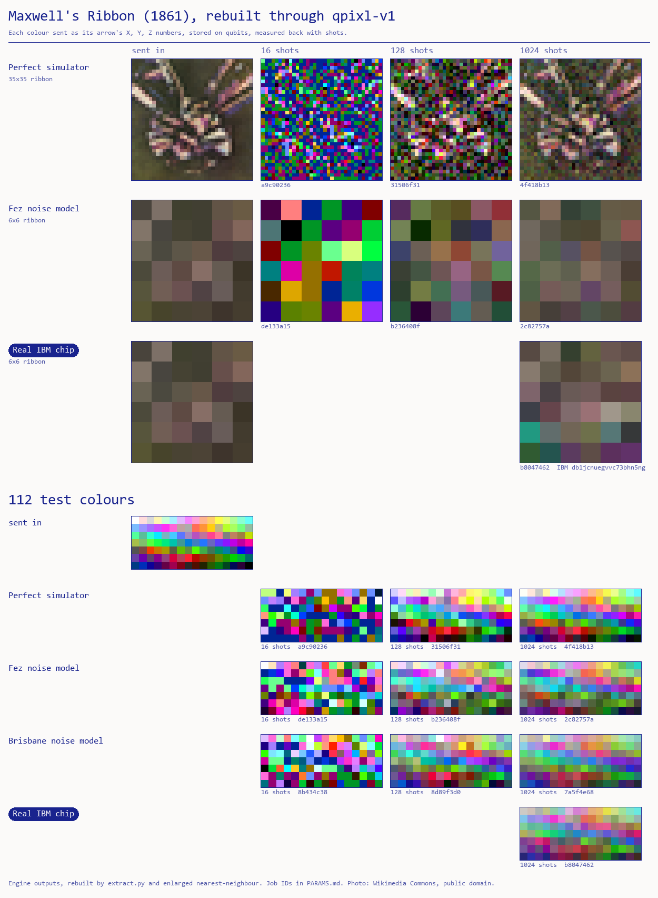

# Maxwell's Ribbon

**Moth Hack 2026 · Challenge 11 · FQxI Challenge**: an educational app that teaches a general audience
something about quantum mechanics, using at least one Atlas engine.

> **Rebuild a qubit the way Maxwell rebuilt colour.**
> You can't look at a qubit, just as Maxwell couldn't photograph colour in 1861. He used three filters,
> and physicists use three measurements. Pick any colour and see what a quantum run gave back for it.



## The deliverable

An interactive explainer for a 14-year-old: **`web/index.html`** (built by `build_web.py`, published by the
lead with `web/files.json`). It has:

- **The hero: Maxwell's studio**, a pixel-art scene (`web/scene.js`, cast in `web/sprites.json`, drawn by
  `make_sprites.py` in the set's ink palette, scaled by whole numbers with no smoothing). A round **Bloch-ball
  character**, wearing Maxwell's tartan ribbon as a bow, sits on a stool in the colour that was sent to the engine.
  **James Clerk Maxwell** (1861 frock coat, full beard) stands at his camera. Press **Take the three photos** (or
  click the camera): the X, Y and Z filters drop in front of the lens one at a time, each plate flies to the machine
  that stores and measures it, and comes back to hang on the drying line as bright as the number the run measured
  (0 = black, 1 = white). Then the three plates project the **rebuilt portrait** onto the screen. Maxwell reacts to
  the real miss: he cheers below 0.15, strokes his beard up to 0.5, and clutches his brow above that, and his line
  under the scene says why (shot scatter, noise greying the arrow, or 16 shots turning plates pure black or white).
  The machine in the corner is a computer for the simulators (with a fuzzy screen for the noise models) and
  **IBM's chip in its dilution refrigerator** for the hardware run. Click the sitter for a new test colour.
  The flash, flying plates, blinking lights, colour top and light rays are decoration, and the page says so.
- **Data view (one click away):** the 3D colour ball drawn as a qubit (Bloch) sphere with three.js (r128, cdnjs).
  Pick a dot, turn the ball, and "Show every colour's drift" to draw all 112 test colours' sent→rebuilt lines, so
  you can see noise pull the whole ball toward grey.
- **Titled sections under the scene** (restored 5 Oct with the first version's words and graphs, see
  `history/restore_report.md`): **How to play** (the first version's three steps, word for word, plus a map of every
  interactive part), **The data** (the same colour ball, always on show with its original caption, a key, the live
  pick → rebuilt meter and a drift switch; it shares its angle and state with the one at the top), then the story,
  quiz and glossary, then **How it was made** (two drawers), **What this does not claim** (always open) and **Jobs and
  credits** (one row per cached job with its Atlas and IBM job IDs and a Load button, the five failed Tessa job IDs,
  and the credits).
- **Controls under the scene:** a **shots slider** (16 / 128 / 1024) and a **machine selector** (perfect simulator,
  Fez noise model, Brisbane noise model, **real ibm_fez chip**) switch between the cached real jobs. The readout gives
  each plate's sent and measured number, the miss distance and the job ID. "Copy link to this view" shares the exact
  state in `#token`.
- **A scroll story in five chapters:**
  1. Maxwell 1861: switch the R/G/B filters on a scan of the ribbon. One plate is grey; three make colour. *(classical)*
  2. Tomography: a "hidden arrow" game. A Bloch character hides behind a velvet curtain; measure Z, X and Y ten
     clicks at a time and your own Bloch character takes on the rebuilt colour, then Reveal raises the curtain.
     *(classical random numbers with the true quantum odds, labelled)*
  3. Colours live in a ball: grey centre, white and black poles, hue around the equator, the same shape as the qubit ball.
     The "Where your colour sits" bars (Z light–dark, X lean, Y lean, away from grey) show the colour you picked.
     *(labelled analogy)*
  4. What the quantum engine did, with a clickable table of every run.
  5. Maxwell's ribbon rebuilt: wipe between sent and rebuilt, and click a pixel (or use the arrow keys) to send it to
     the ball and to Maxwell's studio at the top.
- **A 3-question quiz** with explanations (its "Start again" button appears once you have answered something), a
  **glossary** (11 terms), the engine details in a drawer, and what the piece does not claim, always open.
- **Links to the rest of the set:** the brand bar (it reads "Challenge 11 · Recover": all 22 entries are equal) goes to the hub, and the foot of the page carries the shared nav
  (`common/nav.py`, inlined by `build_web.py`): ← 10, **All 22 pieces** (the hub), 12 →, and a "Jump to any piece" list.

Nothing auto-plays, and nothing is computed live on the page. Every rebuilt colour is a cached engine output.
The only motion before you click is a gentle idle (blinks, a blinking cursor or chip light). The page works at 375 px
wide, by keyboard (arrow keys turn the ball and move the ribbon cursor), and with reduced motion (the photos then
skip straight to the result and the idle loops stop). There is no audio in this piece.

## What happened to Tessa, and what we ran instead

The brief named **tessa-image-v1**, the Atlas engine that writes a picture onto qubits through a colour
sphere. Every Tessa job failed with `engine_timeout`: two on a 64×64 plate (the documented ceiling), two
on a 32×32 plate (one size down), and one more at the cheapest config after a nine-minute wait.
`plate.py` and `run_tessa.py` are kept as the record, and all five job IDs are in PARAMS.md.

So we ran Tessa's pipeline by hand, with its quantum middle step on **qpixl-v1** (Interwoven QPIXL, from the
same `iqpixl` library Tessa is built on):

| Step | Where it runs | Quantum or classical |
|---|---|---|
| Crop the 1861 scan, choose 112 test colours spread through the colour ball (`payload.py`, `plate.py`) | our code | classical |
| Turn each colour into its arrow (X, Y, Z) in our colour ball; send each component as (c+1)/2, in three "plates" | our code | classical |
| Store each number as a qubit rotation angle and measure it back with shots (`run_qpixl.py` → qpixl-v1) | **Atlas `aer` simulator**, **`fake_fez` / `fake_brisbane` noise models**, **IBM `ibm_fez` hardware** | quantum circuit (simulated, emulated with noise, or on hardware, as labelled) |
| Rebuild each colour from its three measured numbers (`extract.py`) | our code | classical |
| The page: Maxwell's studio scene, three.js ball, filters, game, quiz | your browser | classical |

The X/Y/Z here are the colour arrow's three coordinates, the same three numbers state tomography is after.
But qpixl measures every number the same way, by counting 0s and 1s. **This is not three-basis tomography
of one qubit**, and the page says so. Chapter 2's game shows real three-basis tomography, run with classical
random numbers.

## Engine, parameters and qubits

- **Engine:** `qpixl-v1`, 1 credit per run. `mode` `emu` with `machine` ∈ {`aer`, `fake_fez`, `fake_brisbane`}
  × `shots` ∈ {16, 128, 1024}, plus one `mode: qpu`, `backend_name: ibm_fez`, `shots: 1024`. `dynamic_range`
  stays at `none`, so the measured numbers are not rescaled.
- **Payloads** fill each machine's measured capacity: aer 4,096 values (112 colours + a 35×35 ribbon + padding),
  Fez 448 (112 colours + a 6×6 ribbon + padding), Brisbane 360 (112 colours + padding).
- **Qubits:** qpixl doesn't report a qubit count. `topology.py` computes it from each chip's coupling map using
  the engine's documented checkerboard rule. That rule reproduces all three capacities measured on the live engine:
  Fez 448, Brisbane 360, Torino 378.
  - **ibm_fez (real hardware): 156 qubits**: 64 data + 92 address, the whole chip, in one joint circuit.
  - fake_fez: the same 156-qubit layout, with each ≤ 4-qubit group simulated on its own physical qubits.
  - fake_brisbane: 127 qubits (54 data + 73 address).
  - aer: not reported (the engine sizes its own lattice for 4,096 values).
  - A different rule gives a different number. The build guide's shorthand for QPIXL (ceil(log2 #values) address + 1 data)
    gives 9 + 1 = 10 qubits for 448 values, and entry 07 of this set reports that figure for its own 448-value ibm_fez run.
    That shorthand describes one compact QPIXL register. qpixl-v1 instead spreads the values over a checkerboard lattice
    laid on the chip (its description), and entry 07's PARAMS reports 64 data-qubit groups on fake_fez (from job progress), which
    matches the 64 data qubits counted here. So 156 is the count from the coupling map, and 10 is the count from the shorthand.
- **Every job** with its job ID, IBM job ID, miss and shrink: [PARAMS.md](PARAMS.md). Metrics: `out/metrics.csv`.

## Results

Average miss of the 112 test colours (distance between sent and rebuilt arrow; ball radius 1, 0 = perfect),
and how much of their length the surface colours kept at 1024 shots (100% = no greying). From `out/metrics.csv`.

| machine | 16 shots | 128 shots | 1024 shots | arrow length kept (1024) |
|---|---|---|---|---|
| aer (noiseless simulator) | 1.34 | 0.40 | 0.12 | 103% |
| fake_fez (noise model) | 1.17 | 0.42 | 0.33 | 75% |
| fake_brisbane (noise model) | 1.09 | 0.35 | 0.28 | 72% |
| **ibm_fez (real hardware)** | – | – | 0.32 | 70% |

- **More shots, sharper rebuild:** on the perfect simulator the miss falls 1.34 → 0.40 → 0.12.
- **Too few shots, no picture:** at 16 shots 88% of the numbers came back as exactly 0 or 1, and the ribbon disappears into noise.
- **Noise greys the colours:** on the noisy machines extra shots stop helping (miss stays near 0.3), because the arrows shrink toward the grey centre. The Fez noise model (75%) predicted the real Fez chip (70%) well.

## What this claims, and what it doesn't

- **Claims:** every rebuilt colour on the page is computed from a real, cached qpixl-v1 output (a simulator,
  noise-model or hardware run, labelled). The ibm_fez run used all 156 qubits of the chip (computed as above).
  On real hardware, colours come back pulled toward grey, the centre of the ball.
- **Does not claim:** that photography is quantum (Maxwell's filters are classical optics, and this is a labelled
  analogy). It doesn't claim a colour is a qubit, that qpixl performed three-basis tomography, or any quantum
  advantage (a laptop stores these colours perfectly). The noise models are classical emulations, not hardware.
  Picking a free colour shows the engine's result for the *nearest* of the 112 test colours, with the distance shown.
  Our colour-ball formula is our own; Tessa's built-in sphere uses the same landmarks but differs in detail.

## Reproduce

```bash
python plate.py        # Tessa input plate (kept as the record of the failed attempts)
python payload.py      # colour plates for qpixl, sized per machine (classical)
python topology.py     # qubit counts from the chips' coupling maps (needs qiskit-ibm-runtime, already installed)
python run_qpixl.py    # the 10 qpixl jobs; cached in ../../cache/qpixl-v1, so re-runs are free and offline
python extract.py      # rebuild colours, metrics, web/data.json, PARAMS.md (classical)
python compose.py      # ribbon_rebuilt.png
python make_sprites.py # the pixel-art cast -> web/sprites.json (add --preview sheet.png for a contact sheet)
python build_web.py    # web/index.html (pure ASCII), web/img/mascot.png (common/mascot.py), web/files.json
python verify.py       # BUILD_GUIDE section 7 checks + node test_logic.js
MOTH_FREEZE=1 python run_qpixl.py   # proves every job replays from cache with no new submissions
```

`run_tessa.py` re-submits nothing under `MOTH_FREEZE=1`. It exists to document the five failed Tessa jobs.

## Verification (BUILD_GUIDE section 7)

1. **Freeze replay:** every script re-run with `MOTH_FREEZE=1` (`plate.py`, `payload.py`, `topology.py`, `run_qpixl.py`,
   `run_tessa.py`, `extract.py`, `compose.py`, `build_web.py`). The SHA-256 of every output (raw job JSONs,
   `web/data.json`, PARAMS.md, metrics, plates, `ribbon_rebuilt.png`, `web/index.html`) was identical, and no ledger entries were added.
   (On 5 Oct `compose.py` was re-themed to the set's paper-and-ink look, so `ribbon_rebuilt.png` has a new frame around
   the same engine pixels; re-running it reproduces the new file byte for byte.)
2. `web/index.html` has zero non-ASCII bytes, and its one inline script parses with the guide's node one-liner.
3. The referenced files (`img/ribbon_full.webp`, and the hub mascot `img/mascot.png`) are in `web/files.json`.
   Total size is 1.09 MB.
4. `node test_logic.js` runs 8,646 checks. The JS colour ball matches the Python swatch generator, the RGB↔ball
   round trip holds, landmarks are correct, and nearest-swatch, coin-flip measurement and estimate behave. The page's
   JS rebuild of every test colour in all 10 jobs matches `extract.py`, and the ribbon cell mapping between 35×35 and 6×6 is checked.
   It also checks the sprite cast (even sizes, ink palette only), that every plate value shown is the engine's own
   number in 0..1, that the shoot sequence hangs X, then Y, then Z before the screen lights, and that the pixel font
   covers every label the scene draws.
5. `verify.py`: there is no `fetch`/XHR, no URL other than cdnjs (three.js r128), Google Fonts, the hub and the set's
   other published pieces (the shared nav), and no alert/iframe/download.
6. The copy was re-read against section 5. Every quantum step is labelled with where it ran, classical steps are labelled
   classical, and the analogy is labelled.

7. **Page QA** (`node common/qa/qa_page.cjs entries/11-maxwells-ribbon 6400`, from the project root): `ok: true`, no
   problems, no console errors or failed requests, 0 px overflow at 375 px, only allowed hosts (Google Fonts, cdnjs),
   and all 55 visible controls (buttons, drawers, quiz answers, Load buttons, the jump list) clicked without errors. The piece has no audio or video
   deliverables, so there is nothing to play and nothing sounds (`sound_started: false`, 0 audio contexts). Screenshots are in `qa/`.
8. **Integration audit (5 Oct).** `build_web.py` run twice under `MOTH_FREEZE=1` gives a byte-identical `web/index.html`.
   `node common/qa/deadcontrols.cjs entries/11-maxwells-ribbon 6380` tested 53 controls. Two showed nothing when there was
   nothing to reset, and were fixed: "Reset ball angle" now confirms what it did (a toast), and the quiz's "Start again"
   only appears once there is an answer to clear. The four it still lists are false positives, each re-checked in context: "Scene" is already selected
   on load (it works after "Data"), and the hidden-arrow, your-rebuild and ribbon canvases sit below the fold when the tool
   drags on them without scrolling (scrolled into view, the same drag reveals the arrow, sends the rebuild up, and picks a
   pixel). `node entries/11-maxwells-ribbon/qa/e2e.cjs 6390` walks the whole journey with real assertions and passes: shoot
   on the simulator and on ibm_fez (the plate readouts equal the cached engine outputs for that colour), the shots slider
   and machine selector, sitter and camera clicks, Scene/Data with drag-turn, reset and drift, the three drawers, the
   filters, the hidden-arrow game, a run-table cell, a ribbon pixel, two share links restored after a reload, the quiz,
   the prev/hub/next nav and jump list, no sound, and 0 px overflow at 375 px. `python common/qa/crosslinks.py` reports
   no problems for this piece. Every job ID on the page is in `cache/qpixl-v1/`.
9. **Restore pass (5 Oct).** The first version's words and graphs were brought back under titled sections below the
   scene. `history/inventory.md` lists all 195 user-facing strings and 8 graphs of the pre-sprite page;
   `history/restore_report.md` maps each one to its place on the page now (18 restored word for word, including the
   Chapter 3 "Where your colour sits" bars and the colour ball in an always-visible "The data" section), plus the kept
   later corrections (the brand bar reads "Challenge 11 · Recover": all entries are equal). `qa/e2e.cjs` gained steps
   for the new sections and passes; `qa_page.cjs` is `ok`. deadcontrols still lists canvases below the fold as false
   positives (it drags without scrolling them into view; e2e checks each of them in view), now including the ball in
   "The data".
10. **Integration re-check after the restore (5 Oct).** `build_web.py` run twice under `MOTH_FREEZE=1`: byte-identical
   `web/index.html`, mascot and `files.json`, and the same bytes as the page already in `web/`; `compose.py` reproduces
   `ribbon_rebuilt.png` byte for byte; `verify.py` passes (8,646 logic checks). All 195 first-version strings in
   `history/inventory.md` were checked again against today's template, app.js, scene.js and page copy: all are there word
   for word except "11 / 11 · Recover" (now "Challenge 11 · Recover", because all entries are equal). deadcontrols tested
   77 controls and lists 6: "Scene" (already selected on load) and five canvases below the fold (the ball in The data,
   the chapter 1 filters picture, the hidden arrow, your rebuild, the ribbon). Each was re-run with the same drag after
   scrolling it into view (and "Scene" after "Data"), and every one changed the page, so none is dead. `qa/e2e.cjs` has a
   new step that screenshots every first-version graph under its titled section (G1-G8 in the restore report: the colour
   ball in The data and in the hero's Data view, the filters, the 1861 photograph, the hidden-arrow pair, the estimate
   bars, the "Where your colour sits" bars, the run table, the ribbon) and the studio scene, and checks each one is
   painted (not blank paper) and sits in its section; all 21 steps pass. `qa_page.cjs`: `ok`, no problems.
   `crosslinks.py`: no problems for this piece. Every job ID (10 qpixl-v1 and the IBM job) is in `cache/qpixl-v1/`, the
   15 ledgered credits match piece.json, and every deliverable path in piece.json exists.

**Look.** The page follows the shared brief-page style (`common/brand.css`: paper `#FBFAF9`, one ultramarine ink
`#19238E`, IBM Plex Mono labels, light Geist headings, hairlines, square panels, pill buttons, no glows, gradients or
shadows, single light theme, footer disclaimer). Chrome on the three.js ball (grid, axes, sent-colour ring, error and
drift lines, sample rims) and on the ribbon canvas (divider, labels, cursor) is drawn in that ink and paper. The colour
dots, arrows and ribbon pixels are data and keep their own colours; the dots and arrows get a thin ink outline so pale
colours stay visible on paper. The studio scene's sprites use only the shared ink palette; the warm accent appears
only as light (the flash, the light rays, the open lens). The only other colours in the scene are data: the sitter and
the portrait (the sent and rebuilt colours) and the plate greys (the measured numbers).

`ribbon_rebuilt.png` (made by `compose.py`) uses the same paper ground, ink labels and hairline frames; the hardware row
gets a solid-ink label like the page's hardware badge. Its pixels are the engine outputs, enlarged.

No pip packages were installed. `topology.py` uses qiskit-ibm-runtime 0.45.1, which was already on the machine.

## Files

`data/Tartan_Ribbon.jpg` (source scan, public domain), `data/filepage_check.txt` + `wikimedia_meta.txt`
(licence check), `swatches.json` (112 test colours), `data/payloads.json`, `data/topology.json`,
`out/qpixl_*.json` (raw engine outputs), `out/rebuilt_*.png`, `out/metrics.csv`, `out/attempts.jsonl` (every failed
attempt), `engine_schema.json` (tessa schema as read), `data/qpixl_schema.json`, `web/` (page source and build), `qa/e2e.cjs` (the end-to-end journey test) and `qa/` (QA reports and screenshots).
Credits and licences: [CREDITS.md](CREDITS.md).
