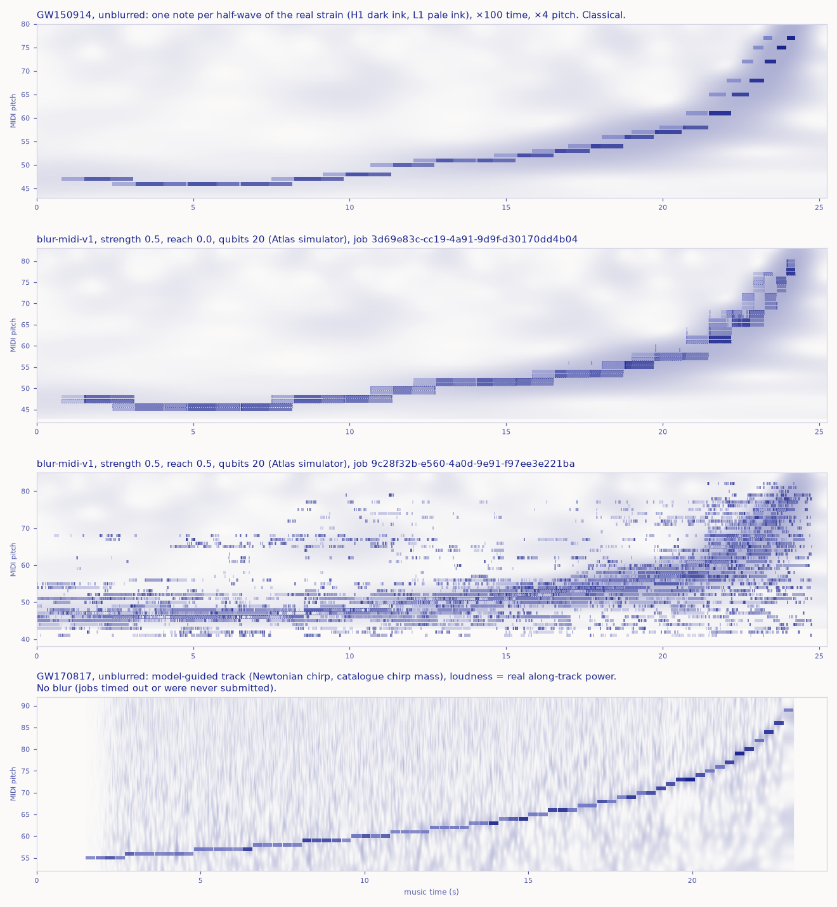

# Chirp Instrument

**Moth Hack 2026 · Challenge 02 (Make it audible)** · status: **partial** (see "What is missing")



*Play the last fifth of a second of two black holes.* This piece turns the real LIGO strain of
**GW150914** into MIDI, one note per half-wave of the measured signal. **GW170817** gets a
model-guided track. An Atlas quantum blur (`blur-midi-v1`, simulated, 20 qubits per pass) then
scatters the result. The deliverables are MIDI files, WAV renders, and a playable web instrument
in which the user taps through the chirp, scrubs the blur's reach, loops the merger and jams on a
keyboard over it.

## Play it

Open `web/index.html` (or the published artifact). Nothing plays until you act.

The page opens on an illustrated **scene**, drawn as a labelled scientific plate in ink pixel art (*Scene / Data*
toggles it with the piano roll). Above, on the night sky, GW150914's black holes appear as what you would see: two
dark shadows sized by mass (36 : 29 M☉; a shadow's radius is √27 GM/c², proportional to mass), each edged by its
photon ring, with the background stars and a Milky-Way-like band bent around them. The page ray-traces two
point-mass lenses for every pixel, every frame, and the pair's orbit tightens with the real ridge frequency as the
notes play. Below them stand the two real observatories, **LIGO Hanford** and **LIGO Livingston**, as oblique aerial
engravings: a camera hangs behind the outside corner of each L and looks along the bisector of its arms, over that
site's real geometry (the arms at their true azimuths, 3994.5 m long, with the end stations at 4 km; at Hanford the
mid stations at 2 km, which held the end mirrors of its former 2 km interferometer, and the Rattlesnake Hills on the
skyline with Rattlesnake Mountain at its real bearing; at Livingston, which has no mid stations, the pine forest with
the arms in cleared strips). Each corner station's roof is cut away to show the
laser, the beam splitter, the input test masses and the photodetector, all labelled. Each real half-wave leaves the
pair as a ripple that lands on Livingston 0.73 s before Hanford, exactly when each voice's note sounds: light runs
through the cut-away optics and out along both arms, one arm stretches while the other squeezes (its end station
moves 2 px), and the photodetector flashes. Between the two sites run each site's real whitened strain and the
quantum blur as a cloud of the real blurred notes around the playhead. On a phone the two observatories stack,
Livingston above Hanford, under the source. What the scene takes from the data and what is drawn is listed on the page
("Who is who in the scene") and below.

- **Tap** the black holes in the scene, the pad, or press `Z`/`X`: each tap plays the next half-wave of the real signal,
  together with everything the blur put inside that half-wave, and sends that ripple out. You set the tempo,
  so speed up into the merger. Tap an **observatory** to mute its voice (its laser goes off); tap the **blur cloud** to step its reach.
- **Play** (`Space`) runs the transport. There is a speed slider (0.25×–2×), a volume slider, and
  H1/L1 voice toggles (Hanford panned left, Livingston right).
- **Scrub** the *Quantum blur · reach* slider: off → 0 (local) → 0.5 → 1. Stops that were never run
  are struck through, and the slider snaps back from them with an explanation. `,` and `.` step it.
- **Loop**: drag along the tape under the scene (or across the roll: in *Data*, or in Figure 1 under *The data*; the strain under the roll takes clicks and drags the same way), or pick *Inspiral* / *Merger*.
  Click either to move the playhead, or use the arrow keys when it has focus.
- **Jam**: play the on-screen keys, or `A W S E D F T G Y H U J K O L P ;` (DAW layout), with `-`/`=`
  for octaves. Keys glow by how much each pitch is used in the current setting; every key that lights throws
  a little pixel note.
- **Hear the detector**: plays 0.31 s of the actual whitened, band-passed H1/L1 strain at real speed.
- **Hear the renders**: all four WAV deliverables play on the page (as MP3 in `web/audio/`). Each one has
  Play/Pause, Stop and a position slider, plus a button (*Show this MIDI on the roll*) that loads the same MIDI into the instrument. Starting
  one pauses the others and the transport. Nothing loads or sounds before you click (`preload="none"`).
- **Copy link to this view**: the event, reach, strength, speed, voices and loop go into `#e0_r2_s0_v100_m3_l17.80-25.23`.

**The scene, data versus drawing.** From the data: one ripple per real half-wave (one per 16-cycle note for
GW170817), its ink from the measured strain (the note velocity), its arrival at each observatory at that voice's note
onset; which arm stretches and which squeezes (it flips every half-wave, because the strain changes sign), the light
in the arms and the photodetector's flash at that moment; the orbit turning a quarter turn per half-wave
(gravitational waves run at twice the orbital frequency); the separation following the ridge frequency as
r ∝ f<sup>−2/3</sup>, with Newtonian Kepler readouts in km and fraction of c (about 920 km apart at 30 Hz, about
320 km and 0.55 c at 150 Hz, cf. the PRL's ~350 km and ~0.5 c); the merger at the measured peak (+0.0226 s on the H1
clock); the strain strip charts (real whitened H1/L1; for GW170817 the measured along-track power per note); every dot
in the blur cloud (a real note of the current setting within 1.5 s of the playhead); and one grain per blurred note
that starts. Real-world geometry: the shadows' 36 : 29 : 62 sizes (source-frame masses from PRL 116, 061102); each
observatory's vertex, its arms' true azimuths (H1 324° and 234°, L1 252.3° and 162.3°) and 3994.5 m length, the end
stations at 4 km and Hanford's mid stations at 2 km (Livingston has none), projected through a pinhole camera; at Hanford, Rattlesnake Mountain
(1,076 m, 17.6 km away at bearing 255.6°) and Lookout Summit (1,106 m) at their real positions; and the neutron stars
drawn the same size (about 24 km across). Drawn: the lensing strength, the stars, band and host galaxy (NGC 4993), the
ringdown shape (its 251 Hz, 4.0 ms timing is GR's prediction for the measured remnant, PRL 116, 221101, slowed ×100),
GW170817's flash, the grains' paths and shimmer; at the observatories, the building footprints (approximate) and
their enlargement (corner stations 1.6×, mid and end stations 3.5×), the cut-away optics (a schematic: positions and
chamber sizes exaggerated), the light in the tubes (really infrared and hidden), the 2-pixel arm stretch (really about
4×10⁻¹⁸ m at the peak), the hills' height (×2.5), the sagebrush and pine textures; the neutron stars at 3× the orbit's
own scale; and every distance between the source and the Earth. The orbit is drawn 1.4× wider than the shadows' own
scale, so the pair stays apart until the last half-waves, when the shadows flow into one outline. The ripple speed is
chosen so the 0.73 s canon fits between the observatories on screen (with GW170817, which has no lag, the ripple is
quick on a phone so it reaches both stacked observatories within a few hundredths of a second), and GW170817's orbit is
drawn a quarter turn per note (really 8 orbits). There are no faces or characters: the cast is authored in
`make_sprites.py` (the two observatories, each in three frames with the anchor points for the callouts and the light;
the lensed pair, the remnant and the tap pad on the page's own lens rule; the neutron-star icon and the flash), which
writes `web/sprites.json`. `build_web.py` inlines it with `common/inksprite.js` and renders the hub mascot
(`web/img/mascot.png`, the lensed black-hole pair, 152 px) with `common/mascot.py`.

In the *Data* view the roll is drawn over the real wavelet scalogram, and under it is the real strain (GW150914)
or the measured along-track power (GW170817). The HUD maps the playhead back to real detector time and frequency.
Below the instrument, six titled sections hold the rest of the page, always open: *How to play* (every control);
*The data*, with Figure 1 (the same piano roll over the real scalogram, with its own Play button), Figure 2 (the real
strain or along-track power on the same clock) and Figure 3 (this README's hero figure, drawn live from the same note
lists: every take side by side; click one to put it on the roll); *How it was made*; *The science* (who is who in the
scene); *What this does not claim*; and *Jobs and credits* (every planned blur setting from `out/jobs.csv`, with the
completed, failed and never-submitted ones). Then the prev / hub / next links to the other pieces (`common/nav.py`).
The page uses the shared paper/ink look (`common/brand.css`): one ultramarine ink on warm paper, with the
scalogram as a light ink wash and H1/L1 as solid/lighter ink. It passes `common/qa/qa_page.cjs` (no console
errors, no overflow at 375 px, every MP3 decodes, sound starts only from a click).

## How the chirp becomes MIDI (classical)

| | GW150914, **measured track** | GW170817, **model-guided track** |
|---|---|---|
| Data | GWOSC H1 + L1, 32 s at 4096 Hz around GPS 1126259462.4 | GWOSC H1 + L1, 32 s at 4096 Hz around GPS 1187008882.4 |
| Cleaning | whiten (Welch 4 s, median) | L1 high-pass 15 Hz, then the known glitch gated (inverse Tukey, −1.10 to −0.95 s), then whiten |
| Frequency | Morlet scalogram of H1+L1 power (L1 shifted by the measured lag), Viterbi ridge that may only rise | leading-order (Newtonian) chirp law with the catalogue chirp mass 1.186 M☉ × (1 + z = 1.01) = 1.198 M☉; only the merger time is fitted (grid search, best +0.052 s) |
| Notes | ridge phase cut into half-cycles: **one note per half-wave**, 21 per detector, −0.200 s to +0.028 s | **one note per 16 wave cycles**, 72 per detector, 48.9 → 340.7 Hz |
| Pitch | ridge frequency × 4 (two octaves up), rounded: MIDI 46–77 | model frequency × 4: MIDI 55–89 |
| Loudness | peak whitened strain in that half-wave, per detector | real power along that stretch of the track ÷ power at nearby off-track frequencies, per detector (log-mapped) |
| Time | ×100 stretch; L1 notes start 7.32 ms × 100 = 0.73 s earlier (measured lag) | constant 0.3 s per note |
| Check | Newtonian fit to the ridge: chirp mass ≈ 35 M☉ (detector frame; catalogue 27.9 M☉ source frame ≈ 31 detector frame). A crude check. | along-track power 6.8× off-track; the same statistic with the merger time shifted ±2 s gives 1.65× |

MIDI layout: SMF type 1, 480 ticks/beat, 120 bpm. Track 0 is the conductor, track 1 is "H1 Hanford"
(channel 0) and track 2 is "L1 Livingston" (channel 1). Velocity runs from 24 to 127.

## The quantum step

**Engine:** Atlas `blur-midi-v1` ("Blur Jazz": Quantum Blur for MIDI), 1 credit per run. According to
its docs it turns each track into piano-roll stacks, blurs them as height maps with a quantum circuit
on a simulator, and re-emits notes above a relative noise gate. Its docs list no hardware (QPU) mode.

**Parameters:** `qubits = 20` (the engine's maximum budget per pass), `resolution = 2` ticks per roll
step, `strength = 0.5`, `reach ∈ {0, 0.5}` (completed), with `threshold = 0.1` and `margin = 0.15` left at defaults.

**Qubits, and how we know.** Quantum Blur stores a w × h grid in ⌈log₂ w⌉ + ⌈log₂ h⌉ qubits, the rule
Atlas documents for blur-v1. For each GW150914 track the roll is 32 semitones + 15% margin on each
side = **42 pitch rows**, by 11,633 (H1) / 11,281 (L1) steps of 2 ticks, so 6 + 14 = **20 qubits**:
one pass at the engine's maximum. This is **our calculation; the engine does not report its width**.
Two facts support it: the cached job records show `qubits = 20` and `resolution = 2` were sent, and
the reach-0.5 output spans exactly MIDI 41–82, which is the 42 rows we assumed. We chose `resolution = 2` precisely so that the
whole chirp fits one 20-qubit register rather than smaller tiles.

| Setting | Job | Notes out | What it sounds like |
|---|---|---|---|
| unblurred | none (classical) | 42 | the chirp: two voices, rising and quickening |
| strength 0.5, reach 0 | `3d69e83c-cc19-4a91-9d9f-d30170dd4b04` | 251 (144 shorter than 40 ms) | every half-wave becomes a two-note cluster with a neighbouring semitone, plus 2–6 ms pre-echoes |
| strength 0.5, reach 0.5 | `9c28f32b-e560-4a0d-9e91-f97ee3e221ba` | 9,444 (8,140 shorter than 40 ms) | the merger's notes scatter into a granular cloud across all 25 s, before and after the event |

## What is missing, and why (honest account)

The plan was 9 jobs: GW150914 at strength {0.5, 1.0} × reach {0, 0.5, 1}, and GW170817 at strength
0.5 × reach {0, 0.5, 1}. **Only 2 completed.**

1. Job 1 ran alone and completed in 294 s.
2. To save time I then launched the remaining 8 in parallel. My first launch (shell `&`) looked dead
   but was not, so a second launch duplicated it. The engine answered **"The engine did not respond in
   time — retry the job"** for 9 submissions, each within about a minute.
3. The retries pushed the ledgered spend to **11 credits against a cap of 10**. The overspend is mine:
   concurrent workers each passed the cap check before the others had ledgered. The client then
   refused every further submission, so reach 1, strength 1.0 and all of GW170817's blurs were never
   obtained.
4. So 3 settings were submitted and failed (3 attempts each): GW150914 s1.0/r0 and s1.0/r1, and
   GW170817 s0.5/r0.5. The other 4 were never submitted: GW150914 s0.5/r1 and s1.0/r0.5, and
   GW170817 s0.5/r0 and s0.5/r1. A read-only status check on 2026-10-04 (no credits) confirmed all
   9 failed jobs are still `failed`.
5. Every failed job ID is listed in `out/jobs.csv` and [PARAMS.md](PARAMS.md). Nothing was faked or
   simulated in their place. On the page those stops are struck through, and each one says whether it
   timed out or was never submitted. GW170817 says plainly that it has no blur.

`run_blur.py` is now sequential only, and it never submits once the cap is reached. The overrun
cannot be undone, and it needs the lead's explicit acceptance. No job has been submitted since.
Completing the brief's reach sweep (0, 0.5, 1) at strength 0.5 needs one more credit, for
GW150914 s0.5/r1.0. Only the lead can approve that, by raising `CAP` in `run_blur.py` from 10 to
12. The ledger stands at 11, and s0.5/r1.0 is the first uncached setting in the plan, so exactly one
job is submitted before the cap stops the script. Then `python render_wav.py` and
`python build_web.py` add its WAV, its MP3 player card and its reach-1 stop on the page with no code changes.

**Status on 2026-10-04 (polish pass):** an automated workflow proposed raising the cap to 13 to submit this
one job. It was **not** submitted: spending credits needs the user's own explicit go-ahead, which that
pass did not have. Everything on the page still replays from the cache, and the ledger is unchanged at 11.

## Quantum vs classical

| Step | Kind |
|---|---|
| Download, whitening, gating, scalogram, ridge tracking, chirp-law model, MIDI writing (`fetch_data.py`, `chirp_lib.py`, `track_chirp.py`) | classical |
| Blur of the GW150914 MIDI (`run_blur.py` → blur-midi-v1) | **quantum circuit on Atlas's simulator**; no hardware mode |
| WAV renders (`render_wav.py`) and the web synth | classical (numpy / Web Audio) |
| Figures and page build (`figures.py`, `build_web.py`) | classical |

**What this claims:** the notes come from real public LIGO data via the documented mappings above.
The blurred MIDI files are real, downloaded blur-midi-v1 outputs, with the job IDs listed.

**What it does not claim:** no quantum advantage, and no detection, measurement or improvement of
anything about gravitational waves. The blur is an audio effect with no physical link to the source.
The ×100 time stretch and ×4 pitch shift are artistic choices, so this is not "what a black-hole
merger sounds like". GW170817's pitch line comes from a textbook model, not from tracking. The
chirp-mass check is a crude leading-order fit. No quantum hardware was used.

## Reproduce

```bash
python fetch_data.py      # GWOSC strain (≈ 250 MB for GW150914's 4096 s bulk files) + catalogue values
python track_chirp.py     # tracks, MIDI, scalograms -> midi/, out/
python run_blur.py        # cached Atlas jobs replay free and offline (MOTH_FREEZE=1 safe)
python render_wav.py      # wav/*.wav
python figures.py         # hero.png (the page's paper/ink palette, the same four takes as Figure 3), out/wav_check.png
python make_sprites.py    # the scene's pixel-art cast and the two observatories -> web/sprites.json (Python + numpy)
python build_web.py       # web/index.html + web/files.json + web/img/mascot.png; wav/*.wav -> web/audio/*.mp3 (bundled ffmpeg)
node tests/test_logic.js  # unit tests of the page's pure logic
node tests/smoke_chrome.mjs <outdir>   # headless Chrome: no console errors, flows work, no scroll at 375 px
node qa/e2e.cjs 6240      # Playwright end-to-end journey (from the project root: node entries/12-chirp-instrument/qa/e2e.cjs 6240)
```

No extra packages beyond the project's standard set (numpy, scipy, h5py, gwosc, mido, pillow, matplotlib).

## Files

- `midi/GW150914_chirp.mid`, `midi/GW170817_chirp.mid`: the chirps as MIDI (classical)
- `midi/blurred/GW150914_s0.5_r0.0.mid`, `midi/blurred/GW150914_s0.5_r0.5.mid`: blur-midi-v1 outputs
- `wav/*.wav`: 44.1 kHz stereo renders of all four MIDI files
- `web/`: the instrument (`index.html`, `template.html`, `files.json`, `sprites.json` with the scene's pixel-art cast, `img/` including `mascot.png` for the hub, `audio/` with the four renders as MP3, libmp3lame VBR q4, 1.2 MB in total)
- `make_sprites.py`: draws the realistic cast: LIGO Hanford and LIGO Livingston as oblique aerial engravings from their real geometry (projected through a camera; corner-station roof cut away to show the optics), the lensed black-hole pair and remnant on the page's own lens rule (also the hub mascot), the neutron-star icon, the kilonova flash and the tap pad, into `web/sprites.json`
- `qa/`: the page QA report and screenshots (`report.json`, `desktop.png`, `mobile.png`, `desktop-after-clicks.png`), the end-to-end journey `e2e.cjs` with its result `e2e.json` (tap, play, blur scrub, loops, jam, mute, Hear, every render, every graph drawn, sections, share link and reload, the prev / hub / next links, and the page's numbers against `piece.json`, `out/jobs.csv` and the engine cache), and `deadcontrols.json` from `common/qa/deadcontrols.cjs`
- `out/jobs.csv`, `out/GW150914.json`, `out/GW170817.json`: the audit trail and track data
