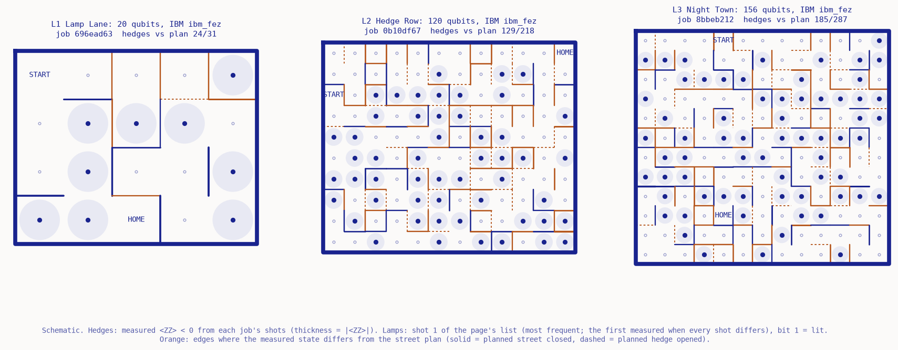

# Moth to Flame

**Moth Hack 2026 · Challenge 05: Quantum game**



Why do moths circle lamps? Not because they fly *at* the light. Fabian et al. (Nature Communications,
2024) filmed insects in 3D around artificial lights and found that they keep their **back** toward
the brightest light, the *dorsal-light response*. Under an open sky that keeps them level. Next to a
lamp it makes them fly across the light, and they end up circling, stalling or flipping over.

**Moth to Flame** is a small night-flight game about that reflex. You fly a moth home through a town of
hedges and street lamps. Every lit lamp tries to pull the moth into orbit, and you fight it. Every
level is one real Atlas `labyrinth-v1` job on **IBM ibm_fez** (Heron, 156 qubits): the **hedges** are the signs of
⟨ZZ⟩ measured from the job's shots, and the **lit lamps** are the bits of one measured shot that you choose.

## Play it

Open `web/index.html` (a single self-contained file). Nothing moves until you press **Take off**.

| You | How |
|---|---|
| Steer | `←` `→` (or `A` `D`), drag on the town, or hold the on-screen Left / Right buttons. A pad press (or the first key on the focused town) also takes off, flies again after a flight, or resumes from pause |
| Flap harder (faster, costs energy) | `↑` / `W` / Shift, or hold **Flap** |
| Pause / resume | `Space` / `P`, or the Pause button |
| Reset the flight | `R` / **Reset flight** |
| Hands off: watch the reflex fly | `H` / **Hands off**, or **Let go by a lamp** (drops the moth beside the nearest lit lamp) |
| Choose a level | one button per job, all three on IBM ibm_fez; each button shows its backend, qubits and job ID |
| Re-light the town | step through 40 measured shots (‹ ›): the 40 most frequent, or the first 40 when all 4096 shots differ (Hedge Row and Night Town) |
| Read one square | tap a square on the lamp map, or on Figure 1 before take-off, to read its qubit and its bit in this shot; arrow keys move the pick and `Esc` clears it |
| Lamp pull | slider 0–2× scales the dorsal-light reflex (0 = lamps have no pull) |
| Plan vs measured | dashes on every edge where the quantum state disagreed with the street plan (white in the Scene, orange in the Data view and in Figure 1) |
| Scene / Data | flip the town between the pixel-art scene and the plain schematic, with the measured ⟨ZZ⟩ printed on every edge when zoomed in |
| Whole town | zoom out on the big levels (Hedge Row and Night Town) |
| Compare backends | Figure 4 sets a level beside an earlier run of the same town on another backend (Aer emulator, IBM ibm_miami); **Mark where the two runs disagree** bands every edge that is a hedge in one run and a street in the other |
| Share | **Copy link to this town** puts `#L<level>.s<shot>.p<pull>` in the URL: same town, same lamps. Opening such a link restores them, also in a tab where the page is already open |

### Below the game: six titled sections

Everything the first version of the page said, and its graphs, sits under visible section headings below the game:
**01 How to play** (the controls above), **02 The data** (four live charts in the plain paper-and-ink schematic style:
Figure 1, the town map the game was first played on, following the same flight, with each edge's measured ⟨ZZ⟩ on hover
or printed when there is room, and steerable by drag or arrow keys; Figure 2, the lamp map of the chosen shot; Figure 3,
every level at a glance, the page's own drawing of `out/levels.png`, click one to load it; Figure 4, a level beside an
earlier run of the same town on another backend, the page's own drawing of `out/compare.png`, with a side-by-side table),
**03 How it was made** (what the quantum engine did, how the game reads a job), **04 The science** (why moths circle lamps),
**05 What this does not claim**, and **06 Jobs and credits** (every job ID, backend, shot count and score, the credit spend
from the ledger, and the sources). `history/inventory.md` lists every item of the first version and
`history/restore_report.md` says where each one is now.

### The cast (pixel art, `web/sprites.json`)

The town is drawn as ultramarine-ink pixel art at night (the shared palette in `common/inksprite.js`), at a whole-number
scale so every pixel stays square. **Scene** is the default view; **Data** flips the same flight to the plain schematic,
with the measured ⟨ZZ⟩ printed on every edge when zoomed in.

| Sprite | What drives it |
|---|---|
| The moth, from above (8 headings, 3-frame wingbeat, faster when you flap) | your steering and the classical flight model |
| Dizzy stars over the moth | the flight model: shown while the lamp's pull is strong (the HUD's "a lamp has you") |
| Street lamps: warm glass (lit) or dark glass | one measured bit per square: 1 = lit, 0 = dark |
| Warm dithered pool around a lit lamp | the glare zone, where brightness > 3 and energy drains fast |
| Hedges, in three leafiness tiers | measured ⟨ZZ⟩ < 0; tier from \|⟨ZZ⟩\|: below 0.02, 0.02 to 0.1, 0.1 and up |
| Cobbled streets | measured ⟨ZZ⟩ ≥ 0 |
| White dashes (Plan vs measured) | edges where the measured state disagrees with the street plan |
| Backend chips: a heavy-hex chip (ibm_fez, Heron) on every level card; in Figure 4 a little computer (Aer emulator) and a square-lattice chip (ibm_miami, Nighthawk) mark the comparison runs | the backend each job ran on (schematic icons, not chip maps) |
| The front-view moth on the cards (blinks, beams at home, dizzy when trapped, sleepy when spent) | how your flight ended |
| Houses, trees, the night flowers at the start, the cottage at home, hearts | decoration only |

On ibm_fez most hedges come out as the thin or middle tier, because the noise shrank the correlations: from 0.31 on the
noiseless emulator run of Lamp Lane to 0.075 on its ibm_fez run, and to about 0.01 on the two big towns (Hedge Row has 1
thick hedge of 89, Night Town 1 of 123). On the emulator comparison run every hedge is the thick tier. The mascot
(`web/img/mascot.png`) is exported from the same sprite file with
`python common/mascot.py entries/13-moth-to-flame/web/sprites.json moth entries/13-moth-to-flame/web/img/mascot.png --scale 5`.

Sound (Web Audio, synthesised in the page) starts only with Take off: mains hum that swells near lit
lamps, wing flutter, and soft cues for bumps, orbits, home and exhaustion. It has an on/off toggle.

## Levels, engine, qubits

Every level ran on **IBM ibm_fez** (`mode="qpu"`, `backend_name="ibm_fez"`, the default target in `run_levels.py`), and the
engine reports `ibm_fez` as the backend of each one.

| Level | Town | Qubits | Ran on | Atlas job | IBM job | Measured hedges matching the plan | mean(plan sign × measured ⟨ZZ⟩) | Engine's classical tomography estimate |
|---|---|---|---|---|---|---|---|---|
| L1 Lamp Lane | 4 × 5 | 20 | IBM **ibm_fez** (Heron) | `696ead63-7383-4e03-b2e4-13ef60a1b318` | `db1psfmegvvc73bi0fk0` | 24 / 31 (77%) | 0.075 | 31 / 31, 0.431 |
| L2 Hedge Row | 10 × 12 | 120 | IBM **ibm_fez** (Heron) | `0b10df67-a232-4151-8cc3-ce7242fe045c` | `db1pvqbid5ic73ergopg` | 129 / 218 (59%) | 0.008 | 217 / 218, 0.314 |
| L3 Night Town | 12 × 13 | 156 | IBM **ibm_fez** (Heron, 156 qubits: the whole chip) | `8bbeb212-7196-4677-bd06-4fba1d71d510` | `db1j3feegvvc73bhmqc0` | 185 / 287 (64%) | 0.013 | 286 / 287, 0.298 |

**Comparison runs (not levels).** Before this pass, Lamp Lane ran on the Aer emulator and Hedge Row on ibm_miami. Both runs
are kept, clearly labelled, because the page compares them with the ibm_fez levels (Figure 4, the level notes and the jobs
table). You can't fly them.

| Comparison run | Same town as | Qubits | Ran on | Atlas job | IBM job | Measured hedges matching the plan | mean(plan sign × measured ⟨ZZ⟩) | Edges where it disagrees with the ibm_fez run |
|---|---|---|---|---|---|---|---|---|
| Lamp Lane on the emulator | L1 | 20 | Aer emulator (noiseless simulator; the emulator's 20-qubit ceiling) | `9d0fd5f8-691b-4913-adca-056bdfa01823` | – | 30 / 31 (97%) | 0.310 | 6 of 31 |
| Hedge Row on ibm_miami | L2 | 120 | IBM **ibm_miami** (Nighthawk, 120 qubits: the whole chip) | `da6eaf6d-512c-492d-9ee4-655ac76d0e82` | `db1jh9ivog1s73fi7ejg` | 140 / 218 (64%) | 0.018 | 105 of 218 |

**What the noise remembers.** On the noiseless emulator the state keeps the street plan almost perfectly. One
planned street still comes out as a hedge, because the 3-sweep ZZ preparation only approximates the target.
On ibm_fez the same 20-qubit town keeps a quarter of that correlation (0.31 → 0.075), and on the big towns the correlations
shrink by twenty to forty times (0.008 on Hedge Row, 0.013 on Night Town); on the big towns every one of the 4096 shots is a
different bitstring (4080 of 4096 on Lamp Lane). Yet 59% to 77% of the edges still match the plan, where coin flips would
match about half. The engine's own classical estimate predicted a near-perfect layout. The real samples show how much of it the noise
erased, and the game uses the real samples. Turn on **Plan vs measured** to see every changed edge.

Where the measured hedges cut the town apart, the game plays in the largest connected region: 9 of 20 squares on Lamp Lane,
104 of 120 on Hedge Row and 96 of 156 on Night Town.

The two chips: a town grid needs four neighbours per square. Heron (ibm_fez) gives each qubit at most three (IBM's
heavy-hex layout), so a grid with every neighbour coupled cannot sit on that chip without routing (extra swap gates).
Nighthawk (ibm_miami) has 120 qubits on a square lattice with 218 couplers, exactly a 10 × 12 grid, so the town could map onto
it one-to-one. The same Hedge Row plan ran on both chips: on ibm_fez it kept 129 of 218 edges (mean 0.008), on ibm_miami 140 of
218 (mean 0.018). The two runs disagree on 105 of 218 edges, about what two independent samplings that match the plan 59% and 64% of the time would give (about 104).
The engine reports neither layout nor depth, so we can't confirm what the transpiler did, and one run per chip is not a
benchmark of either chip. Reported QPU time: 3 s for each ibm_fez level and 19 s for the ibm_miami run.

- **Engine:** `labyrinth-v1` (the only engine used). One qubit per town square, so qubits = rows × cols
  (`num_qubits`, reported back by the engine). On ibm_fez the limit is the chip: Night Town uses all 156 qubits. Lamp Lane
  (20 qubits) and Hedge Row (120) keep the sizes of their earlier runs, so each comparison pair is the same street plan edge
  for edge: 20 is the emulator's ceiling, and 120 is the whole of ibm_miami.
- **Credits:** 25 of the 27-credit cap (5 jobs × 5 credits). Order: L1 on the emulator, then L3 on ibm_fez, then L2 on ibm_miami
  (15 credits, the first cap); then L1 and L2 again on ibm_fez at the same sizes (10 credits, from a 12-credit allowance), so
  that all three levels are real ibm_fez jobs.
- **Parameters:** `shots=4096, steps=3, fraction=1/3, k=3` (engine defaults) and `top_n=-1`, which keeps every
  distinct measured bitstring so ⟨ZZ⟩ can be computed from the complete counts. Full table: [PARAMS.md](PARAMS.md).
- **Input:** a street plan (`town.py`): a seeded random maze, so home is always reachable in the *plan*, plus 30% extra
  streets that make loops. The engine targets ZZ = +1 on planned streets and ZZ = −1 on every other grid-adjacent pair
  (a hedge). It prepares the state from |+⟩^N with 3 sweeps of ZZ steps, then samples it.

## What is quantum, what is classical

| Step | Kind |
|---|---|
| Street plan (`town.py`) | classical, seeded |
| ZZ state preparation + sampling, 4096 shots per level (`run_levels.py` → labyrinth-v1) | quantum circuit on **IBM ibm_fez hardware** for every level; the two comparison runs: **Aer emulator** (noiseless classical simulation) and **IBM ibm_miami** hardware (see tables) |
| Hedge layout: sign of ⟨ZZ⟩ per edge, averaged over the job's shots (`build_web.py`) | classical average of quantum samples |
| Which lamps are lit: one measured bitstring, bit 1 = lit | quantum sample, read directly |
| Start and home squares, lamp positions in each square | classical game design |
| Moth flight, glare, energy, orbits (`web/sim.js`) | classical, simplified, in the browser |

The engine also reports its own classical tomography estimate of ⟨ZZ⟩ (`zz_couplings`, scored as `sz_tomo`).
We checked it: those values do **not** come from the shots, because they reproduce `sz_tomo`, not `sz_samp`. The game
ignores them for the layout. Hedges come only from the measured shots, and our mean(plan sign × ⟨ZZ⟩)
reproduces the engine's `sz_samp` exactly.

## The flight model (classical, simplified)

Top-down, one square = 1 unit. Each step the moth finds the brightest lit lamp it can see. Hedges block the
view, and brightness is I = 1/(d² + 0.05). The reflex then turns the heading toward the angle that keeps that
lamp just ahead of abeam (0.75 rad ahead), at a rate 4.0 · pull · I/(I + 0.25) · sin(error) rad/s. Left alone in
open space at pull 1, the moth settles into an orbit about 0.44 squares from the bulb, one loop every 1.5 s or so,
tightening at higher pull (0.29 at 1.5×, 0.21 at 2×). Among hedges and neighbouring lamps it swings back and forth
instead, still held in the light. You can command up to 3.3 rad/s, and flapping raises speed from 1.15 to 1.84
squares/s. Energy drains with time (each level's budget is 40 s + 3.5 s per square on its shortest route), a little
faster when flapping, and fastest in glare (brightness > 3, about 0.55 squares from a bulb). Bumping a lit bulb
costs 2%. Dark posts are scenery. Lamps stand toward one corner of their square, and the start and home squares have
no lamp. "Loops" counts full 360° turns of the moth's heading while it is in a lamp's light.

This is a game rule *inspired by* the paper's finding. It is not the authors' 3D guidance model, and it does
not reproduce their measurements.

Tested in `test_sim.js` (31 checks): the share-token round trip, hedges blocking light, start and home having no
lamp, bit 1 = lit, a hands-off moth getting trapped at pull 1, no orbit at pull 0, steering away escaping, home
reachable on every level, and a simple route-following autopilot reaching home on the 10 lamp patterns of each level.
At pull 1 it wins 10/10 on L1, 6/10 on L2 and 8/10 on L3, and at pull 0.5 it wins 10/10 everywhere.

## What it claims, and what it doesn't

**Claims:** every hedge and every lit lamp on screen is read from real, ledgered `labyrinth-v1` jobs (IDs on
the page, in [PARAMS.md](PARAMS.md) and in `out/*.json`): all three levels on IBM ibm_fez, plus two labelled comparison runs
of the same towns (one on the Aer emulator, one on IBM ibm_miami). Each level button names its job and backend. On these
runs, IBM hardware kept a faint but visible trace of the planned correlations (59% to 77% of edges, mean correlation about
0.008 to 0.075).

**Does not claim:** that the quantum engine models moths or flight (it doesn't), any quantum advantage, or
certified randomness. The emulator comparison run is a noiseless classical simulation of the circuit. We don't know the
hardware circuits' layout or depth, because the engine doesn't report them. One run per chip is not a benchmark of
either chip. The flight model is classical and simplified.

## Reproduce

```bash
pip install numpy matplotlib requests
python run_levels.py        # needs MOTH_API_KEY in ../../.env; completed jobs replay free from ../../cache/labyrinth-v1/
                            # (every level targets ibm_fez; L1-emu and L2-miami are the cached comparison runs)
python build_web.py         # web/index.html (inlines web/sprites.json + common/inksprite.js), web/levels.json,
                            # web/compare.json, out/levels.png, out/compare.png
python write_docs.py        # PARAMS.md, piece.json (credits from the local ledger)
node test_sim.js            # unit + playability tests for web/sim.js
node qa/e2e.cjs 6420        # end-to-end browser journey (Playwright from ../../common/qa/node_modules): fly home, sound,
                            # Scene/Data, drawers, Figure 4 comparison, share link + reload, prev/hub/next nav,
                            # numbers vs PARAMS.md and the cache
```

`MOTH_FREEZE=1 python run_levels.py` replays every level and comparison run from cache and refuses any new submission.
