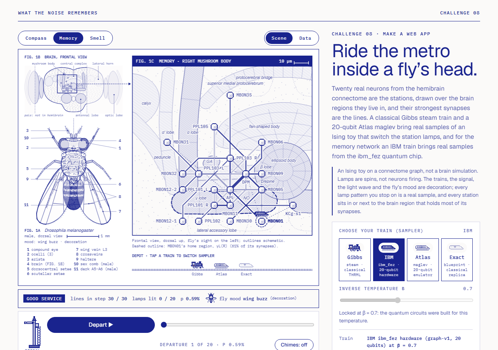

# Fly Brain Metro

**Moth Hack 2026 · Challenge 08: Make a web app**



*Ride the metro inside a fly's head.*

Three 20-neuron circuits from a real fruit-fly connectome (Janelia FlyEM hemibrain) become Ising
models: synapse counts set how strongly each pair of spins wants to point the same way. A classical
THRML Gibbs sampler and a 20-qubit Atlas graph-v1 circuit then show which spins fall into step. The circuit ran on
**IBM's ibm_fez quantum chip** for the memory network (20 of its 156 qubits) and on the Atlas emulator as the noiseless baseline.

The page is laid out like a page of an anatomy atlas, with three linked plates. **FIG. 1A** is an
anatomically drawn male *Drosophila melanogaster* (dorsal view, numbered parts). **FIG. 1B** is its brain
seen from the front, with the hemibrain's extent and a box around the region being shown. **FIG. 1C** is a
**transit map of the 20 real neurons drawn over the real neuropils of that region**: the central complex
for the compass, the right mushroom body for memory, the right olfactory pathway for smell. Every station
sits in or next to its home region, the brain region that holds most of its synapses in the hemibrain ROI
table. Stations are named by their hemibrain cell types (EPG, PEN-a, Delta7, MBON05, APL, LHCENT4 ...), the
metro lines are the 30 modelled bonds, and line weight follows the synapse count. Each station lamp is a spin: lit is +1, dark is -1,
and the lamps switch to each real sample the slider brings. The two samplers are two trains: a Gibbs
**steam train** (classical THRML) and an Atlas **maglev** with a Bloch-sphere roundel (graph-v1 on the
emulator), plus a dotted **blueprint** maglev for the exact classical statevector replica. A fourth train, the solid-ink
**IBM** train with a chip emblem, carries the real ibm_fez hardware samples (memory network, 20 qubits, Atlas job
`6469b158-8538-4230-9a6d-ed535173b37c`, IBM job `db1rsijid5ic73erj1k0`). The page opens on it, and its readout compares it with
the exact blueprint.

This is an Ising toy on a connectome graph, not a brain simulation. Spins are not neurons firing.

## Play it

- **Replay page** (the artifact): `web/index.html`. One self-contained file that replays every cached
  run and makes no network calls.
- **Web app** (the brief's deliverable): a zero-dependency Node server that serves the same page and
  proxies graph-v1 calls to Atlas from the server side.

  ```bash
  node entries/14-hemibrain-ising/app/server.js        # http://127.0.0.1:5814
  ```

  The API key is read on the server (`MOTH_API_KEY` env var, or the project `.env`) and is only ever
  placed in the Authorization header of server-to-Atlas requests. Responses to the browser never include
  it (tested: the key prefix appears in none of `/`, `/api/health`, `/api/sample`). The browser sends only
  `{circuit, mode, beta}`, and the server builds the graph-v1 parameters itself. Cached runs are served
  free from `cache/graph-v1/`, using the same cache key as `atlas/client.py` (the tests check that the keys
  match). New jobs are refused unless `ALLOW_NEW_JOBS=1`, and even then the ledgered credit cap applies.
  With this piece's cap spent, the server answers 402 (tested). It binds to 127.0.0.1 and is not deployed.

**You control:** pick the network (Compass, Memory, Smell) · choose a train (Gibbs steam, IBM ibm_fez hardware
(memory only), Atlas maglev, Exact blueprint; or tap a parked train in the depot; a "vs exact" readout under each train
compares it with the exact blueprint) and the inverse temperature β (Gibbs only) · drag the
slider through the real samples (the 20 most frequent patterns, or for Gibbs the 160-step chain
"journey") or press **Depart** to ride (the semaphore beside it clears and lights its lamp; tapping the semaphore
departs or holds too) · tap a station
(or use the arrow keys) and the train takes the lines there; its home region gets a dashed outline and the
station card lists its brain regions and synapses · switch to **Data** for the departures board (top-20
patterns with exact-probability ticks) and the correlation matrix · optional **Chimes** (Web Audio, off
until clicked, with a stop) · tap the fly on FIG. 1A or the small fly in the status line and it buzzes
(decoration) · copy a ticket link to the exact view (`#c.memory.s.exact.b.7.p.2.n.0`).
Nothing auto-plays.

**Below the metro: the bench and the sections.** Under the ink bar "Fly Brain Ising · The bench behind the
metro", a row of section buttons jumps to six titled sections that hold the earlier version's words and
graphs (`history/restore_report.md` lists every item): **01 How to play** (the earlier lead heading "Pull 20
spins into line with a fly's own synapses.", its four steps and a table of every control), **02 The data**
(the results bench: **Figure 1** wiring graph, **Figure 2** spin patterns, **Figure 3** correlation matrix and
the **Neuron** card, always visible, with their own circuit and sampler switches, β slider, ← Pattern /
Pattern →, Play Gibbs chain and Copy link to this view), **03 How it was made**, **04 The science**, **05 What
this does not claim** and **06 Jobs and credits** (all eight ledgered graph-v1 jobs with "Ride this run" for the
three completed ones; 40 of 40 credits). The bench and the metro share one state: circuit, sampler, β, sample,
selected neuron and the pair under the pointer, so a change in either moves the other, and a ticket link
restores both. The shared prev / hub / next navigation of the set (`common/nav.py`) closes the page.

**What is real and what is decoration.** Station names, line weights and every lamp pattern you stop on
come from the data (hemibrain synapse counts; THRML, ibm_fez hardware, emulator or exact-replica samples). Each station's home
region and the region breakdown on its card come from the hemibrain v1.2 ROI table (`roi_profile.py`: the
synapses each cell makes and receives in every primary ROI, over all its partners). Where the cell-type
name gives a finer place (a protocerebral-bridge glomerulus such as PEG L3, a mushroom-body compartment
such as MBON09 at γ3, an antennal-lobe glomerulus such as DP1m), the station is pulled towards it.
The neuropil outlines are our own schematic of a frontal view (`anatomy.py`): approximate proportions, depth
flattened, not a mesh from the data. Station positions are then snapped to an octilinear grid
(`metro_layout.py`, seeded simulated annealing, presentation only; a final seeded repair pass makes sure no
line runs through a station it does not serve). In each network 10 or more of the 20 stations sit inside
their home region or on its edge (within 6 um: compass 10, memory 11, smell 11), and the farthest sits 25 um
(compass), 23 um (memory) or 46 um (smell) outside it; the station card gives each station's distance. Decoration, labelled on the page: the train rides, the light wave
that spreads from the train when you step, the semaphore, the fly's mood (it buzzes its wings as each new
sample arrives when at least 29 of 30 lines are in step, grooms at 22 or fewer, stands otherwise) and the
chime (two notes whose interval widens as more lines run in step).

**Look and QA (realism pass).** The page uses the shared paper-and-ink brief-page style
(`common/brand.css`) and draws its plates as ink engravings on the canvas, in the shared palette:
- **FIG. 1A, the fly**, at true proportions (40 drawing units = 1 mm; male about 2.2 mm long, wing about
  1.9 mm; a 1 mm scale bar): compound eyes of hexagonally packed facets, three ocelli, antennae with
  plumose aristae (dorsal and ventral branches, terminal fork), the orbital, ocellar, postvertical and
  vertical head bristles, all 26 macrochaetae of the dorsal thorax (2 humerals, presutural,
  2 notopleurals, 2 supra-alars, 2 postalars and 2 dorsocentrals per side, plus basal and crossing apical
  scutellars), eight rows of acrostichal hairs, clear wings with the costa and its humeral and subcostal
  breaks, veins L1 to L6 and both crossveins, halteres, six legs with five tarsomeres and claws, the
  male's sex combs and dark A5-A6. Eleven parts are numbered with leader lines and a key, and the brain is
  shown as a dashed cut-away inside the head.
- **FIG. 1B, the brain** (frontal view, about 630 x 290 um, the size of the JRC2018 template): stippled
  cortex, hatched neuropils (optic lobes with lamina, medulla, lobula and lobula plate; antennal lobes with
  glomeruli; mushroom bodies; the central complex; lateral horns), the oesophageal foramen, the hemibrain's
  extent (outside it is washed pale), the box FIG. 1C enlarges and the 20 stations as live dots.
- **FIG. 1C, the map**: the same neuropils enlarged (a micrometre scale bar in the title), labelled where
  the names clear the stations and lines, with the selected station's home region outlined.

The pixel sprites (`web/sprites.json`, drawn with `common/inksprite.js` at integer scale) are the steam
train (its firebox and headlamp are warm pixels), the maglev, the blueprint, the IBM hardware train (the maglev in solid
ink with lit windows and a chip emblem in place of the Bloch roundel, added for the ibm_fez samples), station lamps, steam puffs and
flip sparks, plus three new realistic ones drawn by `fly_sprite.py` from the same anatomy as FIG. 1A: `fly`
(70 x 92 px, 5 ink tones, see-through wings; the hub mascot `web/img/mascot.png` is it at 2x),
`flyIcon` (the status-line fly: rest, two wing-beat frames, grooming) and `signal`, an upper-quadrant
railway semaphore that replaces the old cartoon conductor (arm level or raised; its lamp is the only warm
pixel and lights while you ride). The metro's own charts (departures board, correlation matrix) sit behind
the Scene / Data toggle; the earlier page's three graphs are always visible in 02 The data. `hero.png` is a
screenshot of the top of the replay page, which opens on the IBM ibm_fez train. The page passes `node common/qa/qa_page.cjs entries/14-hemibrain-ising 6800` (no console
errors or failed requests, no overflow at 375 px, only Google Fonts fetched, no autoplay, the chime starts
sound on click; report in `qa/report.json`). `node qa/e2e.cjs 6210` walks the whole user journey in headless
Chromium with 106 assertions checked against the source data (job IDs including the ibm_fez and IBM job IDs, the
hardware backend and qubits, the hardware patterns and their comparison with the exact replica, synapse counts, the
credit ledger, the nav links; report in `qa/e2e.json`), and `node common/qa/deadcontrols.cjs
entries/14-hemibrain-ising 6200` finds no control without a function (81 controls tested) (the only control it can flag is the
option that is already selected, which the journey test clicks after another one).

## Data

- **Source:** hemibrain v1.2 exported traced adjacencies, from Janelia FlyEM (CC BY 4.0, verified on
  https://www.janelia.org/project-team/flyem/hemibrain). The tarball downloads without an account from
  `storage.googleapis.com/hemibrain/v1.2/` (MD5 checked). Details are in [CREDITS.md](CREDITS.md).
- **Not v1.2.1.** The brief asked for v1.2.1, but neuPrint serves v1.2.1 only to signed-in users with a
  token, and the public bucket has no v1.2.1 adjacency export. This piece uses v1.2.
- **Circuits** (`prepare_circuits.py`): a greedy densest-set search within one brain region's cell types.
  It starts from the strongest connected pair, then repeatedly adds the neuron with the most synapses to
  the set, with at most a few cells of any one type.

| Circuit | Region | Cell types | Synapses among the 20 | Connected pairs |
|---|---|---|---|---|
| Compass | Central complex, protocerebral bridge | EPG, PEN_a, PEN_b, PEG, Delta7 | 7,235 | 168 / 190 |
| Memory | Mushroom body output | APL, DPM, 10 MBON types, 4 PPL1 dopamine types, 1 KC | 28,073 | 151 / 190 |
| Smell | Lateral horn | 5 uniglomerular PN types, 13 lateral-horn types | 9,571 | 171 / 190 |

- **Brain regions** (`roi_profile.py`): from the same tarball, `traced-roi-connections.csv` gives synapses
  per neuron pair per primary ROI. For each of the 60 neurons we sum the synapses it makes and receives in
  each ROI over all its partners (not only the 20), and for each modelled bond the ROIs that hold its
  synapses (`data/neuron_rois.json`). The CSV is read straight out of the cached tarball.
- **Couplings:** w_ij = synapses i→j + synapses j→i. The modelled graph is the maximum spanning tree
  (19 bonds) plus the next 11 strongest pairs, so 30 bonds per circuit. Each bond gets
  J_ij = w_ij / median(w over the 30 bonds). All J ≥ 0 (ferromagnetic), because the export carries no
  excitatory or inhibitory sign. The page draws the other real connections faintly.

## Engines, parameters, qubits

| Step | Engine | Key parameters | Qubits | Where it ran |
|---|---|---|---|---|
| Sample compass circuit | Atlas **graph-v1** | `num_qubits=20`, 20 Bloch ops (X=+1) + 30 relationship ops (ZZ=+1, `fraction` per bond), `coupling_map` = all 190 pairs, `shots=4096`, `mode=emu` | **20** (engine maximum; `num_qubits` echoed by the engine) | Atlas emulator, Aer simulator (`backend: aer`) |
| Sample memory circuit | Atlas **graph-v1** | same recipe | **20** | Atlas emulator, Aer |
| **Sample memory circuit on hardware (primary result)** | Atlas **graph-v1** | same recipe, `mode=qpu`, `backend_name=ibm_fez` (the default `QPU_BACKEND`), `shots=4096` | **20** (`num_qubits` echoed by the engine; 20 of the chip's 156) | **IBM ibm_fez** (`backend: ibm_fez`), job `6469b158-8538-4230-9a6d-ed535173b37c`, IBM job `db1rsijid5ic73erj1k0`. The first memory job (`787c9fa8...`) was cancelled after about 16 min waiting at IBM |
| Sample compass circuit on hardware | Atlas **graph-v1** | same parameters, `mode=qpu`, `backend_name=ibm_fez` | 20 | **Not possible:** failed twice, "QPU job ended as cancelled" (`8642a642...`, 05:13 UTC) and, resubmitted with identical parameters, "QPU job ended as failed" (`9b97ee9a...`, 14:12 UTC, while every ibm_fez job in the ledger failed). No hardware data; the emulator run stays as compass's quantum result |
| Sample smell circuit on hardware | – | not submitted | – | The ibm_fez allowance (15 credits) went on the four attempts above |
| Gibbs baseline | THRML 0.1.4 (classical) | 64 chains, 300 warm-up sweeps, 250 samples × 4 sweeps, β = 0.1…1.5 | – | CPU |
| Exact checks | numpy (classical) | full enumeration of 2^20 spin states; exact 2^20-amplitude statevector replica of the graph-v1 recipe | – | CPU |

Every job with its ID and status is in [PARAMS.md](PARAMS.md) and `out/atlas_jobs.json`.

**How a circuit becomes graph-v1 operations** (`run_graph.py`): every qubit gets a Bloch target X = +1
(|+⟩, spin up or down with equal odds). Then each bond, strongest first, gets a two-qubit target ZZ = +1
applied with `fraction` f_ij. QuantumGraph turns a target into a unitary that maps the pair's current
eigenvectors onto the target's eigenspaces, and `fraction` takes a fractional power of that unitary.
f_ij is chosen so that, acting alone on two fresh |+⟩ qubits, it would give ⟨Z_iZ_j⟩ = tanh(βJ_ij),
the exact thermal correlation of an isolated Ising bond. The f → ⟨ZZ⟩ curve comes from `qg_replica.py`.
On the full, loopy graph the rotations act on qubits that are already entangled, so the prepared state is
not the Boltzmann distribution. The quantum runs use β = 0.7.

## Quantum vs classical

| Step | Kind |
|---|---|
| Download, circuit selection, couplings (`fetch_hemibrain.py`, `prepare_circuits.py`) | classical |
| Choosing each bond's `fraction` (`qg_replica.pair_curve`) | classical (2-qubit exact calculation) |
| State preparation and sampling on hardware (`run_graph.py` → graph-v1, `mode=qpu`, ibm_fez) | quantum circuit, **run on IBM ibm_fez** (memory network, 20 qubits, 4,096 shots; counts shown as returned, no error mitigation) |
| State preparation and sampling, baseline (`run_graph.py` → graph-v1, `mode=emu`) | quantum circuit, **run on Atlas's Aer simulator** (noiseless) |
| Other hardware attempts (`mode=qpu`, ibm_fez) | compass twice (cancelled, then failed) and memory once (cancelled) on the IBM side, no counts returned |
| Gibbs sampling (`run_thrml.py`) | classical (THRML block Gibbs, JAX on CPU) |
| Exact Boltzmann enumeration, exact statevector replica (`run_thrml.py`, `check_replica.py`) | classical |
| Synapses per brain region (`roi_profile.py`) | classical, offline |
| Neuropil plate and station anchors (`anatomy.py`) | classical, presentation only |
| Transit-map layout (`metro_layout.py`) | classical, presentation only |
| Pixel sprites and mascot (`fly_sprite.py`, `common/mascot.py`) | classical, presentation only |
| Page and web app | classical replay / proxy |

## What came out

- **The emulator reproduces the circuit exactly.** For each of the 20 most frequent bitstrings graph-v1
  returned, we compare its frequency with the probability from our exact statevector replica. Total
  variation on those 20 is 0.0115 (compass) and 0.0109 (memory). Chi-square is 30.6 and 24.4 over the
  20 strings, close to what 4,096-shot noise allows once you account for picking the top 20. The
  two all-aligned patterns hold 3.3% of compass shots against 3.3% exact.
- **On ibm_fez the hardware keeps the shape but noise spreads the shots** (memory, job `6469b158`). Its most frequent
  pattern is all spins down (all lamps dark), which is also the exact state's likeliest outcome, and 12 of its 20 most frequent
  patterns are among the exact state's 20 likeliest (the emulator's: 17). But those 20 hold only 4.3% of the 4,096 hardware
  shots, where the noiseless circuit gives the same 20 strings 9.9%. The two all-aligned patterns took 0.8% against 2.6% exact.
  Total variation on the returned 20 is 0.032 (emulator 0.011), and chi-square is 644 on 20 strings, far above shot noise.
  Within the returned 20, a hardware pattern has 28.1 of 30 bonds in step on average (emulator 28.2). We show the counts as
  returned (no error mitigation, no readout correction) and do not claim the hardware matches the model.
- **The quantum state under-correlates relative to the thermal model.** On the 30 bonds at β = 0.7, the
  mean ⟨s_i s_j⟩ is 0.84 (compass) and 0.81 (memory) for THRML Gibbs, which matches exact enumeration.
  For the exact quantum state it is 0.60 and 0.66. Each rotation is calibrated on an isolated pair, and
  later rotations act on qubits that are already entangled with others. The "Exact state" sampler shows
  this gap pair by pair.
- **graph-v1's reported tomography does not match its own samples.** Its docs call the tomography exact.
  It reports mean bond ⟨ZZ⟩ 0.21 (compass) and 0.30 (memory). The exact state gives 0.60 and 0.66, and the
  engine's samples agree with the exact state. So the page does not use the reported tomography. The
  values are kept in `out/runs.json` (`tomo_zz`) for inspection.
- **THRML agrees with exact enumeration.** Across 3 circuits × 15 β values, pair correlations sit within
  0.031 of exact (mean gap 0.0045).
- Patterns: at β = 0.7 both samplers favour the two all-aligned states and states with one or two flipped
  spins. In the compass circuit the quantum state also leans to spin-down (|1⟩): all-down took 2.4% of
  shots against 0.9% for all-up, and the exact mean ⟨Z⟩ is −0.10. The thermal model is up/down symmetric.
  The memory circuit shows almost no lean (1.4% vs 1.3%).

## What this claims, and what it does not

**Claims:** the couplings are computed from real hemibrain synapse counts (CC BY 4.0). One 20-qubit graph-v1 job
ran on IBM ibm_fez hardware (memory network) and two ran on the Atlas emulator, and their outputs are shown unedited (job IDs on
the page and in PARAMS.md). THRML's Gibbs estimates are checked against exact enumeration.

**Does not claim:** this is not a simulation of a brain. Spins are not neurons firing, β is not a
biological temperature, and the couplings ignore synapse sign, neurotransmitter, timing and every neuron
outside the 20. The graph-v1 recipe is a state-preparation heuristic, not a quantum Gibbs sampler. No
quantum advantage is claimed or shown. **Hardware data exists for the memory network only:** the compass network's
two ibm_fez jobs ended cancelled and failed on the IBM side, and the smell network was never sent (no credits left). The
hardware samples are noisy, uncorrected, and only the 20 most frequent patterns come back from the engine. The emulator and the
"Exact state" view are classical simulations of a quantum circuit, and the page labels them so.

## Budget

graph-v1 costs 5 credits per run, and the piece cap is 25. Two compass/emu submissions at 16,384 shots
failed inside Atlas: its simulator backend was unreachable ("failed to connect … No route to host",
then "Connection refused"), while other builders' jobs were running. They are still ledgered. Then two
emulator runs at 4,096 shots completed, and one ibm_fez run was cancelled. That is 25 of 25 credits
ledgered, so the smell circuit has only the classical sampler.

**ibm_fez round (5 Oct 2026, 15 more credits, cap 40).** `run_graph.py` now targets ibm_fez by default and runs the
hardware steps first: compass, then memory, then smell if credits remain. The compass resubmission (identical parameters)
ended "QPU job ended as failed" at 14:15 UTC. In those minutes every ibm_fez job in the shared ledger, from every piece and
engine, failed. With two failures on ibm_fez, compass was not tried again. Memory's first job was cancelled after about 16
minutes waiting at IBM. Its second job completed in 516 s, which used the last of the allowance: 40 of 40 credits ledgered, 8
jobs, 3 completed. Smell therefore still has only the classical sampler.

## Reproduce

```bash
pip install numpy scipy requests jax thrml          # all preinstalled here
python fetch_hemibrain.py        # 46 MB public download, MD5-checked (no account)
python prepare_circuits.py       # -> data/circuits.json, data/hemibrain_subset.csv
python run_graph.py              # Atlas graph-v1: ibm_fez hardware first (QPU_BACKEND, default ibm_fez), then the emulator
                                 #   baseline; cached, so free and offline; MOTH_FREEZE=1 refuses new jobs; also rebuilds out/atlas_jobs.json
python check_replica.py          # exact statevector cross-check -> out/replica.json
python run_thrml.py              # THRML Gibbs + exact enumeration -> out/thrml.json (about 3 min)
python roi_profile.py            # synapses per brain region, from the cached tarball -> data/neuron_rois.json
python anatomy.py                # frontal-view neuropil plate + station anchors -> data/brain_plate.json
python metro_layout.py           # octilinear transit-map layout near the anchors -> data/metro_layout.json (a few min, seeded)
python fly_sprite.py             # realistic pixel fly, status-line fly and semaphore -> web/sprites.json
python build_web.py              # -> web/index.html (replay), app/public/index.html (live), web/img/mascot.png
node tests/test_logic.js         # page logic, share tokens, plate data, server cache keys
node ../../common/qa/qa_page.cjs . 6800   # headless page QA -> qa/report.json + screenshots
node qa/e2e.cjs 6210                      # end-to-end journey against the source data -> qa/e2e.json
node app/server.js               # the web app
```

With `MOTH_FREEZE=1`, the whole chain re-runs with no new jobs and reproduces `data/circuits.json` and
`out/thrml.json` byte for byte. The raw hemibrain CSVs (≈123 MB) live in `data/raw/` and are not published.
