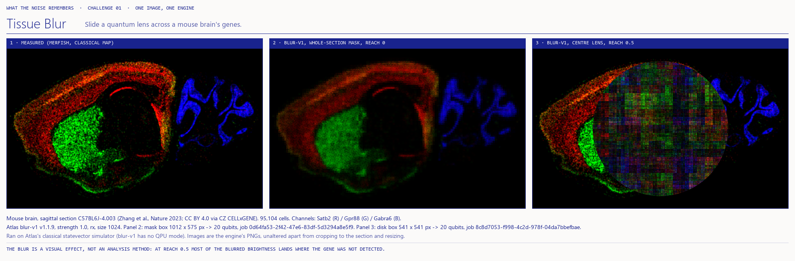

# Tissue Blur

**Moth Hack 2026 · Challenge 01: One image, one engine**



*Slide a quantum lens across a mouse brain's genes.*

This is a real spatial-transcriptomics map: 95,104 cells in one sagittal slice of an adult mouse brain, measured
by MERFISH (Zhang et al., Nature 2023). It is run through Atlas's **Quantum Blur** (`blur-v1`) at the engine's
maximum of **20 qubits**. Three genes ride in each image, one per colour channel. You pick a gene, move the blur
lens, and wipe between the measured expression and the quantum-blurred one. Every view is a real, ledgered Atlas job.

The point is visual. It also makes a cautionary one: the blur keeps the brain's layout (agreement r 0.73–0.93
at reach 0) while placing expression where none was measured. At reach 0.5, 64–94 % of a gene's blurred
brightness lands on pixels where the gene was not detected.

## Play it

Open `web/index.html` (published by the lead as a claude.ai artifact; `web/files.json` lists its media).
The page is **scene first**: the slide is the hero, and a pixel-art lab mouse holds the quantum lens over it.
The page uses the shared paper/ink look (`common/brand.css`): each gene is drawn as a pigment on paper, so more
expression means more ink. The piece has no audio or video.
- **Pick** a gene set (Three territories: Satb2 / Gpr88 / Gabra6; Folds and tracts: Fezf2 / C1ql2 / Mog), then
  one gene or all three. Each gene chip shows a small drawing of the cell type the gene marks.
- **Move** the lens: drag the lens or the mouse, or tap where it should go. The mouse scurries along and the lens
  snaps to the three computed positions (a faint rim previews the snap). You can also pick the whole-section mask.
- **Wipe** to compare: drag the divider, hold "Hold: measured" (or Space) to see the measurement, or press
  "Sweep the wipe" (it pauses on a click, and respects reduced motion).
- **Catch the ghosts**: tap a ghost (or "Catch a ghost", or C) to read the pixel the blur invented.
- **Scene / Data** switches the slide between the cast and the plain engine output with the dashed mask outline.
  Point anywhere to read the measured and blurred values for that pixel, and "Copy link to this view" shares the
  exact state, including the tool and the view (`#A.Satb2.lens_512.echo.w50.move`, plus `.data` in the Data view).
- **Below the slide**, titled sections, all wired to the same job data: **How to play** (every control);
  **The data**, always visible: Figure 1 puts the measured map and the blurred job output side by side (plain
  pigments, dashed mask outline, a pixel probe that reads both) and the per-gene table "Inside the mask, this job"
  (agreement r, ghost signal with its bar), both following the controls; **The science** ("Why a mouse brain's
  genes?"); **How it was made** (what the engine did, the cast); **What this does not claim**; **Jobs and credits**
  (all 8 jobs, the one on the slide marked, **Show** loads any of them; data licence and credits). The words and the
  two figures of the earlier, pre-sprite page are restored there (see `history/restore_report.md`).
- **Go on**: the brand bar links to the hub, and the shared navigation above the footer (`common/nav.py`, inlined
  by `build_web.py`) links to the previous piece, the hub with all 22 pieces, and the next piece, plus a jump list.

### The cast (pixel art, `web/sprites.json`)

All sprites use the shared ink palette and `common/inksprite.js`, drawn at integer scale on an overlay canvas.

| Sprite | Driven by | |
|---|---|---|
| Ghosts | data | Each sits on a real pixel of the job where the measured map was dark (< 4/255) and the blur put the gene's ink: local maxima of the blurred brightness on those pixels, found classically in `build_web.py`. One ghost per ~10% of the gene's ghost signal (at least one if any). The probe shows the pixel's real values when you catch one. |
| Gene tags | data | Each tag sits on the gene's densest measured spot (Gaussian-smoothed, 16 px). |
| Mouse mood | data | Mean agreement r of the genes in view: happy at 0.8 or more, unsure from 0.5, dizzy (with stars) below 0.5, i.e. at reach 0.5. |
| Mouse walk, gasp, jump, lens glint, the cell drawings | decoration | Labelled as such on the page ("Meet the cast" drawer). |

The hub mascot is `web/img/mascot.png` (the mouse with its lens), exported by `common/mascot.py` from the same
`web/sprites.json` during `build_web.py`.

## The brief's deliverable (PNG + params)

- `hero.png`: measured map | blur-v1 whole-section mask (reach 0) | blur-v1 centre lens (reach 0.5)
- `jobs.png`: all 8 engine outputs; raw outputs in `out/`
- Both PNGs come from `compose.py` and use the page's paper-and-ink frame (labels, rules, captions); the engine
  outputs inside them are shown unaltered, as raw RGB on black (one gene per channel), not as the page's pigments.
- `PARAMS.md`: every job, with parameters, qubits and job_id

## Engine, parameters and qubits

- **Engine:** `blur-v1` v1.1.9, the only engine used. Classical statevector simulator, no QPU mode.
- **Params:** `strength` 1.0, `style` rx, `reach` 0 (7 jobs) or 0.5 (1 job), defaults otherwise (`size` 1024, `downscale` true).
- **Qubits:** 20 per job. Each lens is a disk with a 541 × 541 px bounding box, and the whole-section mask's box is
  1012 × 575 px: ⌈log₂ w⌉ + ⌈log₂ h⌉ = 10 + 10 = 20. These counts come from the documented rule; the engine does
  not report one.
- **Jobs:** 8 completed, 8 credits (cap 8). See [PARAMS.md](PARAMS.md).
- **Why reach 0:** the first job probed reach 0.5. It produced a structureless plaid, so the remaining 7 jobs used
  reach 0. The probe stays in the page as the single "wider reach" view.
- **Three genes per job:** the engine documents that colour channels are processed one at a time. The outputs agree:
  in the front lens of set A, the Gabra6 channel stays ≤ 19/255 although Satb2 and Gpr88 fill the lens. Outside
  every mask, the output pixels equal the input pixels (asserted in `build_web.py`).

## What is quantum, what is classical

| Step | Kind |
|---|---|
| Download the MERFISH h5ad (`fetch_data.py`) | classical |
| Expression maps and masks (`make_maps.py`): splat cells, Gaussian smoothing, percentile scaling, tissue silhouette | classical |
| Blur inside each mask (`run_blur.py` → blur-v1): amplitude encoding, one rx rotation per qubit, readout | quantum circuit, **simulated** on Atlas's classical statevector simulator |
| Agreement r and ghost signal (`build_web.py`) | classical image statistics |
| Ghost spots and gene-tag spots for the sprites (`build_web.py`) | classical image statistics |
| Display pigments on a paper ground, faint tissue-outline tint (`web/img/tissue.webp`, from cell density), wipe and pixel probe (page) | classical, in the browser |

## What this claims, and what it does not

**Claims:** every blurred image in the page and `hero.png` is a downloaded blur-v1 output, and its job ID is shown.
The data is real, licensed CC BY 4.0 and credited in [CREDITS.md](CREDITS.md).

**Does not claim:** the blur is a **visual effect, not an analysis method**. It does not denoise, impute, cluster or
smooth expression for statistics. It moves brightness between pixel positions according to their bit addresses,
and the ghost-signal numbers show it inventing expression. Nothing here ran on quantum hardware, and there is no
quantum advantage: the images were computed by a classical simulator. Map values are relative brightness (99.5th
percentile scaling), not molecule counts. The lens snaps to precomputed positions. Because of the 8-credit cap,
reach 0.5 and the whole-section mask were each run for one gene set only. The page says so and switches to the
nearest computed view.

**Definitions** (inside the mask, per gene channel). Agreement r is the Pearson correlation of measured and
blurred pixel values. Ghost signal is the share of the channel's brightness on pixels that were dark (< 4/255) in
the measured map, shown as measured → blurred. A gene counts as present in a mask if its measured maximum there is
≥ 64/255.

## Reproduce

```bash
pip install numpy scipy h5py pillow matplotlib requests
python fetch_data.py      # 133 MB CC BY 4.0 h5ad from CZ CELLxGENE, no account
python make_maps.py       # maps/ and masks/ (deterministic)
python run_blur.py        # needs MOTH_API_KEY in ../../.env; cached jobs replay free and offline
python compose.py         # hero.png, jobs.png
python build_web.py       # web/index.html, web/img/*.webp, web/img/mascot.png, web/data.json, web/files.json
node tests/test_page.cjs  # unit tests for the page logic
node qa/e2e.cjs           # end-to-end journey in headless Chromium (Playwright from common/qa)
```

`data/` holds the 133 MB download; the page does not need it and it should not be published.

All 8 jobs are cached under `../../cache/blur-v1/`. With `MOTH_FREEZE=1`, `run_blur.py` reproduces every output and
submits nothing.
