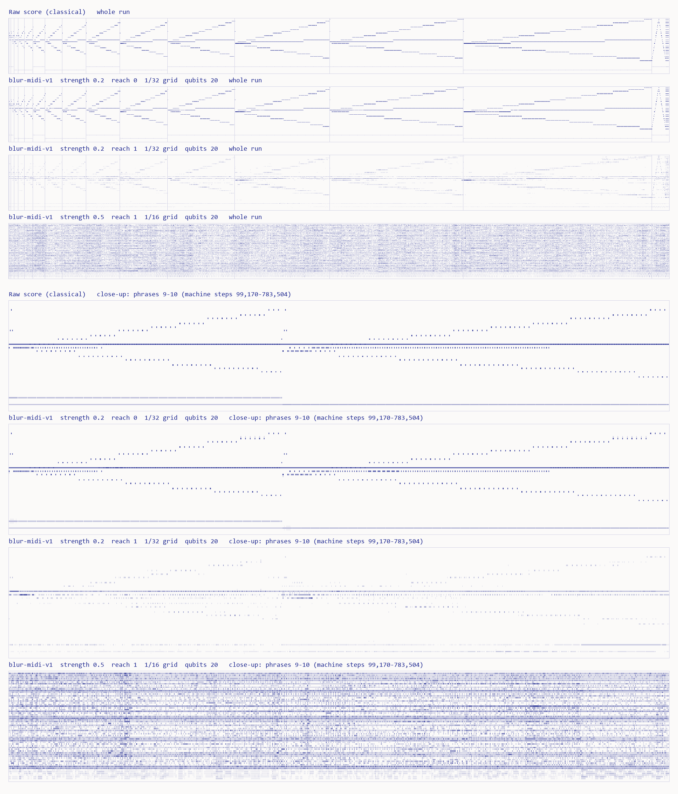

# Busy Beaver Score

**Moth Hack 2026 · Challenge 02, "Make it audible"** · part of *What the Noise Remembers*



The five-state, two-symbol busy beaver champion, found by Marxen and Buntrock in 1989, runs for
**47,176,870 steps** from a blank tape and then halts, leaving 4,098 ones. In 2024 the bbchallenge
collaboration proved, with a Coq-checked proof, that no five-state machine that halts runs longer:
BB(5) = 47,176,870.

This piece turns that run into music. We simulate all 47 million steps, sample the tape's
space-time diagram into a piano roll of 4,574 sixteenth notes, and write it as MIDI. Then we blur the MIDI with
Atlas's **blur-midi-v1** at **qubits = 20**, the engine's maximum, at reach 0 (local) and reach 1
(global). The page lets you scrub through the run while it plays. The strip under the falling notes
is the machine's real tape at the step you are hearing, re-computed in your browser.

What you hear is the machine's structure. The run is 15 phrases, one per turn of its Collatz-like
rule. In each phrase the head zigzags outward, filling a 1 0 0 1 0 0 pattern one unit per round trip, so
every phrase is a widening low, centre, high, centre figure, longer and wider than the one before.
The bass follows which branch of the rule is running. At the end come two sweeps across all 12,289
cells, the halt, and a chord.

## Play it

Open `web/index.html` (the lead publishes it with `web/files.json`). Nothing plays until you press a Play button.

1. **Play**, then **scrub** anywhere in the run. Drag the mini-map, drag the falling score in the Data
   view (down or right = forward), use ← → (Shift: 16 notes), or use `[` `]` and the Phrase buttons to
   jump between phrases (after the last phrase, Phrase ▶ goes to the halt). The readout gives the exact
   machine step, the head's cell and state, and the ones on the tape.
2. **Flip** between the raw score and the six blurred scores: reach 0 or 1, strength 0.2 or 0.5, and
   on the 0.2 jobs a 1/16 or 1/32 time grid. Raw notes stay outlined so you can see what moved. The 1/32
   grid was only run at strength 0.2, so picking it at strength 0.5 moves to 0.2 (and a note says so).
   While the raw score is on, the blur's reach, strength and grid buttons stay dimmed but live: picking
   one switches straight to that blur.
3. **Change the tempo** from 4 to 40 notes a second, **jump to the halt** (the note at step 47,176,870,
   where the dam is finished; press Play there for the final chord), or **copy a link to this moment**
   (`#c<note>.m<score>.t<tempo>`, plus `.vd` when shared from the Data view). If the browser blocks
   copying, the link appears, selected, beside the button.
4. **Hear the full renders.** The three WAV deliverables play on the page ("Hear the full renders"),
   each with its own Play/Pause button and seek bar. They are on the page's clock (15 notes a second), so
   the score canvas switches to the matching score and follows the recording while it plays. Starting a
   render pauses the live synth and any other render, and the reverse.

The page also runs the whole machine in your browser when it loads (about a second), checks that it
halts at step 47,176,870 with 4,098 ones, and says so on screen.

### The scene (the default view)

The page opens on an illustrated scene; the falling score and the tape's space-time history are one click
away under **Data: score + tape**. Everything the scene shows is the real run:

- **The beaver is the head.** It stands on the head's real cell at every note (`col_cell` in `out/score.json`,
  re-checked against the simulation), and its hard hat shows the machine's state, A to E (a green H at the halt).
- **The river is the tape.** Each cell holds a log (1) or open water (0), read from the tape your browser
  re-computes. On each note the beaver does the first step of the rule it is in: places a log on water, gnaws
  a log away (rules C1 and E1 write 0) or leaves it, then hops to the next note's cell. Paused, a speech
  bubble spells out the rule it will apply next.
- **Time-lapse.** In phrase 1 a hop is one machine step; later a hop covers up to about 23,000 steps, so the
  beaver dives and surfaces at the head's next sampled cell. The label above the scene gives the exact
  number of steps in the current hop.
- **The far dam** is the whole tape to scale (cells -12,243 to 45, every cell the run ever visits), with the
  number of logs and how wide they spread. At step 47,176,870 the dam reaches the lodge, the flag goes up
  and the beaver throws its hat: 4,098 logs across 12,289 cells. The celebration is brief, and a click skips it.
- **The echo pool** draws one ring per note of the score you picked, at its pitch (left = low), so the
  quantum blur's extra notes spread across the pool; ticks on its edge mark the raw score's notes.
- Clouds, trees, waves, wood chips, splashes and sparkles are decoration. Clicking the beaver makes it slap
  its tail (decoration, no sound). With reduced motion the scene holds still between notes.

The pixel art lives in one file, `web/sprites.json` (ink palette only), drawn with the shared
`common/inksprite.js` at whole-number scales; `build_web.py` inlines both and renders the hub mascot,
`web/img/mascot.png`, from the same file with `common/mascot.py`.

### The page, top to bottom

On top: the brand bar (linking the hub), the stage with its Scene / Data toggle, the transport and minimap, the
readouts, the headline, the controls and the share link. Below them come titled sections, each with its own
ink bar, all on the same clock as the stage:

1. **How to play**: the four original steps, plus the keys and gestures.
2. **The data**: two graphs, always visible and live. *The score over the tape* (the same figure as the Data
   view; drag it to scrub) and *The whole run, note by note* (every note of the chosen score across all
   4,574 columns, phrase starts numbered, the part heard shaded; click or drag it to jump).
3. **Hear the full renders**: the three WAV players.
4. **The science**: the drawer "Why this machine?".
5. **How it was made**: the drawers on the score mapping and on what the quantum engine did.
6. **What this does not claim**: both honesty notes, always visible.
7. **Jobs and credits**: the six Atlas jobs (a "Show" button on each puts that job's score on the stage and
   in the graphs) and the credits.

Then the shared piece-to-piece navigation (previous piece, the hub, next piece, and a list of all 22),
built from `common/nav.py`, and the footer.


## Deliverables

| File | What it is | Made by |
|---|---|---|
| `score_raw.mid` | the raw score: SMF type 1, 480 PPQ, 1 column = one 16th note, 225 bpm (15 notes/s); tracks "Head" and "Rule" | classical (`compose.py`) |
| `score_raw.wav` | the raw score, 44.1 kHz mono, 5:09 | classical synthesis (`render_wav.py`) |
| `out/blur_*.mid` | the six blur-midi-v1 outputs, exactly as downloaded | Atlas simulator |
| `blur_s0.2_r0_res60.wav`, `blur_s0.2_r1_res60.wav` | the two full-20-qubit blurs (reach 0, reach 1) as audio | Atlas output, classical synthesis |
| `hero.png` | the raw score and three blurs as piano rolls | classical (`make_figures.py`) |
| `web/audio/*.mp3` | the three WAVs re-encoded for the page (mono, 80 kb/s, about 3.1 MB each) | ffmpeg via `imageio_ffmpeg`, in `build_web.py` |
| `web/sprites.json`, `web/img/mascot.png` | the scene's pixel-art cast (beaver, hat, logs, lodge ...) and the hub mascot rendered from it | original pixel art made for this piece; `common/mascot.py` |
| `web/` | the interactive page (`index.html` built from `template.html` by `build_web.py`; `files.json` lists the MP3s and the mascot) | |

Every MIDI (the raw score and all six blurs) is synthesised live on the page with Web Audio, and the three
WAVs play there as MP3s. Render any other blur to WAV with
`python render_wav.py blur_s0.5_r0` (the strength-0.5, reach-1 blur has 122,594 notes and takes a while).

## How 47,176,870 steps become 4,574 sixteenth notes

- **Phrases (exact).** At 15 moments the tape is a single block of x ones with the head in state A
  just left of it: x = 0, 6, 16, 34, 64, 114, 196, 334, 564, 946, 1,584, 2,646, 4,416, 7,366, 12,284.
  `simulate.py` predicts these steps from the high-level rule and checks each one against the
  simulated tape. Then x = 12,284 = 3·4,094 + 2 takes the halting branch.
- **Phrase lengths (compressed).** Phrase k gets round(15 × 1.41ᵏ) notes: 15, 21, 30, …, 926, 1,306.
  The coda gets 96 and the final chord 24. Phrase 1 plays every one of its 15 steps; phrase 14 packs
  30,196,527 steps into 1,306 notes (about 23,000 steps per note).
- **Inside a phrase.** With 2 or more notes per head sweep, each sweep gets its turnaround and then
  cells evenly spaced along it. Otherwise sweeps are sampled evenly in right/left pairs, and each
  sampled sweep gives 2 notes: its turnaround and its midpoint. Sampling turnarounds instead of
  evenly spaced steps keeps the zigzag from aliasing into noise. The coda is spaced evenly in steps.
  Every melody note is a real head position at a real step (`out/score.json` lists the step for
  each of the 4,574 columns).
- **Pitch.** Left = low. The cells the head visits in a phrase are spread over D minor pentatonic.
  The range widens with the tape, from 6 notes (phrase 1) to 21 (four octaves, A2 to A6).
  The bass is the rule's branch: x = 3k plays D, x = 3k + 1 plays B♭, re-struck every 8 notes. The
  final chord sounds every note of the range, because the halted tape is a uniform 1 0 0 pattern
  across all of it.

## Engine, parameters and qubits

- **Engine:** Atlas `blur-midi-v1` ("Blur Jazz"), the only quantum engine used, 1 credit per job.
  It runs on Atlas's **classical statevector simulator** and has no hardware mode.
- **Input:** `score_raw.mid`. Fixed at engine defaults: `margin` 0.15, `threshold` 0.1, `mask` none.
- **Swept:** `reach` ∈ {0, 1}, `strength` ∈ {0.2, 0.5}, and `resolution` ∈ {auto, 60 ticks} for strength 0.2.
  We ran the default strength 0.5 first. At reach 1 it scattered the score into a near-uniform cloud
  of 122,594 notes, so we added the gentler 0.2.
- **Qubits:** every job used `qubits = 20`, the engine maximum. The engine does not report how many
  qubits each pass used, so we **computed** it with QuantumBlur's grid rule
  ⌈log₂ time steps⌉ + ⌈log₂ pitch rows⌉ (`make_grid` in the QuantumBlur source):
  - The raw melody spans MIDI 45–93 (49 pitches). The outputs reach down to 38, exactly the documented
    15 % margin (7 rows), and never above 93. So the roll has 56 pitch rows, or 63 if the margin is also
    padded above with nothing landing there. Either way that is 6 qubits.
  - 1/16 grid (resolution auto = 120 ticks): 4,574 time steps, 13 qubits, so **19 qubits** per pass.
  - 1/32 grid (resolution 60): 9,148 time steps, 14 qubits, so **20 qubits** per pass, the full budget.
    We ran these two jobs to make sure the full budget was really used.
  - The bass roll is smaller: the raw bass spans MIDI 34–45 (12 pitches), and only the outputs reach
    down to 32 (the margin). At most 14 rows = 4 qubits, so it needs fewer.
- **Jobs:** 6 completed, 6 credits ledgered (cap 6). See [PARAMS.md](PARAMS.md).

## What is quantum, what is classical

| Step | Kind |
|---|---|
| Running the machine for 47,176,870 steps (`simulate.py`, and again in the browser) | classical |
| Phrase detection, time compression, pitch mapping, MIDI writing (`compose.py`) | classical |
| Blurring each track's piano roll (`run_blur.py` → blur-midi-v1) | quantum circuit, **run on Atlas's classical statevector simulator** |
| WAV synthesis (`render_wav.py`), MP3 encoding, and live Web Audio synthesis on the page | classical |
| Figures, page build | classical |

## What it claims, and what it doesn't

**Claims.** The machine, its step count and its 4,098 ones are checked twice: in `simulate.py` and
again in the browser. Every melody note is the head's position at a stated machine step. Every
blurred note on the page and in the WAVs comes from a downloaded blur-midi-v1 output, and the job IDs
are listed.

**Does not claim.** The blur computes nothing about the machine and says nothing about BB(5). It is
a sound effect with a quantum circuit inside, run on a classical simulator: no hardware, no quantum
advantage. The time compression and pitch mapping are artistic choices, documented above. When more
than 10 notes start on the same grid step (almost everywhere in the strength-0.5, reach-1 blur), the
page plays only the 10 loudest so the browser keeps up (the final chord gets up to 32). It still
draws them all, and the WAVs (playable on the page) render every note. The proof of BB(5) is the bbchallenge collaboration's work; we only replay its champion.

## Reproduce

```bash
pip install numpy scipy mido pillow requests
python simulate.py        # 10-15 s: runs the machine, checks steps, ones and the 15 phrase starts
python compose.py         # score_raw.mid + out/score.json
python run_blur.py        # 6 blur-midi-v1 jobs; needs MOTH_API_KEY in ../../.env (cached: free offline)
python render_wav.py      # score_raw.wav + the two 20-qubit blurs
python make_figures.py    # hero.png
python build_web.py       # web/index.html, web/audio/*.mp3 (bundled ffmpeg), web/files.json
node test_page.js         # page logic tests (in-browser machine vs Python, decoding, share links)
node qa/e2e.cjs           # end-to-end journey in headless Chromium (Playwright from ../../common/qa)
```

Every job is cached under `../../cache/blur-midi-v1/`. With `MOTH_FREEZE=1` the whole pipeline
re-runs offline and refuses any new job.
