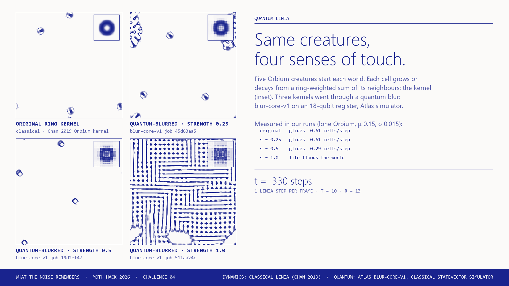

# Quantum Lenia

**Moth Hack 2026 · Challenge 04 (Moving image) · What the Noise Remembers**



*Paint creatures, then blur their sense of touch with quantum noise.*

Lenia is a continuous Game of Life. Every cell feels its neighbours through a smooth ring-shaped
**kernel**, and a bell-shaped growth curve turns that weighted sum into growth or decay. The kernel is the
creature's sense of touch. This piece sends Lenia kernels, and a whole Lenia world, through Atlas's
**Quantum Blur Core** (`blur-core-v1`). It then lets you run classical Lenia live with the real
quantum-blurred kernels, paint creatures, and seed the world from a quantum-blurred snapshot.

What happens, measured in our runs (one Orbium, 2,000 steps, μ 0.15, σ 0.015, `out/dynamics.json`):

| Kernel (ring shell) | Orbium |
|---|---|
| original | glides, 0.61 cells/step |
| blurred, strength 0.25 | still glides, 0.61 cells/step |
| blurred, strength 0.5 | still glides, at about half speed (0.29 cells/step); in the Gaussian shell it breaks up |
| blurred, strength 1.0 | life floods the whole world, in all four shells |

Seeded from the snapshot (original kernel, 1,000 steps): the un-blurred colony carries 3 creatures
forward, and each quantum-blurred copy (strength 0.25 and 0.5) regrows exactly 1.

## Deliverables

- **`quantum_lenia.mp4`**: the moving-image deliverable. 30 s, 1920×1080, 30 fps, H.264, no sound
  (`render_mp4.py`). Act 1 (0–19 s): the same five Orbium in four worlds, one per kernel (original,
  blur 0.25 / 0.5 / 1.0), each panel captioned with its job. Act 2 (19–30 s): what regrows from the
  un-blurred and the two quantum-blurred snapshots. Drawn in the Moth Hack brief-page look (paper ground,
  one ultramarine ink, light sans headings, mono labels, a solid-ink footer bar) with the same paper-to-ink
  colour map as the page. Re-rendered on 5 Oct from the same cached engine outputs: no new jobs, and the
  frames' data are unchanged; only the palette and type changed. Re-rendered once more the same way so its
  footer bar reads "Challenge 04" like the page (all entries are equal; the old "Bonus" label is gone).
  `hero.png` is frame 330.
- **`web/`**: the interactive page (`index.html`, built from `template.html` by `build_web.py`; `files.json`; `media/`;
  `sprites.json`, the pixel-art cast; `img/mascot.png`, Orbi for the hub).
  The page plays the film from `web/media/quantum_lenia_720p.mp4`, a 1.5 MB 1280×720 H.264 copy that
  `build_web.py` encodes with the bundled ffmpeg. It sits in a `<video controls playsinline preload="none">`
  with a poster made from `hero.png`, so nothing is fetched or played until you press play. The film has no
  audio track, and the piece has no other audio.

## Play it

Open `web/index.html`. Nothing moves until you press **Play**. The page is scene first: the live world sits in
an illustrated petri dish, the kernels are lenses, and below it titled sections hold the rest: **How to play**,
**The data** (kernel heatmap, radial profile, table of all 16 measured fates), **What the noise remembers**
(snapshot plates), **The film**, **The science**, **How it was made**, **What this does not claim** and
**Jobs and credits**. The page text and graphs of the pre-sprite page are kept word for word
(`history/restore_report.md`).

1. **Paint the dish**: with the *Orbium* pipette, press and drag to aim, then release to drop a creature. It
   heads the way you dragged; the 8 headings were measured in `analyze.py`. The *Soup* brush paints random
   values and the *Eraser* clears. Keyboard: arrow keys move a cursor on the focused dish, and **Enter** paints.
2. **Swap the lens**: *Original* or *Blur 0.25 / 0.5 / 1.0*, in four shells (*Ring* is Orbium's). Each lens
   shows the real 32 × 32 kernel block through a pixel-art magnifier. Under the lenses, Orbi replays the
   measured fate: it glides at the measured speed (a pale outline keeps the original kernel's pace), breaks
   up, or drowns as life floods the strip. **See the graphs** jumps to *The data*: the kernel heatmap, its
   radial profile against the original, and a table of all 16 measured fates, all following the lab; press
   any cell of that table to load its kernel and shell into the lab and the dish.
3. **Play / Pause** (Space), **Step** (`.`), **Reset** (R, back to step 0), **Clear**, speed and brush sliders.
   Growth μ and σ are adjustable under *Growth settings*.
4. **Seed** from a snapshot plate (*What the noise remembers*): the snapshot's 128×128 colony (un-blurred,
   blur 0.25, blur 0.5) loads into the dish, paused. Each plate shows how many creatures regrew in our run.
5. **Copy link to this setup** stores kernel, shell, μ, σ and seed in `#token` (not your painting).
6. **Move on**: the footer links to the previous piece (16), the hub (all 22 pieces) and the next piece (18), plus a
   "Jump to any piece" list. `build_web.py` inserts it from the shared `common/nav.py` at the `<!--NAV-->` marker.

Live readouts: step `t`, total mass, Orbium-sized blobs (components with mass 55 to 95, the same rule
as `analyze.py`), and steps/s.

### The characters (sprites never fake data)

All sprites are pixel art in the shared ink palette, generated by `make_sprites.py` into `web/sprites.json`
and drawn by the shared `common/inksprite.js` at integer scales with smoothing off.

- **Eyes on every Orbium-sized blob.** The page tracks each blob that the counter counts (mass 55 to 95, no
  wrap, as in `analyze.py`) from detection to detection, and draws eyes on its centroid that look the way
  the blob actually moves (or along the measured heading of the stamp you dropped). Blinks are decoration.
- **Ghosts and sparkles.** A ghost rises when a blob that had counted for at least 30 steps stops counting
  (it broke up, merged or grew), or when you erase or overpaint one. A sparkle marks a creature you dropped,
  or a new blob once it has counted for 30 steps. The 30-step wait only stops flickering soup from spawning
  ghosts; the counter itself has no wait. A blob that leaves the dish's edge gets 60 steps to reappear on
  the other side before it is called gone.
- **Pipette, brush and eraser** are the cursors of the three tools; the pipette squeezes when it drops.
- **Lenses** frame the real kernel blocks (drawn smooth inside the integer-scaled frame).
- **Orbi**, the mascot (an Orbium with a face, `web/img/mascot.png` for the hub), idles in the corner, hops
  when you press Play, gasps when a ghost rises and turns dizzy when the live dish floods (mass over 4,000).
  Tap it for a measured fact. In the fate strip, Orbi's pace is the measured speed (one fixed on-screen
  pace per cell/step); the break-up and flood scenes stand for the measured fates, not their timing.

## Engine, parameters and qubits

Only engine: **`blur-core-v1`** (Quantum Blur Core, 1 credit per run, Atlas **classical statevector
simulator**, with exact probabilities and no `shots`). No QPU was used, and this engine has no QPU mode.

| Grid | Shape sent | Qubits | How we know | Params | Jobs |
|---|---|---|---|---|---|
| Kernel bank | `[4, 256, 256]`: 4 kernel shells, each on the full 256×256 world grid the browser convolves with | **18** = 2 + 8 + 8 | engine status: "Recovered 18-qubit grid from measurement" | strength 0.25 / 0.5 / 1.0, reach 0, style `x`, axes `[1, 2]` (shells never mix), max_qubits 24 | 3 completed |
| World snapshot | `528 × 528` integers 0–99 | **20** = 10 + 10 (each axis padded 528 → 1024) | engine status: "Recovered 20-qubit grid from measurement" | strength 0.5 / 0.25, reach 0, style `x`, max_qubits 24 | 2 completed |

Every job ID is in [PARAMS.md](PARAMS.md), `out/kernel_jobs.csv`, `out/snapshot_jobs.csv` and `out/job_status.json`.

### Why 20 qubits and not 24 (payload limits, measured)

- **Requests are capped at 1 MiB.** Free probes with an invalid `style` (which returns 422 before any job
  exists) showed HTTP 413 "request body is too large limit=1048576 bytes" for a 1024×1024 grid of zeros
  (2.1 MB) and for 4096×4096 (33.6 MB). A 2-D world needs more than 512 cells per side to cost 10 qubits
  per axis, and 21+ qubits in 2-D would need at least 513×1025 values (≥ 1.05 MB even as zeros). So 20 is
  the most a real 2-D world can reach. We send compact JSON (`qblur.py` sets `requests` to `,`/`:`
  separators; `atlas/` is untouched).
- **Results are capped too.** Three paid jobs failed *after* the simulation finished, with "[TMPRL1103]
  Attempted to upload payloads with size that exceeded the error limit":
  - The kernel bank at **reach 1** (strength 0.5), twice. A fully non-local blur makes all 262,144
    outputs non-zero floats, about 5 MB.
  - **Snapshot attempt 1**: 22 Orbia spread over the whole 528×528 world (`make_world.py --attempt1`,
    `out/world_attempt1.npy`).
- **Fix:** at reach 0 the outputs are exactly zero outside aligned Gray-code blocks, so the colony was
  moved into the aligned top-left 128×128 corner of the same 528×528 world. Its blurred output is
  non-zero on exactly 128×128 = 16,384 cells.
- **Register use:** the world fills about 27% of the 20-qubit register (528² / 1024²); the rest is the
  engine's zero padding. We count qubits by register size, as the engine reports.

### Measured locality of reach 0

From where outputs are exactly zero:
- **Kernel axes (8 qubits):** values only spread inside aligned 16-cell blocks, so each blurred kernel
  stays inside a 32×32 window around the centre (4,096 non-zero values per job, 1,024 per shell). The
  low ≤ 4 Gray bits of each axis carry rotation; bits 4–6 provably carry none.
- **Snapshot axes (10 qubits):** the colony spanned rows 8–119 and columns 14–112, and the output fills
  the whole 128×128 block. That means 64- or 128-cell blocks (6 or 7 low bits rotated), not 32.

So reach 0 does not rotate every qubit in the register. The engine does not report per-qubit angles.

## Quantum vs classical

| Step | Kind | Where it ran |
|---|---|---|
| Kernel shells (`lenia.py`), stacked `[4, 256, 256]` | classical | Python |
| Kernel blur, strength 0.25 / 0.5 / 1.0 (`run_kernels.py`) | **quantum circuit** | Atlas `blur-core-v1`, classical statevector simulator |
| Snapshot world: Orbium colony + 40 Lenia steps (`make_world.py`) | classical | Python |
| Snapshot blur, strength 0.5 / 0.25 (`run_snapshot.py`) | **quantum circuit** | Atlas `blur-core-v1`, classical statevector simulator |
| Lenia dynamics: live page, film and measurements (`template.html`, `render_mp4.py`, `analyze.py`) | classical | browser / Python |

The browser's Lenia step reproduces `lenia.py` to 1e-14 (`tests/test_page.js`).

## What this claims, and what it does not

**Claims.** The kernels and snapshots on the page and in the film are real `blur-core-v1` outputs, used
exactly as returned:
- **Kernels** are normalised to sum 1 for the convolution.
- **Snapshots** are divided by the input maximum (99) and stored at 16-bit precision on the page.

The fates and speeds quoted are measured by `analyze.py`.

**Does not claim.**
- **Not quantum dynamics.** The dynamics are classical Lenia (Chan 2019). Only the kernels and the
  snapshots went through the quantum blur. "Quantum Lenia" names this pipeline; it is not a quantum
  cellular automaton.
- **Not hardware.** The blur ran on a classical statevector simulator.
- **No advantage.** There is no claim of quantum advantage, and the blur is not presented as physics.
- **Narrow measurements.** Fates were measured for one seed (a lone Orbium) at μ 0.15, σ 0.015. Other
  seeds or settings can differ.
- **Partial register use.** Reach 0 rotates only the lower qubits of each axis (see above).

## Files

| File | Role |
|---|---|
| `lenia.py` | classical Lenia rule and kernel shells (ring = Orbium's exponential core, Gaussian, polynomial, step) |
| `orbium.py` | Orbium unicaudatus from Chan's MIT-licensed repository, RLE-decoded; re-checks that it glides |
| `qblur.py` | Atlas wrapper: 8-credit cap, compact JSON, payload check |
| `probe_payload.py` | the free 1 MiB request-limit probes (invalid `style`, so 422/413 and never a job) |
| `run_kernels.py`, `run_snapshot.py` | the quantum jobs (cached; documented failures are never resubmitted) |
| `make_world.py` | the 528×528 snapshot world (`--attempt1` rebuilds the failed attempt's world) |
| `analyze.py` | measured dynamics → `out/dynamics.json`, Orbium headings → `out/stamps.json` |
| `render_mp4.py` | the film (`PREVIEW=dir` saves a few PNG frames instead) |
| `build_web.py` | page build (asserts every inlined block holds all non-zero engine output; inlines the sprites and `common/inksprite.js`; renders the mascot) |
| `make_sprites.py` | the pixel-art cast → `web/sprites.json` (Orbi, eyes, pipette, brush, eraser, lens, ghost, sparkle, fragments) |
| `tests/test_page.js`, `tests/cdp_check.mjs` | node unit tests of page logic; headless-Chrome interaction check |
| `qa/e2e.cjs` | Playwright end-to-end journey (every restored graph renders: live world, kernel heatmap, radial profile, 3 snapshot colonies, film poster; paint, play, lenses until the measured fates show live, the data section and its fates table, drawers, honesty + jobs sections, plates, film play/pause, share link + reload, prev/hub/next nav); writes `qa/e2e.json` |

## Reproduce

```bash
pip install numpy scipy pillow requests imageio-ffmpeg
python orbium.py                 # decode + verify Orbium
python make_world.py             # snapshot world (classical)
python run_kernels.py            # 3 quantum jobs (cached in ../../cache/blur-core-v1/)
python run_snapshot.py           # 2 quantum jobs (cached)
python analyze.py                # classical measurements
python render_mp4.py             # quantum_lenia.mp4 (PREVIEW=dir saves frames; frame_330.png is hero.png)
python make_sprites.py           # web/sprites.json (pixel-art cast)
python build_web.py              # web/index.html + web/media/ (720p film copy, poster from hero.png) + web/img/mascot.png
node tests/test_page.js
node qa/e2e.cjs 6510           # end-to-end journey in headless Chromium
```

With `MOTH_FREEZE=1` every script replays from the cache and submits nothing: verified, with byte-identical
outputs (`tests/hashes_before.txt`, `out/freeze_log.txt`). Credits: **8 of 8 spent** (5 completed jobs +
3 failed jobs, all ledgered under `17-quantum-lenia`).
