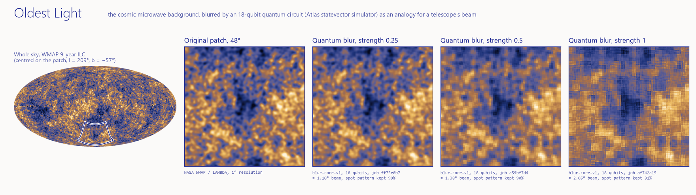

# Oldest Light

**Moth Hack 2026 · Challenge 11 (FQxI, educational)**



The cosmic microwave background is the oldest light we can see. It was released about 380,000
years after the Big Bang, when the universe cooled enough for atoms to form. Its temperature
ripples are a few parts in 100,000. In the standard (inflationary) model of cosmology they began as
quantum fluctuations in the first split second, stretched to cosmic size by inflation, and gravity
later grew them into the large-scale structure of galaxies.

This piece puts a real patch of that sky, from NASA's WMAP 9-year data, under an **18-qubit quantum
blur** (Atlas `blur-core-v1`). The blur stands in for a telescope's beam: the blurrier the
telescope, the more fine ripples vanish. The blur is an analogy for resolution, not a model of
inflation. The page lets a general audience explore that idea with their hands.

## Play it

Open `web/index.html` (self-contained apart from `web/img/sky.webp`; the lead publishes it as an artifact).

The page opens on an illustrated scene: the real sky, with a small pixel-art cast drawn in the shared ink
palette (`web/sprites.json`, rendered by `common/inksprite.js`, integer-scaled and crisp).

- **Mapper**, a WMAP-style satellite (two back-to-back dishes over a flat sun shield), rides the dividing
  line. **Drag** it across the sky: to its left the original, to its right the sky as its blurry eye sees it.
  Its beam circle is drawn at the real equivalent beam size. Point at (or tap) any spot and it turns its
  dishes there and catches that spot's **photons**: little wiggling wave packets, orange where the map
  shown there is warmer than average and lilac where colder. Mapper squints when its eye is very blurred,
  shivers when you mark the Cold Spot and cheers for planted seeds and right quiz answers.
- **Slide** the blur strength across 7 stops: no blur, then 6 real blur-core-v1 jobs (0.1 to 1). On the
  **mission line-up** pixel Planck, WMAP and COBE stand at their real beam sizes, and a **telescope eye**
  rides the axis at this view's equivalent beam, getting fuzzier as the "spot pattern kept" falls.
- **Plant galaxy seeds**: seeds sprout into little galaxies on the 56 hottest spots of the original map
  (local peaks above twice the typical ripple). On the blurred side each one stays a galaxy if the blurred
  map still has a hot spot there, fades if it has blurred away, and **phantoms** pop up where the blur
  invented a hot spot the sky does not have. The census is counted classically in the browser on the
  engine outputs (for strength 0.5: quantum 44 kept, 12 lost, 27 phantoms; Gaussian 29, 27, 0).
- **Scene / Data** switches the cast off for the plain instrument (round handle, scale bar). Pan by dragging
  the sky, zoom with + / - (or pinch, or ctrl-scroll); Original / Blurred views; Quantum (Atlas), a classical
  **Gaussian beam** of the same fitted width, and an idealised **COBE 7°** view; "spot pattern kept" and
  "contrast kept" meters, the job ID, params and qubit count; hover or tap for the temperature (µK) and
  galactic coordinates.
- **Seeds of galaxies**: five story cards (each with its own sprite), each with a "Show me" button.
- **Quiz**: six questions with instant explanations, and Mapper reacting to each answer.
- **Copy link to this view** stores the whole state in `#v1~...`.
- **Below the scene**, titled sections: *How to play* (the instrument steps, the scene and the keys),
  *The data* (Fig. 1, the equivalent-beam ruler with live "spot pattern kept" / "contrast kept" meters and its own
  blur and strength buttons that drive the sky; Fig. 2, the per-strength fit table with an on-demand galaxy-seed count),
  the story and quiz, *How it was made* (engine and qubit drawers, Table 1 of every qubit limit measured), *The science*,
  *What this does not claim*, and *Jobs and credits* (Table 2 of every engine job, each with a "Show" button that puts
  that output on the sky). The words and graphs of the first version are kept verbatim (`history/restore_report.md`).

The page follows the shared Moth Hack brief-page look (`common/brand.css`: paper, one ultramarine ink,
mono labels, hairlines, no glows or shadows); the sky keeps its data colour map and the sprites use only the
shared ink palette (the warm accent only for light: photons, the antenna lamp, galaxy cores). The piece
has no audio or video deliverables, so nothing on the page makes sound. Only Mapper's gentle idle loop
(blink, bob) runs on its own; everything else starts from your action, and reduced motion freezes it.
Keyboard: arrows pan, shift+arrows move Mapper (and the wipe), + / − zoom, 0 resets, space peeks at the original.
A drawer, "The cartoon, honestly", lists what each sprite is driven by and what is decoration.
At the foot of the page the shared set navigation (built in from `common/nav.py`) links the previous piece
(17 Quantum Lenia), the hub of all 22 pieces and the next piece (19 Frog Chorus), with a jump list of every piece.

## Engine, parameters and qubits

- **Engine:** `blur-core-v1` (Atlas, Moth Quantum), the only quantum engine used. It amplitude-encodes
  a grid of non-negative numbers on a Gray-coded register, applies single-qubit Rx rotations and
  returns exact probabilities. It runs on Atlas's **classical statevector simulator**; it has no QPU mode.
- **Input:** `out/grid_input.npy`, a 257 × 257 grid of integers 0–999 (WMAP ILC temperatures mapped
  linearly from −285…+295 µK; 0.5806 µK per unit).
- **Params:** `strength` ∈ {0.1, 0.25, 0.375, 0.5, 0.75, 1.0}, `style = "x"` (Rx), `reach = 0` (local),
  `max_qubits = 24`, exact probabilities (no `shots`).
- **Qubits: 18 per job.** Documented rule: ⌈log₂ 257⌉ + ⌈log₂ 257⌉ = 9 + 9 = 18 (each axis padded to
  512). The engine reports it too: every job's status reads "Recovered 18-qubit grid from
  measurement" (`out/job_status.json`). The sky fills 66,049 of the 262,144 amplitudes (25%); the rest
  is zero padding.
- **Jobs:** 6 completed + 1 failed (19 qubits), 7 credits of the 8-credit cap. Full table in
  [PARAMS.md](PARAMS.md); all six outputs beside their Gaussian equivalents in [sweep.png](sweep.png).

### Why 18 qubits and not 24

We started at the ceiling and stepped down, measuring each notch (`probe_limits.py`,
`out/probes.json`). The probes send an all-zero grid with a deliberately invalid `style`, so the API
answers without creating a job and they cost nothing.

| Qubits | Grid | Outcome |
|---|---|---|
| 24 | 2049 × 2049 | HTTP 413: request body over the 1 MiB API limit (free probe) |
| 22 | 1025 × 1025 | HTTP 413 (free probe) |
| 21 | 1025 × 513 | HTTP 413, even with every value written as `0` (free probe) |
| 20 | 513 × 513 | body accepted (free probe), but every 20-qubit blur-core-v1 job in this project has failed after computing: sibling jobs `43503eaa`, `02b057fb` (dense 640 × 640) and `a8a739fb` (528 × 528, 99.6% zeros) all ended with `TMPRL1103 ... payloads with size that exceeded the error limit` |
| 19 | 257 × 513 | **our job `89f0fcee-3faf-458a-82cf-af8f174ec435`** (a 48° × 96° panorama of the same sky) ran, reported "Recovered 19-qubit grid from measurement", then failed with the same `TMPRL1103` result-size error (1 credit) |
| **18** | **257 × 257** | **6 jobs completed** |

So 18 qubits is the largest register this engine returns for a dense 2-D sky grid through the API
today. The failed job is listed in `out/jobs.json` and on the page; it was not retried (it would fail
the same way, and `run_blur.py` refuses to resubmit a recorded failure without `--retry-failed`).

## What is quantum and what is classical

| Step | Kind |
|---|---|
| Download the WMAP ILC map (`fetch_data.py`) | classical |
| Project a 257 × 257 patch around (l, b) = (209°, −57°), map to integers 0–999 (`make_patch.py`) | classical |
| Free size-limit probes (`probe_limits.py`) | classical HTTP; no job created |
| **Blur at 6 strengths (`run_blur.py` → blur-core-v1)** | **quantum circuit, 18 qubits, run on Atlas's classical statevector simulator** |
| Fits: best Gaussian width, spot-pattern and contrast measures (`analysis.py`) | classical |
| Display: remove the engine's average shift (+1.4 to +31.9 µK), colour map, Gaussian and COBE comparisons, galactic coordinates (page) | classical, in the browser |
| Hero and sweep figures (`compose.py`) | classical |

### What the blur does to the sky (classical measurements of the engine output)

| Strength | Equivalent beam | Spot pattern kept (quantum / Gaussian) | Contrast kept (quantum / Gaussian) |
|---|---|---|---|
| 0.1 | 1.02° | 100% / 100% | 100% / 100% |
| 0.25 | 1.10° | 99% / 100% | 99% / 97% |
| 0.375 | 1.22° | 97% / 99% | 98% / 94% |
| 0.5 | 1.38° | 90% / 96% | 97% / 91% |
| 0.75 | 1.70° | 65% / 88% | 95% / 85% |
| 1.0 | 2.05° | 31% / 78% | 95% / 81% |

"Equivalent beam" is the Gaussian smoothing that best matches the output (least squares), added in
quadrature to the map's own 1° resolution. "Spot pattern kept" correlates the original and blurred
skies after band-passing both to spot scales (11′–45′). "Contrast kept" is the ratio of standard
deviations. The quantum blur is unitary: it shuffles weight between Gray-code neighbours instead of
averaging it, so it keeps contrast but scrambles the spot pattern into square blocks (the shape of the
qubit register showing through). That difference is shown on the page with the Gaussian toggle.

## What it claims and what it does not

**Claims:** the sky is real NASA WMAP data; every blurred image is a downloaded blur-core-v1 output
whose job ID is shown; each job used an 18-qubit register (rule and engine report agree); the beam,
pattern and contrast numbers are classical measurements of those outputs.

**Does not claim:** the blur is an analogy for a telescope's resolution. It is not a physical model of
inflation, of the early universe, or of any real telescope beam, and nothing quantum about the cosmos
was simulated. It ran on a classical simulator, not quantum hardware, and there is no quantum advantage.
The COBE view is an idealised, noise-free classical smoothing, not COBE data. The ILC map is a
foreground-cleaned display map; the WMAP team cautions that its structure below about 10° is less
certain, so it is used here to show the sky, not for science. The quantum origin of the ripples is the
standard inflationary account, strongly supported by the data but not directly observed; the page says
so. The Cold Spot's significance is debated (see CREDITS.md).

## Reproduce

```bash
pip install numpy scipy pillow requests matplotlib astropy astropy-healpix   # astropy + astropy-healpix were pip-installed for this piece (Windows wheels)
python fetch_data.py        # 25 MB FITS from NASA LAMBDA -> data/
python make_patch.py        # grids, metadata, full-sky Mollweide -> out/
python probe_limits.py      # free probes (replays out/probes.json; --force to re-probe)
python run_blur.py          # needs MOTH_API_KEY in ../../.env; cached jobs replay free and offline
python analysis.py          # classical fits -> out/analysis.json
python build_web.py         # web/index.html (ASCII) + web/img/sky.webp + web/files.json
python compose.py           # hero.png, sweep.png (drawn in the page's paper / ink palette; the sky keeps its data colour map)
python tests/make_ref.py && node tests/test_logic.js        # 13 unit tests vs the Python pipeline
python ../../common/mascot.py web/sprites.json wmap web/img/mascot.png --scale 4   # hub mascot
node tests/smoke_dom.js     # 10 DOM smoke tests (needs jsdom: npm install jsdom)
node qa/e2e.cjs             # end-to-end journey in headless Chromium (Playwright from ../../common/qa): 19 checked steps
```

Every completed job is cached under `../../cache/blur-core-v1/`; the whole pipeline re-runs with
`MOTH_FREEZE=1` and creates no new jobs (verified).

## Files

`fetch_data.py`, `make_patch.py`, `probe_limits.py`, `run_blur.py`, `analysis.py`, `build_web.py`,
`compose.py`, `cmap.py` (shared colour map), `engine_schema.json` (blur-core-v1 schema as fetched),
`out/` (grids, engine outputs as `.npy`, `jobs.json`, `job_status.json`, `probes.json`, `analysis*.json`),
`web/` (`template.html`, `index.html`, `files.json`, `sprites.json`, `img/sky.webp`, `img/mascot.png`), `tests/`, `qa/e2e.cjs` (end-to-end test; results in `qa/e2e.json`), `hero.png`, `sweep.png`,
[PARAMS.md](PARAMS.md), [CREDITS.md](CREDITS.md), `piece.json`. `data/` holds the downloaded FITS file
(not published).
