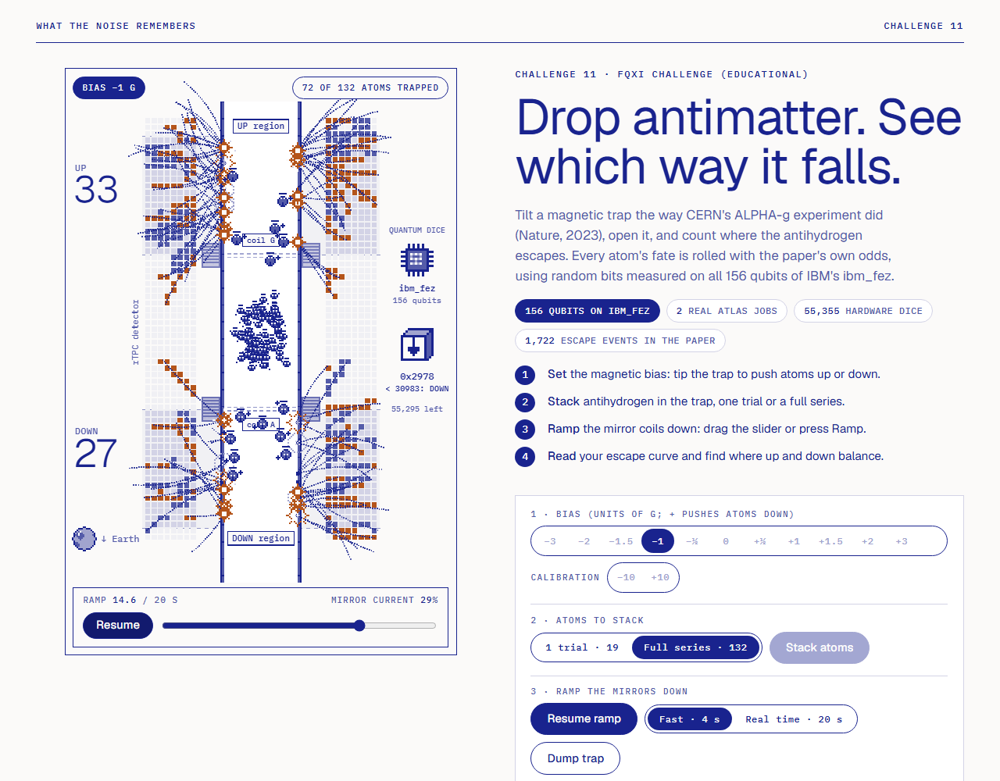
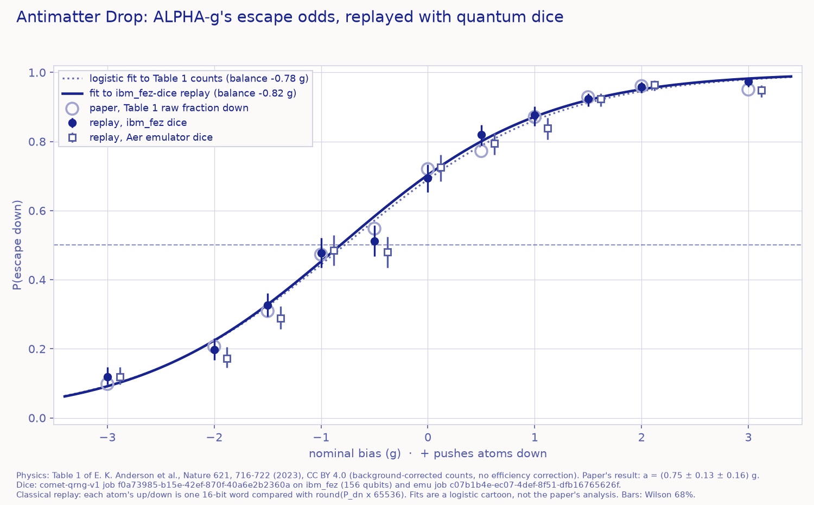

# Antimatter Drop

**Moth Hack 2026 · Challenge 11 (FQxI Challenge, educational)**

> **Drop antimatter. See which way it falls.**
> Tilt a magnetic trap the way CERN's ALPHA-g experiment did (Nature, 2023), open it, and count where the
> antihydrogen escapes. Every atom's fate is rolled with the paper's own odds, using random bits measured on all
> 156 qubits of IBM's ibm_fez.



In 2023 the ALPHA collaboration published the first direct observation of how gravity acts on antimatter. They
stacked antihydrogen in a vertical magnetic trap, slowly opened both ends, and counted how many atoms escaped up
and how many escaped down. They repeated this across 11 magnetic "bias" settings, then compared the resulting escape
curve with 3-D trajectory simulations. Their result: antihydrogen accelerates towards Earth at
**a = (0.75 ± 0.13 (statistical + systematic) ± 0.16 (simulation)) g**, consistent with 1 g. Repulsive
"antigravity" of 1 g is ruled out (probability below 10⁻¹⁵).

This piece is an educational instrument for that experiment. You run the protocol yourself. Each atom's up or
down outcome is a weighted coin. The weights come from the paper's Table 1, and the coin is flipped with real
quantum random bits.

## Play it

Open `web/index.html` (self-contained, about 362 KB; the page itself loads no other files). The lead publishes it
as an artifact. It follows the Moth Hack 2026 brief-page look from `common/brand.css`: warm paper, one ultramarine
ink, mono labels, light Geist headings, hairline rules, square panels and pill buttons. The trap scene, the escape
curve and `out/escape_curve.png` are classical graphics, so they use the same paper/ink palette (no engine artwork
here). There is no video and no audio file: the only sound is the optional **Hear the dice** button, a classical
Web Audio sonification synthesised in the page (one short tone per die as it lands, high for up and low for down).
It stays silent until you click it, and the same button then reads **Mute the dice** and stops it.

**Scene first.** The hero is an illustrated ALPHA-g trap in the shared "ultramarine ink pixel art" style
(`common/SPRITES.md`). Its cast lives in `web/sprites.json` and is drawn by the shared `common/inksprite.js` at
whole-number scales (the canvas backing store follows the screen's device pixels, so the pixels stay crisp):
- **Antihydrogen atoms**: an antiproton with a minus-sign mouth, a positron "+" orbiting it, and the overbar of
  H-bar floating overhead like a hat. They idle (orbit, blink, bob), get nervous once the ramp reaches the 10-20 s
  escape window, and look down or up *after* their die has decided which way they go. Big series use a smaller
  crowd sprite.
- **The die**, beside the trap: the only quantum step. It rolls once per escaping atom, lands on a down or up arrow,
  and shows that atom's real 16-bit word and threshold. Its source changes with the dice selector: a qubit chip for
  ibm_fez, a laptop for the Aer emulator, a browser window for the classical RNG. A dotted zap links the die to the
  atom it decided, and it greys out when a bank is used up.
- **Mirror coils G and A** (wound-wire sprites) fade with the ramp, and dashed barrier "gates" across the tube
  thin out; a bias thickens one of them (exaggerated).
- **Annihilation**: an atom reaching the wall flashes (the warm accent is used only here), pion tracks spray
  through the rTPC, and the readout pads they cross light up and cool down. The vertex stays as a dot.
- **The host** (the mascot, a big antihydrogen atom) waves from an empty trap and reacts to each finished trial
  ("13 down, 6 up: mostly down!"). Earth sits bottom-left for orientation, and the UP/DOWN counters hop.

Below the trap the page runs in titled sections, each opened by an ink bar: **How to play**, **Your results**,
**The data**, **Test yourself**, **The science**, **How it was made**, **What this does not claim** and **Jobs and
credits**. In *Your results*, **"Where do your atoms balance?"** is a ruler of biases: the host walks to *your* fitted
balance point and stands on a bar showing its 68% range, beside signposts for where a falls-down (−1 g), no-gravity (0)
and falls-up (+1 g) world would balance in the naive 1-D picture, and a ring for the same fit to Table 1. Its face and
words follow the verdict, and the last-eight dice log sits under the verdict. *The data* always shows both graphs of
the first version, each with a caption: the escape curve (your points with 68% Wilson intervals over Table 1's
fractions, your logistic fit, the optional "other worlds") and the |B| sketch (the schematic on-axis field, whose two
barriers fall with the ramp and tilt with the bias). Nothing a sprite does is invented: every outcome, count, word and
position on the ruler comes from the real dice and your own tallies; motion, timing, tracks and pads are labelled
cosmetic in the honesty notes.

1. **Set** the bias: 11 nominal settings from −3 g to +3 g, plus the ±10 g calibration settings. A positive bias
   raises the top barrier and pushes atoms down.
2. **Stack** atoms: one trial (the paper's average detected escapes per trial at that bias, e.g. 19 at 0 g) or a full
   series (the paper's total at that bias, e.g. 131 at 0 g).
3. **Ramp** the mirror coils down: drag the slider (it only moves forward, like the real ramp), or press Ramp
   (4 s fast or 20 s real time). Pause any time. Space on the canvas stacks, ramps or pauses.
4. **Read** your escape curve and find where up and down balance: the host walks along the ruler to your logistic
   fit, and *The data* shows the escape curve, your points (with 68% Wilson intervals) over the paper's Table 1
   fractions, your fit, and "Show other worlds" (1-D cartoon curves for falls-down, no-gravity and falls-up worlds).

Also on the page:
- "Run the whole campaign" replays all 11 biases with the paper's 1,721 escapes. It's user-started and can be
  paused.
- A dice selector (ibm_fez hardware, Aer emulator, or your browser's crypto RNG) can be switched mid-ramp.
- The die beside the trap shows each 16-bit word and its comparison; the dice log under the verdict keeps the last eight.
- "Copy link to my curve" saves your exact tallies and bank position in `#token`.
- **Hear the dice / Mute the dice**: optional sound, one tone per roll (classical sonification, nothing plays on load).
- A six-question quiz (one answer per question; "Reset the quiz" unlocks it).
- The shared set navigation just above the footer: previous piece (19 Frog Chorus), "All 22 pieces" (the hub), next
  piece (21 The Quantum Nose Test) and "Jump to any piece". The brand bar also links to the hub.
- Drawers: *What antimatter is* and *How ALPHA-g weighed antimatter* (with Table 1) under *The science*, and *What the
  quantum computer did* under *How it was made*. The honesty notes (*What this does not claim*) are always visible,
  and *Jobs and credits* lists both Atlas jobs from `out/jobs.json` and the sources.

The **static deliverable** is `out/escape_curve.png`: the whole campaign replayed with the ibm_fez bank and the
emulator bank, over the paper's Table 1 fractions.



## Engine, parameters and qubits

One engine, **comet-qrng-v1 v1.0.0** (Atlas), 5 credits per run. Two completed jobs, 10 of the 12-credit cap.
Full table in [PARAMS.md](PARAMS.md).

| Job | Mode / backend | Qubits (reported by the engine) | Output |
|---|---|---|---|
| `f0a73985-b15e-42ef-870f-40a6e2b2360a` | **qpu, ibm_fez** (IBM job `db1jigpb694s73dscbr0`) | 148 register + 8 Bell witness = **156**, the whole Heron chip (`provenance.circuit` n_rand 148, n_total 156; `initial_layout` covers physical qubits 0–155) | 110,710 conditioned bytes = 55,355 dice; CHSH S = 2.548 ± 0.015 |
| `c07b1b4e-ec07-4def-8f51-dfb16765626f` | emu, Aer simulator | 20 register qubits, no witness = **20**, the emulator's cap for the whole circuit | 8,423 bytes = 4,211 dice |

Shared parameters: `shots` = 10000 (the maximum), `epsilon_log2` = 128 (the strictest extractor setting),
`output_bytes` = 1000000 (you receive what the entropy budget allows), `include_raw_counts` = true, default
`public_seed` "toeplitz-v1". The emu run uses 20 + 0 rather than 12 + 8 because a 12 + 8 emu run returns 0
extractable bytes (entry 05 measured this). That leaves no dice.

**How the dice work.** Each escaping atom reads the next 16 bits of the active bank as an integer k in 0–65,535.
It goes **down** if `k < round(P_dn × 65536)`, else up. `P_dn = max(0, N_dn) / (max(0, N_up) + max(0, N_dn))`
for the chosen bias, from Table 1. Over all 65,536 words the down count equals the threshold exactly
(`test_core.js` checks this). A bank never wraps silently: when it runs out, the ramp stops and the page offers a
labelled rewind.

## What is quantum, what is classical

| Step | Kind |
|---|---|
| 148 qubits in \|+⟩ measured 10,000 times on ibm_fez, plus 4 CHSH Bell pairs | **quantum, IBM hardware (ibm_fez)** |
| Min-entropy estimate (NIST SP 800-90B, h = 0.679 bits per raw bit), Toeplitz extraction to 110,710 bytes | classical, inside the engine |
| Emulator bank: same engine on Aer, 20 qubits | quantum circuit **on a classical simulator** (pseudo-randomness) |
| Escape probabilities P_dn per bias | **from the paper** (Table 1, Anderson et al. 2023); no computation of ours |
| Each atom's up/down: one 16-bit word vs. a threshold | classical comparison of quantum (or emulator, or browser) random bits |
| Escape timing, motion in the trap, vertex positions, pion tracks, lit detector pads, barrier gates | classical and illustrative (seeded mulberry32 PRNG) |
| Sprites (atoms, die, coils, host, Earth, signposts) and their reactions | classical decoration that only mirrors the real dice and your tallies |
| Logistic fit, balance point, "other worlds" curves | classical; our cartoon, not the paper's analysis |
| "Hear the dice" tones (one per roll, high = up, low = down) | classical Web Audio sonification of the same rolls |
| `replay.py` campaign replay and figure | classical replay of the banks |

## What this claims, and what it doesn't

**Claims.** Every number quoted from the paper was checked against its full text (Europe PMC XML of PMC10533407):
a = (0.75 ± 0.13 ± 0.16) g; p = 2.9 × 10⁻⁴ for no gravity; below 10⁻¹⁵ for repulsive 1 g; Table 1 counts;
4.53 × 10⁻⁴ T per g of bias; 1.74 T peak field; 25.6 cm × 4.4 cm trap; about 0.5 K depth; about 100 atoms from 50
stacks in about 4 h; 20 s ramp; 10–20 s window; about 80% of hydrogen exiting the bottom of a symmetric trap in
simulation; 1,722 events. The dice are real engine outputs with the job IDs above. A fresh page's "Run the whole
campaign" with ibm_fez dice reproduces `out/replay.json` exactly (tested headlessly in `test_page.js`).

**Does not claim.**
- This is not a simulation of antihydrogen. It replays the published outcome frequencies, so you can't discover
  anything the experiment didn't. What you can feel is how ~150 atoms per bias produce the error bars.
- Table 1 counts are background-corrected but not efficiency-corrected. Our rough reading of the ±10 g
  calibration rows puts the up/down efficiency difference at a few per cent. The bias labels are nominal; the
  paper plots derived biases.
- The paper's balance point is "close to −1 g". Our logistic fit to the raw counts gives −0.78 g [−0.84, −0.74].
  The ibm_fez replay gives −0.82 g [−0.86, −0.76] and the emulator replay −0.72 g [−0.78, −0.68]. The spread is
  ordinary counting noise from 1,721 draws. Reading −b₀ as "gravity in g" is the paper's naive 1-D picture, not
  its 3-D analysis.
- The quantum computer adds no physics. Its bytes are entropy-accounted under the engine's stated assumption
  (no dependence beyond pairwise correlations within a shot; health tests passed, 10 of 156 qubits biased at
  p < 10⁻⁶ before extraction). That is grade "hardware-accounted", not device-independent certification. The
  CHSH value is a fidelity witness. The emulator bank is classical pseudo-randomness.
- No quantum advantage is claimed: the browser's classical RNG gives the same curve.

## Reproduce

```bash
pip install numpy requests matplotlib     # Python 3.12
python run_qrng.py      # 2 comet-qrng-v1 jobs (cached in ../../cache/comet-qrng-v1/: re-runs are free and offline)
python replay.py        # out/replay.json + out/escape_curve.png
python build_web.py     # web/index.html (ASCII, self-contained) + web/img/mascot.png (the hub mascot)
node test_core.js       # 11 unit + cross-language tests
JSDOM_PATH=<dir with node_modules/jsdom> node test_page.js   # 9 jsdom page tests (optional: needs jsdom, not shipped)
node verify_render.js   # render checks in headless Chromium; rewrites screenshot.png + out/render/*.png
node qa/e2e.cjs 6600    # end-to-end journey (88 assertions) -> qa/e2e.json
# from the project root:
node common/qa/qa_page.cjs entries/20-antimatter-drop 6610       # shared page QA -> qa/report.json + screenshots
node common/qa/deadcontrols.cjs entries/20-antimatter-drop 6590  # every control does something -> qa/deadcontrols.json
python common/qa/crosslinks.py                                   # set-wide link and number check
```

`MOTH_FREEZE=1` makes the client refuse any job that isn't cached. All three Python scripts reproduce every
output under it with no new jobs, byte for byte, and `build_web.py` is deterministic (two builds give identical
files). `verify_render.js`, `qa/e2e.cjs` and the shared QA use the project's Playwright in
`common/qa/node_modules`. jsdom is test-only and not shipped; `qa/e2e.cjs` covers the same journey in a real browser.

## Files

- `run_qrng.py`: the two Atlas jobs → `out/jobs.json`, `out/<job>.json` (engine output minus hex and raw counts),
  `data/bank_<job>.hex` (the conditioned bytes, verbatim)
- `data/alphag_table1.json`: Table 1 of the paper, transcribed with provenance
- `replay.py`: whole-campaign replay → `out/replay.json`, `out/escape_curve.png`
- `web/template.html`, `web/core.js` (pure logic), `web/sprites.json` (the cast's pixel art), `build_web.py` →
  `web/index.html` (inlines `common/inksprite.js` and the sprites) and `web/img/mascot.png` (the hub mascot, the
  host sprite at 6x); `web/files.json` lists the mascot
- `test_core.js`, `test_page.js`, `verify_render.js`; `screenshot.png`, `out/render/*.png` (rendered from the
  current page by `verify_render.js`)
- `qa/e2e.cjs` + `qa/e2e.json`: the end-to-end journey (stack, ramp, sound on and off, titled sections, both graphs and
  the ruler drawn with content, campaign = `out/replay.json`, share link restored on reload, exhausted bank and rewind,
  quiz (each of the 24 options), drawers, prev / hub / next nav, 375 px)
- `qa/deadcontrols.json`: the shared dead-control scan (61 controls, no dead controls; the 18 quiz options it cannot
  click are the ones locked after a question is answered, and `qa/e2e.cjs` answers with each of them after a reset)
- `qa/report.json` + `qa/desktop.png`, `qa/mobile.png`, `qa/desktop-after-clicks.png`: the shared page QA
  (ok, sound starts only on a click, no console errors, no overflow at 375 px, only Google Fonts as an external host)
- [PARAMS.md](PARAMS.md), [CREDITS.md](CREDITS.md), `piece.json`
