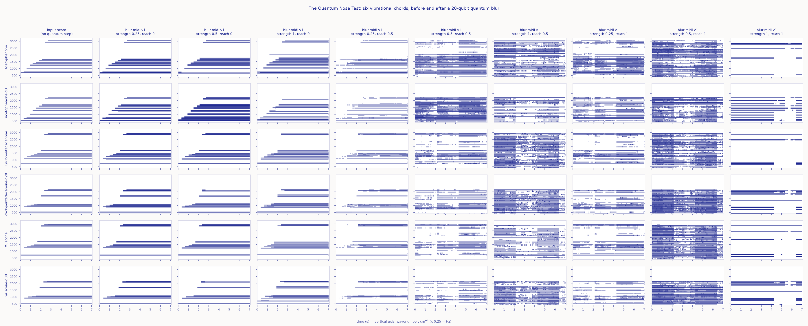

# The Quantum Nose Test

**Moth Hack 2026 · Challenge 02: Make it audible**



In 1996 Luca Turin proposed that we smell molecules by their **vibrations**, read out in the nose by
inelastic electron tunnelling. If that were true, swapping hydrogen for deuterium, which leaves a
molecule's shape alone but slows every C-H vibration, should change its smell. Experiments disagree:
people could not tell acetophenone from acetophenone-d8 (Keller & Vosshall 2004; Gane et al. 2013),
fruit flies could tell isotopes apart (Franco et al. 2011), people picked out deuterated musk
(Gane et al. 2013), and the human musk receptor OR5AN1, tested in cells, responded to both alike
(Block et al. 2015). **The theory is
unproven and contested**, and this piece takes no side.

What it does is let you **smell by ear**. Three odorants' vibrational spectra (textbook group
frequencies) are slowed down about 1.2 × 10¹¹ times into hearing range, so every C-H line becomes a
note. Swap H for D and those notes slide down 5.35 semitones, a little more than a perfect fourth,
while the C=O and ring notes stay put. Then the chords go through **Atlas `blur-midi-v1`**, a
20-qubit quantum blur, from a light local smear to a global scramble, and you take a blind
"can you hear deuterium?" test. Evidence for and against sits in drawers beside the instrument.

## Play it

The interactive page is `web/index.html` (built from `web/template.html` by `build_web.py`). Every audio
deliverable plays on the page: the 10 MIDI files through the page's Web Audio sine synth, and all 61
WAVs as compact mp3s under `web/audio/` (all listed in `web/files.json`; page total about 5.47 MB).
Nothing plays until you press a button, and every sound has a stop or pause.

The page opens on a scene, not a chart. **Plate I** is an ink drawing in the style of an anatomy plate:
a sagittal section through the nose (lateral wall of the nasal cavity, septum removed) with 17 numbered
callouts and a key in English and Latin (naris, vestibule, the three nasal conchae, olfactory epithelium,
olfactory nerve fibres, cribriform plate, olfactory bulb and tract, nasal bone, frontal and sphenoid
sinuses, nasopharynx, pharyngeal opening of the auditory tube, hard and soft palate). Pixel-art odorant
molecules ride a sniff up to the olfactory cleft, and a **detail circle** (a loupe in the plate's top right)
shows one of them on the mucus at molecular scale, magnified roughly ten million times, with a live caption
naming the loudest line sounding. Under the molecule's name: what it smells like (PubChem; The Good Scents
Company; Wikipedia), its molar mass, and, for the deuterated form, what experiments found. **Plate II** zooms in: Fig. b, the olfactory epithelium
(receptor neurons, cilia, mucus); Fig. c, the shape (lock-and-key) theory; Fig. d, the vibration theory as
an inelastic electron tunnelling diagram, labelled **HYPOTHESIS**. The spectrum roll (the result chart) is
one click away behind **Scene / Data**, and is always drawn in the page's **The data** section.

Below the scene, the blind test and the tour, the page is organised in titled sections that keep the earlier
(pre-sprite) page's words and graphs: **How to play**; **The data** (Graph 1, the spectrum roll with its own
Play / Restart / Swap and the shared playhead; Graph 2, every chord before and after every blur, the `hero.png`
figure drawn live from the same note lists, where a click loads that cell into the instrument; Table 1, the line
table); **The science** (evidence for and against); **How it was made**; **What this does not claim**; and
**Jobs and credits** (the nine job IDs with run times and notes out, each loadable). An "On this page" row links
them. `history/inventory.md` lists the earlier page's content and `history/restore_report.md` maps each item to
its place now.

The sprites (web/sprites.json, drawn with the shared `common/inksprite.js`) are built from the real
structures: acetophenone C6H5-C(=O)-CH3 (8 H), cyclopentadecanone (15-carbon ring, 28 H), muscone (its
3-methyl, 30 H); `test_page.js` checks the H counts against the formulas. Hydrogen is drawn light and
deuterium dark, at the same size, because deuterium only adds a neutron. While a chord plays, every atom's
wobble follows the notes sounding at the playhead, from the same note lists you hear (input score or
blur-midi-v1 output): C-H/C-D stretch notes shake hydrogens along their bonds, bend notes shake them
sideways, C=O notes move the oxygen, ring notes breathe the ring; a C-D bond visibly wobbles 1.36 times
slower than a C-H bond. Fig. d's rungs are the molecule's line list in meV (1 cm⁻¹ = 0.124 meV) and light
up when their note sounds; the receptor gap is a slider, not a property of any real receptor. Reactions,
all illustrations rather than measurements: **Sniff** plays a two-part sniff (filtered noise) and the mascot
sniffs; swapping H for D flies one neutron into every hydrogen in the loupe (H + n = D; the caption gives the
molar masses, e.g. 120.2 u to 128.2 u for acetophenone); when an odorant binds in Fig. b a burst of spikes
runs up the receptor neuron's axon and the olfactory bulb on Plate I flashes; in Fig. d the tunnelling
electron hands the odorant one quantum of the matching line (the mode it drives visibly kicks, labelled
"+1 quantum, ħω = 379 meV"). The blind test uses two pixel sniff bottles that uncork while their sample
plays, and a pixel nose that sniffs along and shows a tick or a cross when you answer; the plates stay still
during the test so they cannot give the answer away. The mascot (`web/img/mascot.png`, 204 x 180, transparent,
exported with `common/mascot.py --scale 4`) is a head in midline section sniffing acetophenone: the conchae,
the olfactory epithelium under the cribriform plate, and the olfactory bulb and tract under the brain. It is
drawn by `make_sprites.py` into `web/sprites.json`, which also holds the neutron and spike sprites.

1. **Pick** a molecule: acetophenone (8 H), cyclopentadecanone / Exaltone (28 H) or muscone (30 H).
   A puff of it rides the sniff up the nose on Plate I (the **Sniff** button sends another, with a sniff sound).
2. **Play** its chord: the lines enter from the lowest to the highest frequency, then sustain, and the
   molecule's bonds wobble with them on Plate II.
3. **Swap H ↔ D** while it sounds (button, a click on Fig. c, or the `S` key anywhere on the page): the hydrogen lines glide down, live.
4. **Blur** it: strength 0.25 / 0.5 / 1 × reach local / halfway / global, each one a real Atlas job.
   Drag the time slider, or (in the Data view) click or drag the spectrum roll; arrows scrub, Space
   plays and pauses.
5. **Test** yourself: two samples, one normal and one deuterated, in random order. Pick the deuterated
   one. The page keeps score and gives the binomial p-value against guessing. "Disguise pitch"
   randomly transposes each sample by up to ±25 % so only the chord's shape gives it away.
6. Open the **Evidence for / Evidence against** drawers; some load the relevant molecule or shade the
   relevant band on the spectrum roll (the C-D stretch range; Block et al.'s 1,380-1,550 cm⁻¹ window).
   In Fig. d, drag the hypothetical receptor gap: a rung in the window lets the electron tunnel; swap to
   D and a receptor tuned to C-H goes quiet.
7. **Copy link to this view** or **Copy my score** to share. The state goes in `#molecule~isotope~setting`, plus `~data`
   when the Data view is open (for example `#muscone~D~s0.25_r0.5~data`); opening the link restores the molecule,
   isotope, blur setting and view. Copy my score copies a one-line message with your score and that link.
8. **WAV file**: the instrument's "Play the WAV render" button plays the deliverable
   `wav/<setting>/<molecule>_<H|D>.wav` for whatever molecule, isotope and blur is selected (a 48 kb/s
   mp3 of it); it toggles to "Stop", the playhead follows it, and changing the selection (even H ↔ D)
   while it plays jumps to the matching file at the same moment. So all 60 chord WAVs are audible and can
   be compared with the live synth.
9. **The tour**: the demo WAV, as an `<audio>` player with chips that jump to each pair (starting it stops the instrument).
10. **The set**: the brand bar links the hub of all 22 pieces, and the foot of the page has previous (20 Antimatter
   Drop), next (22 Scroll Unroll), "All 22 pieces" and a jump list, generated by the shared `common/nav.py` at build time.

## Deliverables

| File | What it is |
|---|---|
| `wav/quantum_nose_demo.wav` | 144 s tour: each molecule normal then deuterated, unblurred, then through a strong local blur (strength 1, reach 0) and a global one (strength 0.5, reach 1) |
| `wav/<setting>/<molecule>_<H\|D>.wav` | every chord as audio: `clean` (input score) and all nine blur settings, 60 files |
| `midi/nose_input.mid` | the input score sent to the engine (6 tracks) |
| `midi/blurred/s<strength>_r<reach>.mid` | the nine engine outputs, as downloaded |
| `web/` | the interactive page (`index.html`, `template.html`, `files.json`, `sprites.json` = the pixel-art cast, `img/mascot.png` = the hub mascot, `audio/quantum_nose_demo.mp3` = the demo WAV at 96 kb/s, `audio/chords/<setting>/<molecule>_<H\|D>.mp3` = the 60 chord WAVs at 48 kb/s) |
| `hero.png` | every chord before and after every blur, as piano rolls (paper/ink palette, matching the page) |

MIDI note numbers here are **spectral bins of 28 cm⁻¹**, not semitones: bin *n* sounds at 7·*n* Hz.
Played on an ordinary synth the files sound wrong; use `render_wav.py` or the page.

## How a vibration becomes a note (classical)

- **Lines.** `spectra.py` lists 9-10 approximate textbook IR group frequencies per molecule (C-H
  stretches near 2,850-3,060 cm⁻¹, C=O near 1,685-1,712, CH₂/CH₃ bends, aromatic ring and C-H bends),
  each tagged with whether it moves a hydrogen and a rough strength class (strong / medium / weak →
  MIDI velocity 112 / 84 / 56). They are not a measured spectrum of any sample.
- **Deuteration.** Lines that move a hydrogen are divided by the harmonic C-H → C-D factor
  √(μ_CD/μ_CH) = 1.362 (from atomic masses); heavy-atom lines are left unchanged. Example: aromatic
  C-H stretch 3,060 → 2,247 cm⁻¹. Real deuterated spectra differ by a few percent and modes mix; this
  is an idealised estimate.
- **Sound.** One linear rule, **1 cm⁻¹ = 0.25 Hz**, so intervals are true vibrational ratios.
  3,060 cm⁻¹ → 765 Hz; 690 cm⁻¹ → 172.5 Hz. For MIDI each line is rounded to a 28 cm⁻¹ bin (±14 cm⁻¹);
  two lines in the same bin are merged.
- **Score.** `make_midi.py` writes each chord as a 7-second track: lines enter bottom to top over
  3 s, then all sustain to 7.0 s (480 ticks/beat, 120 bpm = 960 ticks/s).
- **Synthesis.** Every note is a pure sine with 15 ms attack and 60 ms release (`synth.py`, mirrored
  in the page: sparse chords play as live Web Audio oscillators, so H ↔ D can glide; dense blurred
  chords, with thousands of notes, are summed into a sample buffer in JavaScript with the same rule).
  Each track's loudness is equalised (RMS) so that loudness never gives away the deuterated sample.

## Engine, parameters and qubits

- **Engine:** `blur-midi-v1` ("Blur Jazz", Quantum Blur for MIDI piano rolls), the only engine used.
  1 credit per job; **9 jobs, 9 credits** of the piece's 10-credit cap (`a.spent()` = 9). All 9
  submissions completed; none failed.
- **One file, six chords.** All six chords are separate tracks of one MIDI file, and the engine
  blurs each track as its own piano roll (its progress messages read e.g.
  "Track 2/6: 'acetophenone D' (ticks_per_step=1 ...)"). So each job treats a molecule's H and D chord
  identically, which keeps the blind test fair.
- **Fixed:** `qubits` = **20** (the engine maximum per pass), `resolution` = 1 tick per step;
  `threshold` 0.1, `margin` 0.15, no `mask` (defaults).
- **Swept:** `strength` ∈ {0.25, 0.5, 1} × `reach` ∈ {0 (local), 0.5, 1 (global)}. The six reach-0/1
  jobs ran first; the three reach-0.5 jobs were added once those had all succeeded.
- **Qubits, and how we know.** The engine does not report them. Quantum Blur stores a w × h grid in
  ⌈log₂ w⌉ + ⌈log₂ h⌉ qubits. Each track's roll is its bin span plus the 15 % margin = 77-111 pitch
  rows (7 qubits) by 6,720 time steps (13 qubits) = **20 qubits**, so by the same rule each track fits
  one full-budget 20-qubit pass without tiling. Computed in `make_midi.py`; per-track table in [PARAMS.md](PARAMS.md).
- **Job IDs** for every completed job: [PARAMS.md](PARAMS.md) and `out/jobs.csv`.

What the blur did (counted from the downloaded MIDI, see the notes-out column in PARAMS.md): at
reach 0 the chords keep their lines and gain quiet neighbours one to three bins away, a little like a
low-resolution spectrometer (at strength 1 a few notes land up to 12 bins away). At reach 0.5 and 1,
five of the six settings scatter each chord into 65-3,731 notes spread over the range; strength 1 at
reach 1 instead leaves only 25-56 notes per chord, many far from the original lines.
In all nine jobs the deuterated chords' notes stay at or below bin 80 (≈ 2,240 cm⁻¹) while the
normal chords' highest notes sit at bins 102-109 (≈ 2,860-3,050 cm⁻¹, the C-H stretch region), so the
blur never hides the swap from an ear that listens for the top of the chord.

## What is quantum, what is classical

| Step | Kind |
|---|---|
| Line lists, H → D estimate, mapping to Hz and MIDI (`spectra.py`, `make_midi.py`) | classical |
| Blurring each chord's piano roll (`run_blur.py` → `blur-midi-v1`) | quantum circuit, **run on Atlas's classical statevector simulator**; the engine has no QPU mode |
| Reading MIDI, loudness matching, WAV synthesis (`synth.py`, `render_wav.py`) | classical |
| The page: sine synthesis, H ↔ D glide, blind test and p-values | classical (your browser) |
| The page's mp3s (ffmpeg encodes of the demo WAV and the 60 chord WAVs) | classical |

## What this claims, and what it does not

**Claims:** the H → D shift of textbook vibrational lines is real physics, and it is large enough to
hear once the lines are moved into hearing range. Every blurred sound on the page and in `wav/` comes
from a downloaded `blur-midi-v1` output, whose job ID is shown live on the page.

**Does not claim:** that noses detect vibrations (unproven and contested); that the quantum circuit
models electron tunnelling, a receptor or a nose (it is a sound effect, used as an analogy for a
fuzzy spectrometer); that hearing the difference says anything about smelling it; any quantum
advantage. Band positions are approximate textbook values; deuterated lines are harmonic estimates.
The blind test scores you against chance; it is not a psychophysics experiment.

## Evidence on the page (all checked against PubMed; full list in [CREDITS.md](CREDITS.md))

**For:** Turin, *Chem. Senses* 1996 (the proposal; reports acetophenone and its d8 analogue smell
different) · Brookes et al., *PRL* 2007 (the tunnelling mechanism is physically viable in a simple
model) · Franco et al., *PNAS* 2011 (fruit flies distinguish deuterated odorants and generalise to a
molecule with a vibration in the C-D stretch range) · Gane et al., *PLOS ONE* 2013 (119/132 correct
picks of deuterated cyclopentadecanone).

**Against:** Keller & Vosshall, *Nat. Neurosci.* 2004 (no support in humans) · Gane et al. 2013
itself (acetophenone isotopomers not distinguished; deuteration changes GC retention, i.e. physical
properties) · Block et al., *PNAS* 2015 (the musk receptor OR5AN1 and others respond alike to
isotopomers; muscone-d30 lacks the 1,380-1,550 cm⁻¹ bands) · the 2015 Turin et al. / Block et al.
letters in *PNAS*.

## Reproduce

```bash
pip install numpy mido matplotlib requests imageio-ffmpeg
python make_midi.py        # midi/nose_input.mid + out/input_tracks.json (qubit table)
python run_blur.py         # 9 blur-midi-v1 jobs; cached in ../../cache/blur-midi-v1/, re-runs free and offline
python render_wav.py       # wav/
python make_figure.py      # hero.png
python write_params.py     # PARAMS.md
python make_sprites.py     # draws the mascot (2 frames), neutron and spike sprites into web/sprites.json
python build_web.py        # web/index.html + web/audio/ mp3s (bundled ffmpeg) + web/files.json + web/img/mascot.png
node test_page.js          # unit tests for the page's logic, data and sprites (45,699 checks)
node ../../common/qa/qa_page.cjs . 5120   # headless page QA (61 audio files decode) -> qa/report.json (ok: true, sound_started: true)
node qa/e2e.cjs 6630       # end-to-end journey with real clicks and keys (play, swap, blur, WAV, test, share link + reload, drawers, tour, the sections and their graphs, nav) -> qa/e2e.json
```

Run `run_blur.py` with `MOTH_FREEZE=1` to prove it replays from cache without submitting anything.
