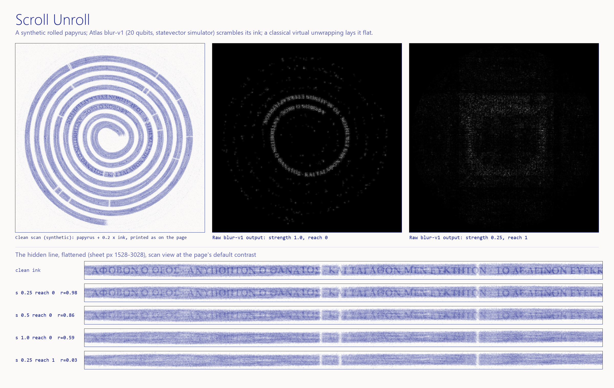

# Scroll Unroll

**Moth Hack 2026 · Challenge 01: One image, one engine**



*Unroll the scroll. Find the line hidden at its core.*

Some scrolls can never be opened. The En-Gedi scroll was burnt to a lump; the Herculaneum papyri were carbonised by
Vesuvius. X-ray CT sees inside them, and "virtual unwrapping" reads them without touching them: find the sheet in the
scan, sample along it, and lay it flat (Seales et al. 2016).

This piece borrows that idea and none of that data. It generates a **synthetic** rolled papyrus: an Archimedean spiral of
7.75 turns (12,653 px of sheet) with a gentle wobble, fibres, cracks, CT ring artefacts, grain, carbon flecks and abraded
strokes, and one line of Greek written into an inner stretch of the sheet, 2.1 to 3.4 turns out from the core. Atlas's
**Quantum Blur** (`blur-v1`) plays the damage: it scrambles the ink layer at 20 qubits, in nine real jobs that run from
"barely touched" to "thrown across the whole roll". A classical virtual unwrapping lays the sheet flat so you can try to
read what survived.

## Play it

Open `web/index.html` (the lead publishes it as a claude.ai artifact; `web/files.json` lists its media).

The page opens on a scene, not a chart: **the desk**, a pixel-art side view of the scroll on an archive table, above
**the CT slice** of the same scroll. Both show one state and both take input. Below the scene the page is in titled
sections: *How to play* (the steps, the reading window, the damage and readout panels, the reveal), *The cast*,
*The data* (the nine jobs' measured "line kept" r against "ink moved", always visible; tap a job to load it),
*Behind the scroll* (four drawers) and *Jobs and credits* (every job's parameters, ID and both measures; each job
number loads that job). "Roll it back up" rolls the whole sheet up and keeps what you have read; "Start over" returns
to the opening view and forgets it.

- **The cast** (pixel art in the shared ink palette; the pixels live in `web/sprites.json`, drawn by
  `common/inksprite.js` at integer scales so they stay crisp):
  - *The archaeologist*: a moth in a pith helmet and round spectacles, carrying a lantern. It **is** the reading
    window: it stands on the sheet where the window is, and its lantern lights that stretch of the desk. It hovers over
    the window in the CT slice too. It reacts to the real state: it perches on the roll and asks **?** while the
    window is still rolled up; it reads (spectacles glinting, lantern lowered) only where the hidden line lies flat and
    the current job's measured "line kept" r passes the same threshold the page uses to count the line as read; it scowls
    at a scribble when that r says the ink is scrambled; it coughs when you step to a job that moved more ink; it
    cheers, with green sparkles, when you find the line. It is also the hub mascot (`web/img/mascot.png`).
  - *The roll*: drawn larger than the desk's scale (places *along* the sheet are to scale). Its spiral turns with the
    real geometry as the sheet comes off; a paperweight holds the outer end.
  - *The ash*: one fleck per 2 % of ink brightness the current blur-v1 job moved off the true ink ("ink moved", measured
    from the job's output by `unwrap.py`); clean ink makes none. Decorative motion, real count.
  - *The letters* on the desk's sheet appear only where you have actually read the hidden line (the page's own
    coverage record), and get a green underline once it counts as found.
  - Each card in *The cast* has a **Show on the desk** button (its portrait): it scrolls back up to the desk and
    marks that character there for a moment, with a note saying what it shows (for the ash: how many flecks the
    current job's measured ink moved gives, or that clean ink gives none).
- **Unroll**: push the roll on the desk or in the CT slice, drag the slider, or press "Unroll it" (it pauses on a
  click; with reduced motion it jumps). The roll turns as the sheet comes off it, like a carpet on a floor. The page
  opens 12 % unrolled so the desk shows what unrolling means.
- **Read**: the reading window shows the flattened sheet, magnified. Tap the desk or the CT slice to send the moth
  there, drag the strip, use the slider, or the arrow keys. Any part still on the roll is hatched: you have to unroll
  to read it.
- **Damage**: the damage slider (or the row of bars, one per job, height = ink moved) steps through the nine blur-v1
  jobs in order of how much ink they move. Flip
  "Blurred ink / Clean ink" to compare, or "Ink layer only" to see the raw engine output with no papyrus under it.
  Contrast (window/level), "Tint the ink" and zoom are classical display controls.
  The page prints the scan in its one ink colour (denser = deeper ultramarine, air = paper); "Ink layer only"
  shows the blur-v1 output in its own greyscale, white ink on black. Page QA: `node common/qa/qa_page.cjs
  entries/22-scroll-unroll 5620` (report and screenshots in `qa/`). The piece has no audio or video.
- **Find** the hidden line: it counts once you have swept the window over 85 % of it while it lies flat, under clean ink
  or damage light enough to read (line kept r ≥ 0.8 in the scan view, ≥ 0.55 in the ink-only view). Then the page
  reveals the translation. "Copy link to this view" shares the exact state (`#u1000.w1529.d3.c0.l0.t0.k35.z10.x0`).

The readout always shows the job ID, its parameters, the qubit count, where it ran, and two measured numbers for
that job: how well the line survived and how much ink moved.

## The brief's deliverable (PNG + params)

- `hero.png`: clean scan | raw blur-v1 output at strength 1, reach 0 | raw output at strength 0.25, reach 1, above the
  flattened hidden line under five settings
- `ladder.png`: all nine raw outputs flattened over the hidden line, in damage order, with job IDs and both measures
- `PARAMS.md`: every job with its parameters, qubits and job_id. Raw outputs: `out/ink_*.png`; flattened strips:
  `out/strip_*.png` (12,653 × 52 px each); measures: `out/metrics.json`
- Inputs: `ink_clean.png` (the engine input), `mask.png`, `scroll_base.png`, `scan_clean.png`, `strip_truth.png`

## Engine, parameters and qubits

- **Engine:** `blur-v1` v1.1.9, the only engine used. Atlas's classical statevector simulator; blur-v1 has no QPU mode.
- **Input:** the ink layer alone, `ink_clean.png` (1024 px), so the blur scrambles the ink and leaves the papyrus alone.
  The page then adds it to the papyrus: scan = papyrus + 0.2 × ink (classical).
- **Mask:** a disk of r = 500 px around the roll. Its 1001 × 1001 px bounding box needs
  ⌈log₂ 1001⌉ + ⌈log₂ 1001⌉ = 10 + 10 = **20 qubits**, the engine's maximum, with `size` 1024 so nothing is downscaled
  or tiled. The count comes from the engine's documented rule; the engine does not report one.
- **Params:** `style` rx; `strength` 0.1 to 1.0; `reach` 0, 0.5 or 1; other parameters at their defaults.
- **Jobs:** 9 completed, 9 credits of a 10-credit cap. See [PARAMS.md](PARAMS.md).
- **What the jobs show:** at reach 0 the letters break into Gray-code blocks but stay where they were (line kept
  r = 0.98 → 0.59 as strength goes 0.25 → 1.0). At reach 0.5 or 1 the ink is thrown across the roll as a plaid, and
  the line is gone (r ≤ 0.03) from strength 0.25 up. Strength 0.1 at reach 1 sits at the edge: the line still reads
  (r = 0.86), with 31 % of the ink already scattered into a faint haze over the whole roll.

## What is quantum, what is classical

| Step | Kind |
|---|---|
| Synthetic scroll: spiral, papyrus, artefacts, ink (`gen_scroll.py`, `geometry.py`) | classical |
| Scrambling the ink layer (`run_blur.py` → blur-v1, 9 jobs) | quantum circuit, **run on Atlas's classical statevector simulator** |
| Compositing ink onto papyrus, contrast window, tint | classical (Python for the PNGs, WebGL/JS on the page) |
| Virtual unwrapping: sampling the scan along the known spiral (`unwrap.py`, and live in the page) | classical |
| Unroll animation: the rolled part moves rigidly, the rest lies flat | classical |
| The desk scene and its cast (pixel art, driven by the page state and the jobs' measured numbers) | classical illustration |
| Measures: Pearson r over the line, share of ink moved | classical |

## What it claims, and what it does not

**Claims:** every scrambled ink layer is a real, downloaded blur-v1 output (the scan view adds it to the papyrus,
classically); its job ID is in the page readout, in
`PARAMS.md` and in `out/jobs.csv`. The measured numbers come from those files.

**Does not claim:**
- No real scroll was scanned and no real scroll data was used. The scroll is synthetic.
- The blur stands in for damage. It is not a model of fire, carbonisation or ageing, and nothing is recovered by the
  quantum step: it only destroys.
- This is not the Vesuvius Challenge method and says nothing about how well that method works. Our unwrapping knows
  the sheet exactly because we drew it; a real pipeline must first find the sheet in a noisy 3D volume, which is the
  hard part. Our ink is bright in the scan (like En-Gedi's, which absorbs X-rays more than parchment); Herculaneum's
  carbon ink is nearly invisible to CT.
- One artistic liberty: in a real scroll a line of text runs across many CT slices. Here the letters are written into
  the thickness of the layer in one slice, so a single 1024 px image can carry a readable line.
- No quantum advantage is claimed or implied.

## Reproduce

```bash
pip install numpy scipy pillow requests
python gen_scroll.py      # synthetic scroll, engine input and mask (seeded; byte-identical on re-run)
python run_blur.py        # 9 blur-v1 jobs; needs MOTH_API_KEY in ../../.env; cached jobs replay free and offline
python unwrap.py          # flattened strips + out/metrics.json
python compose.py         # hero.png, ladder.png
python build_web.py       # web/index.html (inlines common/inksprite.js + web/sprites.json), web/img/*.webp, mascot, files.json
node tests/test_page.js   # 469 checks of the page's geometry and state logic against the Python reference
node qa/e2e.cjs 6660      # end-to-end journey in headless Chromium (needs common/qa's Playwright): qa/e2e.json
```

`tests/headless_check.js` drives the built page in headless Chrome (serve `web/` on port 8722 first): no script
errors, WebGL path active, no horizontal scroll at 375 px, unroll + sweep finds the line, a sweep under heavy damage
does not, every damage rung shows its job, and the share link restores the view.

Every completed job is cached under `../../cache/blur-v1/`; with `MOTH_FREEZE=1` set, `run_blur.py` replays all nine
and refuses to submit anything new.
